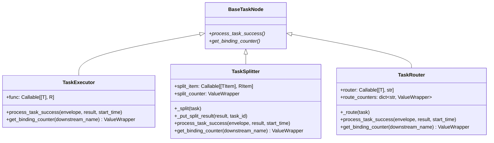

# node/core_nodes.py

> 📅 Last Updated: 2026/09/09

`core_nodes.py` provides the three concrete node classes that CelestialFlow exposes publicly:

- `TaskExecutor` — the general-purpose task executor
- `TaskSplitter` — a 1→N splitter
- `TaskRouter` — a conditional router

> The **direct base class of all three classes is `BaseTaskNode`**, which is the node base class. They each override `process_task_success` and `get_binding_counter` to provide the "execute / split / route" semantics.



> Note: `TaskSplitter` and `TaskRouter` **directly** inherit from `BaseTaskNode`; they are at the same level as `TaskExecutor` (not subclasses of `TaskExecutor`).

## `TaskExecutor[T, R]`

The general-purpose executor: maps a single input to a single result and is responsible for forwarding the result to all registered downstream targets.

### Constructor

```python
def __init__(
    self,
    name: str,
    func: Callable[[T], R] | Callable[[T], Awaitable[R]],
    *,
    execution_mode: str = "serial",
    max_workers: int | None = None,
    max_retries: int = 1,
    max_queue_size: int = 0,
    max_info: int = 50,
    enable_duplicate_check: bool = False,
):
    ...
```

`TaskExecutor` passes all arguments straight through to `BaseTaskNode.__init__`, so `execution_mode / max_workers / max_retries / max_queue_size / max_info / enable_duplicate_check` can all be overridden via keyword arguments at construction time.

### Key Overrides

- `get_binding_counter(_downstream_name) -> ValueWrapper` → returns `self.metrics.success_counter`.
- `process_task_success(envelope, result, start_time)` →
  1. `ctree_client.emit(CTreeEvent.TASK_SUCCESS, parents=[task_id])` to obtain `result_id`;
  2. `self.metrics.add_success_count()`;
  3. `get_lifecycle_inlet().task_success(task_id, result)`;
  4. `get_log_inlet().task_success(...)` to write the log;
  5. For each downstream target (`result_queue.get_target_names()`), re-emit a `TASK_INPUT` event and `put_target` a `TaskEnvelope(result, downstream_input_id)`.

### Example

```python
from celestialflow.node import TaskExecutor


def double(x: int) -> int:
    return x * 2


executor = TaskExecutor(
    "Doubler",
    func=double,
    execution_mode="serial",
)
executor.run([1, 2, 3])
for task, result in executor.get_success_pairs():
    print(task, "->", result)
```

## `TaskSplitter[TItem, RItem]`

Splits one `Iterable[TItem]` into an `Iterable[RItem]`, then sends each `RItem` downstream (the typical 1→N scenario).

### Constructor

```python
def __init__(
    self,
    name: str,
    split_item: Callable[[TItem], RItem] | None = None,
):
    super().__init__(
        name=name,
        func=self._split,         # internal split function
        execution_mode="serial",  # hard-coded
        max_retries=0,            # hard-coded: splitter does not retry
    )
    self.split_item = split_item or self._identity_split_item
    self.split_counter = ValueWrapper(0, self.metrics.lock)
```

> The default `execution_mode` and `max_retries` are hard-coded to `"serial"` and `0`. If you need a different mode, use `set_execution_mode` externally.

### Key Overrides

- `get_binding_counter(_downstream_name) -> ValueWrapper` → returns `self.split_counter` (**not** `success_counter`).
- `process_task_success(envelope, result, start_time)` →
  1. `list(result)` to materialize the result;
  2. `_put_split_result(result_list, task_id)` to put each subtask to all downstream targets one by one, and write a `split_trace` log;
  3. `self.metrics.add_success_count()`, `get_lifecycle_inlet().task_success(task_id, result_list)`;
  4. `_update_split_counter(split_count)` to increment the split counter.

### `_split` Subclass Hook

`TaskSplitter` encapsulates the "how to split" logic in a private method `_split`:

```python
def _split(self, task: Iterable[TItem]) -> Iterable[RItem]:
    return (self.split_item(item) for item in task)
```

Notes:

- `_split` is a **private method**, not part of the public API;
- If you need to customize the split logic, prefer the `split_item` parameter (which maps a single subtask) rather than overriding `_split`;
- The default `split_item` is `_identity_split_item` (the identity mapping `cast(RItem, task)`).

> If you really need to replace the "how to split the collection" logic, you can subclass `TaskSplitter` and override `func` or fully override `process_task_success` outside of `__init__`, but this is not recommended.

### `_put_split_result(result, task_id)` Private Method

For each subtask:

1. `ctree_client.emit("task.split", parents=[task_id])` to obtain `split_id`;
2. For each downstream target, emit a `task.input` event and `put_target` an envelope;
3. `get_log_inlet().split_trace(...)` to record the trace.

Returns `split_count = len(result_list)`.

### Example

```python
from celestialflow.node import TaskSplitter
from celestialflow import TaskGraph, TaskExecutor

# Splitter: split a string into individual characters
splitter = TaskSplitter("CharSplitter")

# Downstream: print every character
class CharSink(BaseTaskNode[str, str]):  # for illustration only
    ...
```

A more common usage is in combination with `TaskGraph`:

```python
from celestialflow import TaskGraph, TaskExecutor
from celestialflow.node import TaskSplitter

splitter = TaskSplitter("Splitter")
sink = TaskExecutor("Sink", func=lambda c: print(c))

graph = TaskGraph(name="SplitGraph")
graph.set_nodes([splitter, sink])
graph.connect([splitter], [sink])

graph.run({splitter.get_name(): [["a", "b", "c"]]})
```

## `TaskRouter[T]`

Dispatches a task to a specified downstream based on the `router` callback.

### Constructor

```python
def __init__(self, name: str, router: Callable[[T], str]):
    super().__init__(
        name=name,
        func=self._route,           # internal route function
        execution_mode="serial",    # hard-coded
        max_retries=0,              # hard-coded: router does not retry
    )
    self.router = router
    self.route_counters = {}
```

> Again, the default `execution_mode` and `max_retries` are hard-coded to `"serial"` and `0`. If you need a different mode, use `set_execution_mode` externally.

### Key Overrides

- `get_binding_counter(downstream_name) -> ValueWrapper` → `setdefault`-creates a corresponding `ValueWrapper` for the downstream name and returns it.
- `process_task_success(envelope, result, start_time)` →
  1. `target, task = result`;
  2. `ctree_client.emit("task.route", parents=[task_id])` to obtain `route_id`;
  3. `self.metrics.add_success_count()`, `get_lifecycle_inlet().task_success(task_id, task)`;
  4. `_update_route_counter(target)` to increment the counter for the corresponding downstream;
  5. `get_log_inlet().route_success(...)` to write the log;
  6. For `target`, emit a `task.input` event and `put_target`.

### `_route` Subclass Hook

```python
def _route(self, task: T) -> tuple[str, T]:
    target = self.router(task)
    if target not in self.route_counters:
        raise InvalidOptionError(
            "Unknown target", target, self.route_counters.keys()
        )
    return target, task
```

> `target` must be a downstream name already registered via `prev_binding`, otherwise an `InvalidOptionError` (defined in `runtime.util_errors`) is raised.

### Example

```python
from celestialflow import TaskGraph, TaskExecutor
from celestialflow.node import TaskRouter


def by_length(text: str) -> str:
    return "LongPath" if len(text) > 5 else "ShortPath"


router = TaskRouter("LengthRouter", router=by_length)
long_node = TaskExecutor("LongPath", func=lambda s: ("L", s))
short_node = TaskExecutor("ShortPath", func=lambda s: ("S", s))

graph = TaskGraph(name="RouterGraph")
graph.set_nodes([router, long_node, short_node])
graph.connect([router], [long_node, short_node])

graph.run({router.get_name(): ["hi", "hello world", "ok"]})
```

## Exception Reference

| Exception | Triggered Scenario |
|-----------|--------------------|
| `InvalidOptionError` | In `TaskRouter._route`, `target` is not present in the registered `route_counters` |
| `ConfigurationError` | Inherited from `BaseTaskNode`: `async` mode but `func` is not a coroutine; `func` parameter count ≠ 1, etc. |
| `CallableParameterKindError` | Signature validation inherited from `BaseTaskNode._set_func` |

## Notes

1. **The direct base class is `BaseTaskNode`**: `TaskSplitter` / `TaskRouter` are **not** subclasses of `TaskExecutor`. They each handle a different `process_task_success` semantic.
2. **Splitters / routers do not retry**: `max_retries=0` is hard-coded in `__init__`; if retries are truly required, use `TaskExecutor` instead.
3. **Splitter `execution_mode` defaults to serial**: splitting itself is a lightweight I/O operation and usually does not need concurrency; if concurrency is truly required, adjust via `set_execution_mode("thread")`.
4. **Router targets must be pre-bound**: the target string returned by `router` must appear in `self.route_counters` (i.e. registered via `prev_binding`); otherwise an `InvalidOptionError` is raised.
5. **Runtime `start_time` / counters**: all three node classes automatically initialize `metrics / task_queue / result_queue / dispatch` etc. through `BaseTaskNode.__init__`; there is no need to re-create them.
