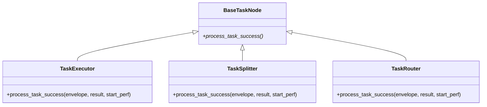

# src/celestialflow/node/core_nodes.py

> 📅 Last Updated: 2026/09/24

`core_nodes.py` provides the three concrete node classes that CelestialFlow exposes publicly:

- `TaskExecutor` — the general-purpose task executor
- `TaskSplitter` — a 1→N splitter
- `TaskRouter` — a conditional router

> **None of the three classes defines its own `__init__`**; they directly reuse `BaseTaskNode.__init__`. They each override `process_task_success` to provide the "execute / split / route" semantics.



> Note: `TaskSplitter` and `TaskRouter` **directly** inherit from `BaseTaskNode`; they are at the same level as `TaskExecutor` (not subclasses of `TaskExecutor`).

## Common Constructor Signature

The three classes share the same constructor signature (inherited from `BaseTaskNode`):

```python
def __init__(
    self,
    name: str,
    func: Callable[[T], R] | Callable[[T], Awaitable[R]],
    *,
    execution_mode: str = "serial",
    max_workers: int | None = None,
    max_retries: int = 1,
    max_queue_size: int = 0,
    max_info: int = 50,
): ...
```

Here `R` is the "direct return type" in each subclass's generics:

| Class | Generic Inheritance | `func` should return |
|----|---------|--------------|
| `TaskExecutor[T, R]` | `BaseTaskNode[T, R, R]` | A single result `R` |
| `TaskSplitter[T, RItem]` | `BaseTaskNode[T, Iterable[RItem], RItem]` | An iterable sequence of sub-tasks |
| `TaskRouter[T, Y]` | `BaseTaskNode[T, dict[str, Y], Y]` | A `{downstream name: payload}` mapping |

## `TaskExecutor[T, R]`

The general-purpose executor: maps a single input to a single result and is responsible for forwarding the result to all registered downstream targets.

### Key Overrides

`process_task_success(envelope, result, start_perf)` →

1. `ctree_client.emit(CTreeEvent.TASK_SUCCESS, parents=[task_id])` to obtain `result_id`;
2. `self.metrics.add_success_count()`;
3. `get_lifecycle_inlet().task_success(task_id, result)`;
4. `get_log_inlet().task_success(name, repr(task), repr(result), elapsed, task_id, result_id)` to write the log;
5. For each downstream target (`self.yield_queue.get_target_names()`): `add_downstream_count(target)`, re-emit a `TASK_INPUT` event, write lifecycle / log input records, and `yield_queue.put_target(target, TaskEnvelope(result, downstream_input_id))`.

### Example

```python
from celestialflow.node import TaskExecutor


def double(x: int) -> int:
    return x * 2


executor = TaskExecutor(
    "Doubler",
    func=double,
    execution_mode="serial",
)
executor.run([1, 2, 3])
for task, result in executor.get_success_pairs():
    print(task, "->", result)
```

## `TaskSplitter[T, RItem]`

`func` receives a single task and returns an iterable sequence of sub-tasks; the sub-tasks are injected into the downstream queue one by one (the typical 1→N scenario).

### Key Overrides

`process_task_success(envelope, result, start_perf)` →

1. `result_list = list(result)` to materialize the result (supports generators);
2. `ctree_client.emit(CTreeEvent.TASK_SUCCESS, parents=[task_id])` to obtain `result_id`;
3. `self.metrics.add_success_count()`;
4. `get_lifecycle_inlet().task_success(task_id, result_list)`;
5. `get_log_inlet().task_success(...)` to write the log;
6. For each downstream target: `add_downstream_count(target, len(result_list))` to add the send count in one go; then for each `item` in `result_list`, emit a `TASK_INPUT` event separately, write lifecycle / log input records, and `yield_queue.put_target(target, TaskEnvelope(item, downstream_input_id))`.

> An empty iterable legitimately produces 0 sub-tasks (it does not raise); a generator input is fully materialized by `list()` before dispatch.

### Example

```python
from celestialflow.node import TaskSplitter


def split_chars(text: str) -> list[str]:
    return list(text)


splitter = TaskSplitter("CharSplitter", split_chars)
# If a single task is injected directly:
# splitter.run(["abc"])  # downstream receives "a", "b", "c" in order
```

A typical usage in combination with `TaskGraph`:

```python
from celestialflow import TaskGraph, TaskExecutor
from celestialflow.node import TaskSplitter

splitter = TaskSplitter("Splitter", lambda task: list(task))
sink = TaskExecutor("Sink", func=lambda c: print(c))

graph = TaskGraph(name="SplitGraph")
graph.set_nodes([splitter, sink])
graph.connect([splitter], [sink])

graph.run({"Splitter": [["a", "b", "c"]]})
```

## `TaskRouter[T, Y]`

`func` returns a `{downstream name: payload}` mapping, based on which the task (or any payload) is dispatched to the specified downstream.

### Key Overrides

`process_task_success(envelope, result, start_perf)` →

1. Validate whether each target name in `result` is registered in `self.metrics.downstream_counter`; if an unregistered target exists, raise `InvalidOptionError("Unknown target", unknown[0], self.metrics.downstream_counter.keys())`;
2. `ctree_client.emit(CTreeEvent.TASK_SUCCESS, parents=[task_id])` to obtain `result_id`;
3. `self.metrics.add_success_count()`;
4. `get_lifecycle_inlet().task_success(task_id, task)` (note: the lifecycle success record is the **input task** `task`, not the mapping `result`);
5. `get_log_inlet().task_success(name, repr(task), repr(result), elapsed, task_id, result_id)` to write the log;
6. For each `(target, yie)` in `result.items()`: `add_downstream_count(target)`, emit a `TASK_INPUT` event, write lifecycle / log input records, and `yield_queue.put_target(target, TaskEnvelope(yie, downstream_input_id))` — what the downstream receives is the **payload corresponding to that target** `yie`, not the router's input task.

### Example

```python
from celestialflow import TaskGraph, TaskExecutor
from celestialflow.node import TaskRouter


def route_by_length(text: str) -> dict[str, str]:
    target = "LongPath" if len(text) > 5 else "ShortPath"
    return {target: text}


router = TaskRouter("LengthRouter", route_by_length)
long_node = TaskExecutor("LongPath", func=lambda s: ("L", s))
short_node = TaskExecutor("ShortPath", func=lambda s: ("S", s))

graph = TaskGraph(name="RouterGraph")
graph.set_nodes([router, long_node, short_node])
graph.connect([router], [long_node, short_node])

graph.run({router.get_name(): ["hi", "hello world", "ok"]})
```

## Exception Reference

| Exception | Triggered Scenario |
|-----------|--------------------|
| `InvalidOptionError` | In `TaskRouter.process_task_success`, `result` contains a target name not bound via `connect_to` |
| `ConfigurationError` | Inherited from `BaseTaskNode`: `async` mode but `func` is not a coroutine; `func` parameter count ≠ 1, etc. |
| `CallableParameterKindError` | Signature validation inherited from `BaseTaskNode._set_func` |

## Notes

1. **The direct base class is `BaseTaskNode`**: `TaskSplitter` / `TaskRouter` are **not** subclasses of `TaskExecutor`. They each handle a different `process_task_success` semantic.
2. **`func` is required**: Since there is no custom `__init__`, all three classes must provide `func`; the defaults are `execution_mode="serial"` and `max_retries=1`.
3. **Router targets must be pre-bound**: The target string returned by `func` must appear in `self.metrics.downstream_counter` (i.e. registered at least via `graph.connect` / `connect_to`); otherwise an `InvalidOptionError` is raised.
4. **Each router target receives its own payload**: A single routing can return multiple targets, and each downstream receives only the value of the corresponding key.
5. **Runtime components are automatically initialized**: All three node classes automatically initialize `metrics / task_queue / yield_queue / dispatch` etc. through `BaseTaskNode.__init__`, with no need to re-create them.
6. **No more `split_item` / `split_counter` / `_split` / `route_counters` / `_route`**: The split and route logic is now entirely handled by the passed-in `func`; the classes themselves only dispatch the result of `func` downstream.
