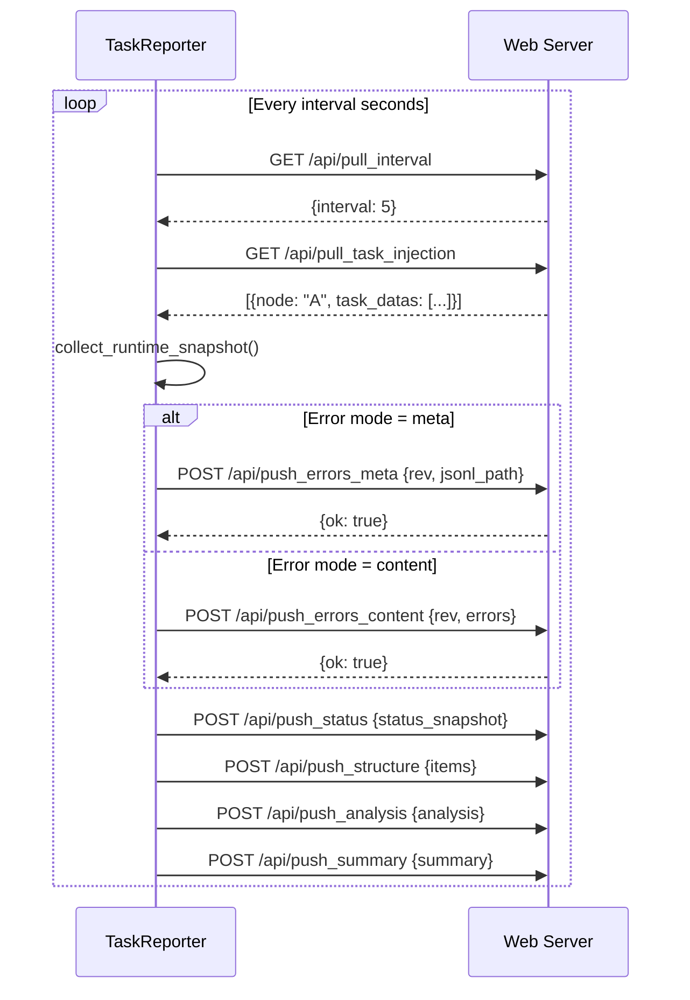

# TaskReporter

> 📅 Last Updated: 2026/05/24

`TaskReporter` is a background component responsible for collecting task graph runtime status and reporting it to a remote Web server (CelestialFlow Web UI). It is also responsible for pulling control commands (such as task injection) from the server.

## Features

- **Status Reporting**: Periodically pushes task graph structure, topology, runtime status (counters), analysis data, summary information, etc.
- **Task Injection**: Receives user-injected new tasks from the Web UI and dynamically inserts them into the running task graph.
- **Dynamic Parameter Adjustment**: Supports pulling configuration from the server (such as reporting interval `interval`).
- **Error Log Synchronization**: Supports incremental error log pushing (metadata mode / content mode).

## Usage

Typically, you do not need to instantiate it directly; instead, enable it through `TaskGraph`:

```python
graph = TaskGraph(...)
# Enable Reporter, connecting to local port 5005
graph.set_reporter(True, host="127.0.0.1", port=5005)
```

## API Interactions

The Reporter interacts with the following Web APIs via HTTP:

### Pull Endpoints

| Method | Endpoint | Description |
|--------|----------|-------------|
| `GET` | `/api/pull_interval` | Get the reporting interval configuration |
| `GET` | `/api/pull_task_injection` | Get injected tasks |

### Push Endpoints

| Method | Endpoint | Description |
|--------|----------|-------------|
| `POST` | `/api/push_errors_meta` | Push error metadata (version number and JSONL path) |
| `POST` | `/api/push_errors_content` | Push error content (incremental, with specific error entries) |
| `POST` | `/api/push_status` | Push runtime status snapshot |
| `POST` | `/api/push_structure` | Push graph structure information |
| `POST` | `/api/push_analysis` | Push graph analysis data |
| `POST` | `/api/push_summary` | Push graph summary statistics |

### Interaction Flow



## NullTaskReporter

When the Reporter is not enabled, `TaskGraph` uses `NullTaskReporter` as a placeholder. Its `start()` and `stop()` methods are no-ops and do not make any network requests.

```python
class NullTaskReporter:
    interval = 1
    history_limit = 20

    def start(self) -> None: ...
    def stop(self) -> None: ...
```

`NullTaskReporter` is also exported via `__init__.py` and can be safely referenced when reporting is disabled:

```python
from celestialflow.observability import NullTaskReporter
```
