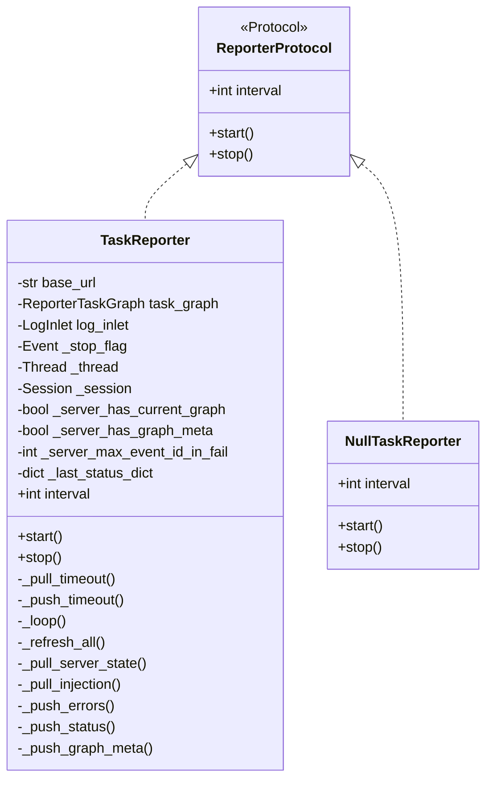
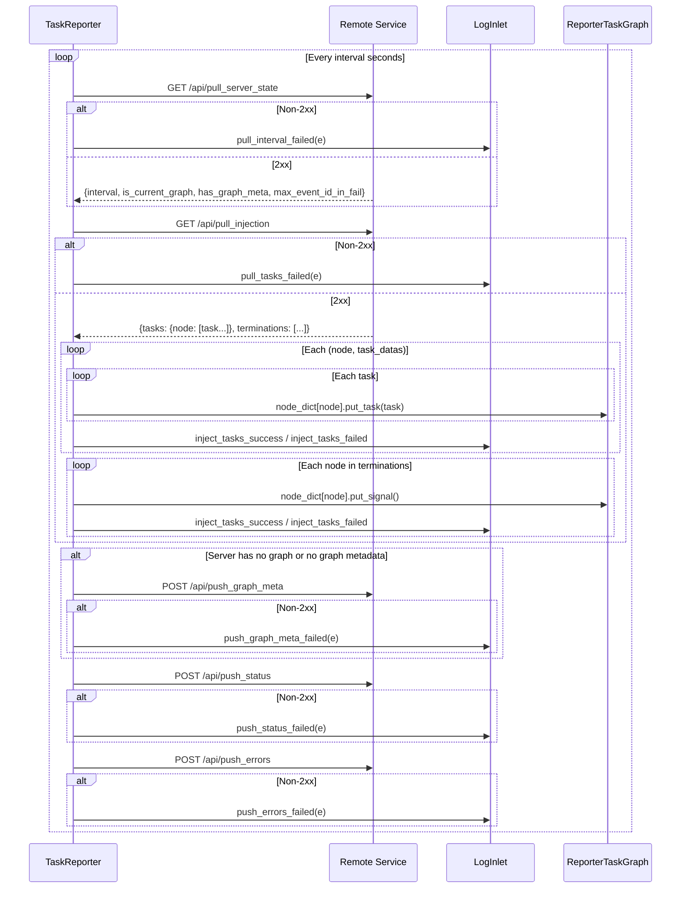

# src/celestialflow/observability/core_report.py

> 📅 Last Updated: 2026/09/24

`core_report.py` implements the reporter component that interfaces with the `celestialflow-web` service. A background thread periodically pushes the task graph's metadata, status, and error information to the remote end, while pulling the tasks and termination signals that need to be injected and dynamically writing them into the running task graph. The file contains three main types:

- `ReporterProtocol`: the minimal interface protocol by which dependants declare "having reporter start/stop capability".
- `TaskReporter`: the real reporter implementation, responsible for HTTP pulling / pushing.
- `NullTaskReporter`: a no-op placeholder used when reporting is disabled.

## Module Overview


```mermaid
classDiagram
    class ReporterProtocol {
        <<Protocol>>
        +int interval
        +start()
        +stop()
    }
    class TaskReporter {
        -str base_url
        -ReporterTaskGraph task_graph
        -LogInlet log_inlet
        -Event _stop_flag
        -Thread _thread
        -Session _session
        -bool _server_has_current_graph
        -bool _server_has_graph_meta
        -int _server_max_event_id_in_fail
        -dict _last_status_dict
        +int interval
        +start()
        +stop()
        -_pull_timeout()
        -_push_timeout()
        -_loop()
        -_refresh_all()
        -_pull_server_state()
        -_pull_injection()
        -_push_errors()
        -_push_status()
        -_push_graph_meta()
    }
    class NullTaskReporter {
        +int interval
        +start()
        +stop()
    }

    ReporterProtocol <|.. TaskReporter
    ReporterProtocol <|.. NullTaskReporter
```

## `ReporterProtocol`

```python
class ReporterProtocol(Protocol):
    """Minimum interface required by Reporter dependants."""

    interval: int

    def start(self) -> None: ...

    def stop(self) -> None: ...
```

Both `TaskReporter` and `NullTaskReporter` satisfy this protocol; dependants (such as the graph layer) can accept either uniformly, so that `start()` / `stop()` can be called safely even when reporting is disabled.

## `TaskReporter`

### Initialization

```python
def __init__(
    self,
    host: str,
    port: int,
    task_graph: ReporterTaskGraph,
) -> None:
    """
    :param host: Remote service host address
    :param port: Remote service port
    :param task_graph: Task graph instance (satisfying the ReporterTaskGraph protocol)
    """
```

Internal state after initialization:

| Field | Type | Description |
|-------|------|-------------|
| `base_url` | `str` | `f"http://{host}:{port}"` |
| `task_graph` | `ReporterTaskGraph` | Task graph injected through the protocol |
| `log_inlet` | `LogInlet` | Obtained via `get_log_inlet()`, used for reporting all failures / injection results |
| `_stop_flag` | `Event` | Controls the exit of the background thread |
| `_thread` | `Thread | None` | Reference to the background thread |
| `_session` | `requests.Session` | Reused HTTP session |
| `_server_has_current_graph` | `bool` | Whether the server already holds the current `graph_id` |
| `_server_has_graph_meta` | `bool` | Whether the server has received a graph metadata (structure + analysis) push |
| `_server_max_event_id_in_fail` | `int | None` | Maximum failed `event_id` watermark known to the server |
| `_last_status_dict` | `dict[str, dict[str, Any]] | None` | Per-node snapshot from the last successful push, used for change gating |
| `interval` | `int` | Reporting period (seconds), default `5`, dynamically adjusted by `_pull_server_state`, in the range `[1, 60]` |

### Lifecycle

```python
reporter.start()  # Clear the stop flag, create a daemon thread executing _loop()
reporter.stop()  # Set the stop flag, join the thread (timeout=2), then perform a final refresh
```

`start()` simply does `_stop_flag.clear()` + `Thread(target=self._loop, daemon=True).start()`.

`stop()` details:

1. If `_thread is None`, return immediately (idempotent calls are allowed);
2. Set `_stop_flag.set()` and `join(timeout=2)`;
3. If the thread has still not finished, close `_session` and raise `ReporterError("Reporter thread is still running.")`;
4. On normal completion, set `_thread` to `None` (so that a second `start()` is supported) and perform one final `_refresh_all()` as the last push;
5. Close `_session` and call `log_inlet.stop_reporter()` to log the stop event.

`_loop()` runs `_refresh_all()` each cycle; exceptions are caught and recorded via `log_inlet.loop_failed(e)`, **without terminating the thread**.

### Timeout Calculation

```python
def _pull_timeout(self) -> float:
    return max(1.0, min(self.interval * 0.2, 5.0))


def _push_timeout(self) -> float:
    return max(1.0, min(self.interval * 0.2, 3.0))
```

- The pull timeout caps at 5 seconds, the push timeout at 3 seconds;
- Both use 20% of `interval` as the base, with a lower bound of 1 second, to avoid a very short `interval` (e.g. 1 second) causing requests to time out immediately.

### `_refresh_all` Execution Order

```python
def _refresh_all(self) -> None:
    try:
        # 1. Pull
        self._pull_server_state()  # GET /api/pull_server_state
        self._pull_injection()  # GET /api/pull_injection

        # 2. Push (on demand)
        if (not self._server_has_current_graph) or (not self._server_has_graph_meta):
            self._push_graph_meta()  # POST /api/push_graph_meta
        self._push_status()  # POST /api/push_status
        self._push_errors()  # POST /api/push_errors
    except Exception as e:
        self.log_inlet.loop_failed(e)
```

`_refresh_all` is wrapped by an overall `try/except`; any internal exception is only written to the `loop_failed` log and not raised, ensuring that a single failure will not terminate the background loop.

## API Interaction

The Reporter interacts with the following endpoints on the `celestialflow-web` service via HTTP:

### Pull Endpoints

| Method | Endpoint | Description |
|--------|----------|-------------|
| `GET` | `/api/pull_server_state?graph_id=...` | Retrieve sync decision state (interval, `is_current_graph`, whether graph metadata already exists, max `event_id` of failed records) |
| `GET` | `/api/pull_injection` | Retrieve the list of tasks to inject this round and the list of termination-signal nodes |

### Push Endpoints

| Method | Endpoint | Description |
|--------|----------|-------------|
| `POST` | `/api/push_errors` | Push errors (failed records) |
| `POST` | `/api/push_status` | Push runtime status snapshot |
| `POST` | `/api/push_graph_meta` | Push graph structure, node metadata, and graph analysis data |

### Non-2xx Response Handling

> ⚠️ **Critical behavior**: after receiving a response, all `GET` / `POST` requests **must** check `res.ok`. If `res.ok` is `False`, immediately raise `ReporterError("...: {status_code}")`; the corresponding `_pull_*` / `_push_*` method's outer `except` will record it in the log (`pull_*_failed` / `push_*_failed`). **Silently passing through 4xx / 5xx responses is forbidden.**

## `_pull_server_state`

```python
GET /api/pull_server_state?graph_id={graph_id}
```

Reads the remote sync state and updates:

- `interval` (in the range `[1, 60]`);
- `_server_has_current_graph` / `_server_has_graph_meta`;
- `_server_max_event_id_in_fail` (`None` when absent).

Failures are recorded via `log_inlet.pull_interval_failed(e)`, without affecting subsequent pushes.

## `_pull_injection` (Split Protocol)

```python
GET / api / pull_injection
```

The returned payload has the following structure:

```json
{
  "tasks": {
    "NodeA": [task1, task2, task3],
    "NodeB": [...]
  },
  "terminations": ["NodeA", "NodeC"]
}
```

> Protocol characteristics: the **task list** and the **termination-signal node list** are disjoint and sent in parallel; the same node can appear in both fields. The processing order is fixed as "tasks first, then terminations".

Injection logic:

```python
injection_payload: dict[str, Any] = res.json()

# 1. Task injection: iterate over task_datas of each node one by one
for target_node, task_datas in injection_payload.get("tasks", {}).items():
    try:
        node = self.task_graph.node_dict[target_node]
        for task in task_datas:
            node.put_task(task)  # enqueue one at a time
        self.log_inlet.inject_tasks_success(target_node, task_datas)
    except Exception as e:
        self.log_inlet.inject_tasks_failed(target_node, task_datas, e)

# 2. Termination-signal injection
for target_node in injection_payload.get("terminations", []):
    try:
        node = self.task_graph.node_dict[target_node]
        node.put_signal()
        self.log_inlet.inject_tasks_success(target_node, [TERMINATION_SIGNAL])
    except Exception as e:
        self.log_inlet.inject_tasks_failed(target_node, [TERMINATION_SIGNAL], e)
```

> ⚠️ **One-by-one enqueueing is a hard protocol requirement**: the `for task in task_datas: node.put_task(task)` loop **must** call `put_task` for each individual task. If the entire `task_datas` list is injected as a single task, it will break `BaseTaskNode`'s enqueueing semantics and produce unexpected downstream behavior. Regression test: `tests/observability/test_reporter.py`.

Payload parsing failures (non-2xx / JSON exception) are recorded via `log_inlet.pull_tasks_failed(e)`, and **do not interrupt** subsequent pushes.

## `_push_errors` (Incremental Push)

Reads the failed records from the lifecycle sqlite and pushes them:

- When `not self._server_has_current_graph` or `_server_max_event_id_in_fail is None`, do a full `load_records(db_path=lifecycle_path)`;
- Otherwise, do an incremental `load_records_after_event_id_in_fail(lifecycle_path, self._server_max_event_id_in_fail)`, only pushing failed records whose `event_id` is strictly greater than the server's watermark.

Push payload:

```python
{
    "graph_id": graph_id,
    "errors": all_errors,
}
```

Non-2xx response → `ReporterError` → `log_inlet.push_errors_failed(e)`.

## `_push_status` (Change Gating)

Collect a snapshot per node and push it:

```python
status_dict: dict[str, dict[str, Any]] = {}
for node_name, node in self.task_graph.node_dict.items():
    status_dict[node_name] = node.get_snapshot()

# Gate: skip when the server holds the current graph and the snapshot matches the last successful push
if self._server_has_current_graph and status_dict == self._last_status_dict:
    return

payload = {
    "graph_id": self.task_graph.get_graph_id(),
    "status": status_dict,
    "timestamp": time.time(),
}
```

After a successful push, `_last_status_dict` is updated to this round's `status_dict`. The timestamp does not participate in the comparison (it necessarily differs every round); the compared object is the per-node snapshot itself. When the server has just switched context (`_server_has_current_graph` is false), its status cache has already been cleared, so a push is forced this time regardless of whether the snapshot is the same.

Non-2xx response → `ReporterError` → `log_inlet.push_status_failed(e)`.

## `_push_graph_meta`

Triggered only when `not _server_has_current_graph` or `not _server_has_graph_meta`:

```python
payload = {
    "graph_id": self.task_graph.get_graph_id(),
    "nodes": self.task_graph.get_nodes(),
    "edges": self.task_graph.get_edges(),
    "source_nodes": self.task_graph.get_source_nodes(),
    "node_meta": self.task_graph.get_node_meta(),
    "analysis": self.task_graph.get_graph_analysis(),
}
```

That is, it merges the former `structure` (nodes / edges / source nodes) and `analysis` into a single graph metadata push, attaching each node's build-time metadata `node_meta` (`class_name` / `execution_mode` / `max_workers`).

Non-2xx response → `ReporterError` → `log_inlet.push_graph_meta_failed(e)`.

## Key Data Flow


```mermaid
sequenceDiagram
    participant R as TaskReporter
    participant S as Remote Service
    participant L as LogInlet
    participant G as ReporterTaskGraph

    loop Every interval seconds
        R->>S: GET /api/pull_server_state
        alt Non-2xx
            R->>L: pull_interval_failed(e)
        else 2xx
            S-->>R: {interval, is_current_graph, has_graph_meta, max_event_id_in_fail}
        end

        R->>S: GET /api/pull_injection
        alt Non-2xx
            R->>L: pull_tasks_failed(e)
        else 2xx
            S-->>R: {tasks: {node: [task...]}, terminations: [...]}
            loop Each (node, task_datas)
                loop Each task
                    R->>G: node_dict[node].put_task(task)
                end
                R->>L: inject_tasks_success / inject_tasks_failed
            end
            loop Each node in terminations
                R->>G: node_dict[node].put_signal()
                R->>L: inject_tasks_success / inject_tasks_failed
            end
        end

        alt Server has no graph or no graph metadata
            R->>S: POST /api/push_graph_meta
            alt Non-2xx
                R->>L: push_graph_meta_failed(e)
            end
        end

        R->>S: POST /api/push_status
        alt Non-2xx
            R->>L: push_status_failed(e)
        end
        R->>S: POST /api/push_errors
        alt Non-2xx
            R->>L: push_errors_failed(e)
        end
    end
```

## Log Integration (`LogInlet` Interface)

`TaskReporter` only depends on the following `LogInlet` methods (see `celestialflow.persistence.core_log` for details):

| Call | Trigger Scenario |
|------|------------------|
| `inject_tasks_success(node, task_datas)` | Successful injection of a task or termination signal (including the `[TERMINATION_SIGNAL]` singleton) |
| `inject_tasks_failed(node, task_datas, error)` | Node does not exist or an exception occurred during injection |
| `pull_tasks_failed(error)` | `/api/pull_injection` non-2xx / JSON parsing failure |
| `pull_interval_failed(error)` | `/api/pull_server_state` failure |
| `push_errors_failed(error)` | `/api/push_errors` non-2xx / payload construction failure |
| `push_status_failed(error)` | `/api/push_status` failure |
| `push_graph_meta_failed(error)` | `/api/push_graph_meta` failure |
| `loop_failed(error)` | Top-level uncaught exception in `_refresh_all` (does not affect the next cycle) |
| `stop_reporter()` | Logs that the reporter has stopped at the end of `stop()` |
| `worker_crash(error)` | Dispatcher worker crash (invoked only by `core_dispatch`) |

> Unit tests can inject a fake `LogInlet` via `monkeypatch.setattr("celestialflow.observability.core_report.get_log_inlet", lambda: fake)` to verify the call.

## `NullTaskReporter`

When the Reporter is not enabled, `NullTaskReporter` is used as a placeholder:

```python
class NullTaskReporter:
    interval: int = 1

    def start(self) -> None: ...
    def stop(self) -> None: ...
```

Both `start()` and `stop()` are no-ops and **do not** initiate any network requests; it also satisfies `ReporterProtocol`, so dependants do not need to branch on "whether the reporter is enabled".

## Usage Example

```python
from celestialflow.observability import TaskReporter, NullTaskReporter
from celestialflow import TaskGraph, TaskExecutor

graph = TaskGraph("Demo")
executor = TaskExecutor("NodeA", lambda x: x * 2, execution_mode="thread")
graph.set_nodes([executor])

# Enable reporter
reporter = TaskReporter(host="127.0.0.1", port=5000, task_graph=graph)
reporter.start()

graph.run({executor.get_name(): list(range(10))})
reporter.stop()

# Use NullTaskReporter as placeholder when reporting is disabled
placeholder: ReporterProtocol = NullTaskReporter()
placeholder.start()
placeholder.stop()
```

## Exception Reference

| Exception | Trigger Scenario |
|-----------|------------------|
| `ReporterError` | The thread fails to exit within 2 seconds at the end of `stop()`; or all `_pull_*` / `_push_*` detect `not res.ok` |

## Notes

1. **Hard requirement to enqueue one by one**: in `_pull_injection`, `node.put_task(task)` **must** be called for every element of `task_datas`; injecting the list as a single task is forbidden.
2. **Non-2xx responses must be checked**: all `GET` / `POST` requests **must** check `res.ok` after receiving the response, and surface failures to the corresponding `_pull_*_failed` / `_push_*_failed` log.
3. **`_thread` must be set to `None` after `stop()`**: this is required to support a second `start()`; otherwise the leaked `Thread` reference will cause repeated `join` issues.
4. **`interval` converges to the range `[1, 60]`**: the `interval` pulled from the remote end is clamped via `int(max(1.0, min(float(interval), 60.0)))`.
5. **Graph metadata pushes are on demand**: triggered only when the server first holds the current graph, or when the graph metadata is missing — to avoid repeated uploads every cycle; `node_meta` has been merged into `_push_graph_meta` and no longer enters the per-cycle status push.
6. **Status pushes have change gating**: `_push_status` sends only when the per-node snapshot changes (or the server has just switched context), avoiding meaningless repeated requests.
7. **Incremental error pushes use the maximum `event_id` of failed records as the watermark**: this requires the client's `event_id` to be monotonically increasing (guaranteed by `LocalEventClient` / `ctree_client`).
8. **Depends on graph protocols, not concrete classes**: `TaskReporter` accesses the task graph through the `ReporterTaskGraph` / `ReporterTaskNode` protocols, allowing it to be tested in isolation without introducing a `celestialflow.graph` dependency.
