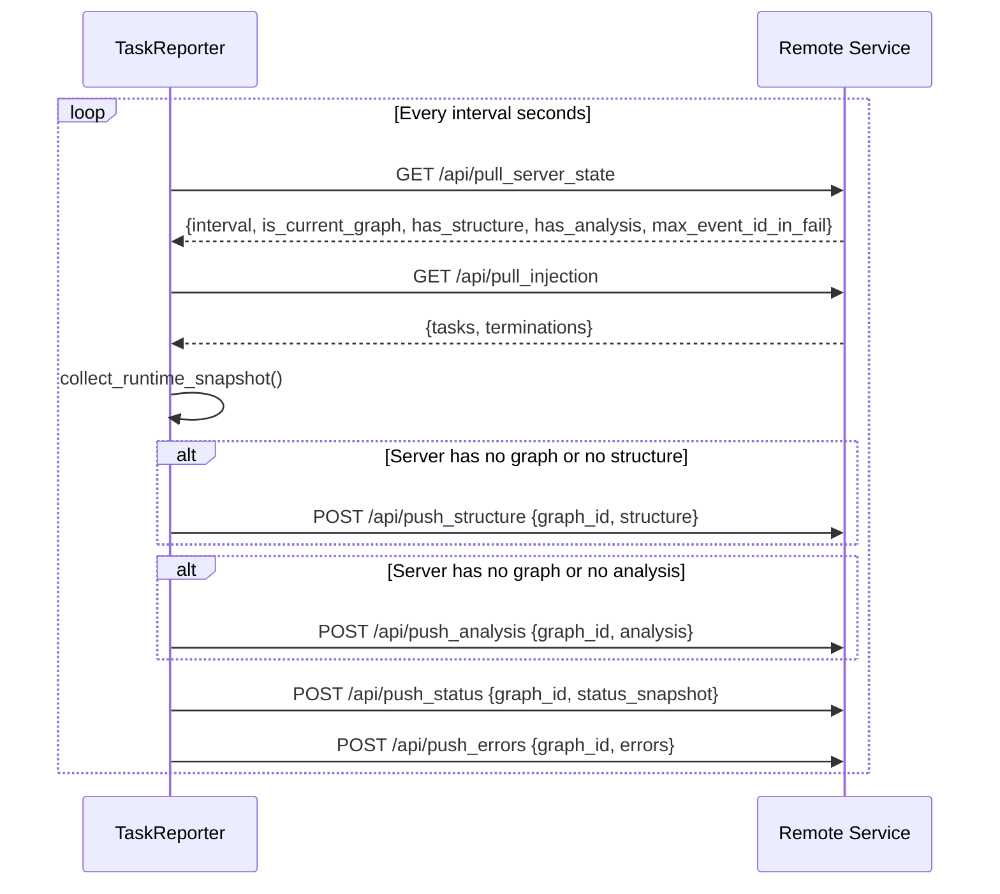

# TaskReporter

> 📅 Last Updated: 2026/08/26

`TaskReporter` is a background component responsible for collecting task graph runtime status and reporting it to the `celestialflow-web` service. It is also responsible for pulling control commands (such as task injection) from that service.

## Features

- **Status Reporting**: Periodically pushes task graph structure, topology, runtime status (counters), and analysis data.
- **Task Injection**: Pulls new tasks to be injected from the remote service and dynamically inserts them into the running task graph.
- **Dynamic Parameter Adjustment**: Supports pulling configuration from the server (such as reporting interval `interval`).
- **Error Log Syncing**: Incrementally pushes error logs (based on `event_id` increments).

## Initialization

```python
class TaskReporter:
    def __init__(
        self,
        host: str,
        port: int,
        task_graph: ReporterTaskGraph,
    ) -> None:
        """
        :param host: Remote service host address
        :param port: Remote service port
        :param task_graph: Task graph instance (satisfying the ReporterTaskGraph protocol)
        """
```

After initialization, `base_url = f"http://{host}:{port}"` is set, with defaults `interval = 5` seconds and `history_limit = 20`.

## API Interaction

The Reporter interacts with the following remote endpoints via HTTP:

### Pull Endpoints

| Method | Endpoint | Description |
|--------|----------|-------------|
| `GET` | `/api/pull_server_state` | Retrieve server sync state (including interval config, structure/analysis state, max event_id, etc.) |
| `GET` | `/api/pull_injection` | Retrieve injected tasks and termination signals |

### Push Endpoints

| Method | Endpoint | Description |
|--------|----------|-------------|
| `POST` | `/api/push_errors` | Push error information (incremental, based on `server_max_event_id_in_fail`) |
| `POST` | `/api/push_status` | Push runtime status snapshot |
| `POST` | `/api/push_structure` | Push graph structure information |
| `POST` | `/api/push_analysis` | Push graph analysis data |

### Interaction Flow


```mermaid
sequenceDiagram
    participant R as TaskReporter
    participant S as Remote Service

    loop Every interval seconds
        R->>S: GET /api/pull_server_state
        S-->>R: {interval, is_current_graph, has_structure, has_analysis, max_event_id_in_fail}

        R->>S: GET /api/pull_injection
        S-->>R: {tasks, terminations}

        R->>R: collect_runtime_snapshot()

        alt Server has no graph or no structure
            R->>S: POST /api/push_structure {graph_id, structure}
        end
        alt Server has no graph or no analysis
            R->>S: POST /api/push_analysis {graph_id, analysis}
        end

        R->>S: POST /api/push_status {graph_id, status_snapshot}
        R->>S: POST /api/push_errors {graph_id, errors}
    end
```

## _refresh_all Execution Order

```python
def _refresh_all(self) -> None:
    # 1. Pull
    self._pull_server_state()  # GET /api/pull_server_state → sync config & state
    self._pull_injection()  # GET /api/pull_injection → inject tasks

    # 2. Collect snapshot
    self.task_graph.collect_runtime_snapshot()

    # 3. Push (on demand)
    if (not self._server_has_current_graph) or (not self._server_has_structure):
        self._push_structure()  # POST /api/push_structure
    if (not self._server_has_current_graph) or (not self._server_has_analysis):
        self._push_analysis()  # POST /api/push_analysis
    self._push_status()  # POST /api/push_status
    self._push_errors()  # POST /api/push_errors
```

## Lifecycle

```python
reporter.start()  # Clear stop flag, create daemon thread executing _loop()
reporter.stop()  # Set stop flag, join thread (timeout=2), final refresh
```

`stop()` details:
1. If the thread is not started (`_thread is None`), return immediately;
2. Set the stop flag and `join(timeout=2)`; if the thread is still not finished, close the session and raise `ReporterError("Reporter thread is still running.")`;
3. On normal completion, perform one final `_refresh_all()` as the final push, then close the HTTP session and call `log_inlet.stop_reporter()` to record the stop log.

In `_loop()`, each cycle executes `_refresh_all()`. Exceptions are caught and recorded via `log_inlet.loop_failed()`, without terminating the thread.

## NullTaskReporter

When the Reporter is not enabled, `NullTaskReporter` is used as a placeholder. Its `start()` and `stop()` are no-ops and will not make any network requests.

```python
class NullTaskReporter:
    interval: int = 1
    history_limit: int = 20

    def start(self) -> None: ...
    def stop(self) -> None: ...
```
