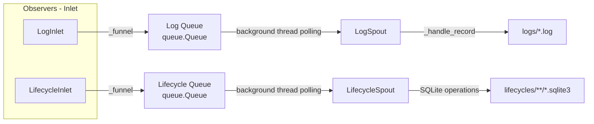

# src/celestialflow/persist/__init__.py

> 📅 Last Updated: 2026/10/09

The `persist` module is CelestialFlow's **persistence module**, providing the recording, writing, and querying of task Lifecycle and runtime Logs. Among them, `LifecycleInlet` / `LogInlet` consume task events as observers and write them to queues, while `LifecycleSpout` / `LogSpout` take records from the queues in background threads and persist them to disk.

## Exported Symbols

The module-level `__all__` exports the following in full:

```python
__all__ = [
    "LifecycleInlet",
    "LifecycleSpout",
    "LogInlet",
    "LogSpout",
]
```

| Exported Symbol | Source Module | Description |
|---------|---------|------|
| `LifecycleSpout` | `core_lifecycle` | Lifecycle record listener, writes task lifecycle to the SQLite database |
| `LifecycleInlet` | `core_lifecycle` | Consumes task events as an observer, writes lifecycle operations into the queue (bound to a spout) |
| `LogSpout` | `core_log` | Log listening thread, writes logs to text files in the `logs/` directory |
| `LogInlet` | `core_log` | Consumes events as an observer, writes log messages into the queue (bound to a spout) |

> The module `__init__` only exports symbols from `core_*` files; the utility functions `util_payload` / `util_sqlite` / `util_render` are not exported here and must be imported from the corresponding modules as needed.

## File Descriptions

1. **core_lifecycle.py** (`LifecycleSpout`, `LifecycleInlet`)
   - **Purpose**: Persistence of task lifecycle, uniformly recording the task's pending / success / failed / skipped states and retry information.
   - **Write method**: `LifecycleInlet` inherits `BaseInlet, Observer`, overrides the `on_task_*` event callbacks, and puts lifecycle operation dictionaries into the queue; `LifecycleSpout` inherits `BaseSpout`, executing the corresponding SQLite write operations by `__op__` in a background thread.
   - **Storage format**: SQLite database (WAL mode), files located under the `lifecycles/` directory.

2. **core_log.py** (`LogSpout`, `LogInlet`)
   - **Purpose**: Runtime log collection and persistence.
   - **Write method**: `LogInlet` inherits `BaseInlet, Observer`, overrides all event callbacks (graph / node / task / termination signal / worker crash) to record logs, and writes node summaries based on `metrics_view`; `LogSpout` inherits `BaseSpout`, writing logs to text files under the `logs/` directory.
   - **Log format**: Each line contains `timestamp level message`.

3. **util_payload.py**
   - **Purpose**: Recursively converts task data into JSON-friendly persisted structures.
   - **Key function**: `to_persisted_payload(task)` — passes through basic types, recursively converts containers, and degrades other types to `str()`.

4. **util_sqlite.py**
   - **Purpose**: SQLite database connection management and record CRUD operation utilities.
   - **Key functions**: `connect_db`, `insert_record`, `promote_record_to_{success,skipped,failed}_by_event_id`, `update_retry_by_event_id`, `load_records`, `query_records`, `load_task_{error,result}_records`, etc.

5. **util_render.py**
   - **Purpose**: Graph structure rendering utility, rendering nodes / edges / source nodes into framed, tree-shaped text.
   - **Key function**: `render_structure_list(nodes, edges, source_nodes)`.

## Module Relationships

### Internal Relationships
- `LifecycleInlet` / `LogInlet` inherit from `funnel.BaseInlet` and `observer.Observer`, writing records into the spout queue via `_funnel()`.
- `LifecycleSpout` / `LogSpout` inherit from `funnel.BaseSpout`, consuming the queue and persisting to disk.

### External Relationships
- **With the Observer module**: `LifecycleInlet` / `LogInlet` are `Observer` subclasses, often registered on `ObserverHub`, and assembled by `run_graph_resources` / `run_node_resources` (`assembly/core_run.py`).
- **With the Runtime module**: `LogInlet` references `runtime.util_constant.LEVEL_DICT` for level filtering and `runtime.util_types.MetricsView` to read node summaries.
- **With the Funnel module**: Reuses the `BaseInlet` / `BaseSpout` base classes to implement thread-safe queues and consuming threads.

## Architecture Features

### Producer-Consumer Pattern



### File Naming Convention

| Persistence Type | File Path Pattern |
|-----------|-------------|
| Log | `logs/flow_log({date}).log` |
| Lifecycle | `./lifecycles/{date}/flow_lifecycle({time}).sqlite3` |

### Batch Refresh Strategy

- Log files are written with **line buffering** (`buffering=1`), so readers can see newly appended logs in a timely manner.
- Lifecycle SQLite writes use **immediate commit**: `LifecycleSpout._handle_record()` calls `commit()` immediately after each operation actually modifies a record, with `_after_stop()` performing one more `commit()` as a safety net.
- Global spouts do not start/stop with individual executors; instead they are started and stopped uniformly by `run_graph_resources` / `run_node_resources` (or inside `TaskGraph.run()`) for the entire runtime, avoiding frequent file handle opens/closes.

## Usage Example

### Assembling onto an Observer Hub

```python
from celestialflow.observer import ObserverHub, MetricsObserver
from celestialflow.persist import LifecycleInlet, LifecycleSpout, LogInlet, LogSpout

metrics_view = MetricsObserver()
hub = ObserverHub()
hub.add_observer(metrics_view)

lifecycle_spout = LifecycleSpout()
log_spout = LogSpout()
hub.add_observer(LifecycleInlet().bind_spout(lifecycle_spout))
hub.add_observer(LogInlet(metrics_view, "INFO").bind_spout(log_spout))

lifecycle_spout.start()
log_spout.start()
# ... run the task graph ...
log_spout.stop()
lifecycle_spout.stop()
```

## Notes

1. **Observers consume events**: `LifecycleInlet` / `LogInlet` no longer provide manual invocation methods such as `task_input` / `task_success`; instead they record in the corresponding observer callbacks (`on_task_*` / `on_graph_*`, etc.).
2. **Constructor parameters**: `LogInlet` requires `metrics_view` (`MetricsView`) and an optional `log_level` (default `"INFO"`) at construction time.
3. **`__all__` only contains core classes**: utility functions are located in `util_*` files and must be imported from `celestialflow.persist.util_xxx` as needed.