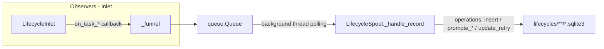

# src/celestialflow/persist/core_lifecycle.py

> 📅 Last Updated: 2026/10/09

`persist/core_lifecycle.py` is responsible for task Lifecycle persistence: it records the state transitions of a task throughout its lifecycle (pending → success / failed / skipped, as well as retry count updates), and writes the data into SQLite database files under the `lifecycles/` directory. The core components are `LifecycleSpout` and `LifecycleInlet`.

## Architecture Design

### Data Flow



The system uses a **Producer-Consumer** pattern:

1. **LifecycleInlet (producer + observer)**: inherits `BaseInlet, Observer`, wraps task lifecycle events into operation dictionaries in the `on_task_*` event callbacks, and puts them into a thread-safe queue via `_funnel()`.
2. **LifecycleSpout (consumer)**: inherits `BaseSpout`, runs in an independent background thread, continuously monitors the queue, and executes the corresponding SQLite write operations according to the operation type (`__op__`).

## LifecycleSpout

`LifecycleSpout` inherits `BaseSpout` and is responsible for managing the creation and writing of the SQLite database file.

### Initialization and Startup

```python
class LifecycleSpout(BaseSpout):
    def __init__(self) -> None:
        """Initialize the lifecycle record listener."""

    self.db_path: Path | None = None
```

After startup (`_before_start()`), a `flow_lifecycle({time}).sqlite3` file is created under the `./lifecycles/{date}/` directory and a sqlite connection is established:

```python
from celestialflow.persist import LifecycleSpout

lifecycle_spout = LifecycleSpout()
lifecycle_spout.start()
print(lifecycle_spout.db_path)  # ./lifecycles/2026-10-09/flow_lifecycle(....).sqlite3
```

`_after_stop()` calls `commit()` first and then closes the connection, ensuring remaining transactions are flushed to disk.

### _handle_record Operation Types

`LifecycleSpout._handle_record` executes different SQLite operations based on `record["__op__"]`:

| Operation | Triggered Callback | Description |
|------|---------|------|
| `insert` | `LifecycleInlet.on_task_input()` | A new task enters a node; writes a `pending` record |
| `promote_success` | `LifecycleInlet.on_task_success()` | Promotes the pending record to `success`; writes the result JSON |
| `promote_failed` | `LifecycleInlet.on_task_fail()` | Promotes the pending record to `failed`; switches to the error event ID and writes the error type and message |
| `promote_skipped` | `LifecycleInlet.on_task_skip()` | Promotes the pending record to `skipped`; switches to the skipped event ID |
| `update_retry` | `LifecycleInlet.on_task_retry()` | Keeps the `pending` state, only updates `retry_times` and the error type / message of the most recent failure |

Each operation calls `commit()` immediately after the record is actually modified; an unknown `__op__` or an uninitialized connection raises an exception.

### File Path

Lifecycle data is saved under `./lifecycles/` by default, archived by date:

```text
./lifecycles/
└── 2026-10-09/
    └── flow_lifecycle(14-30-05-123).sqlite3
```

## LifecycleInlet

`LifecycleInlet` inherits `BaseInlet, Observer` and is a thread-safe write wrapper that consumes task events as an observer. It only overrides the task event callbacks that produce lifecycle records; the remaining events use `Observer`'s default no-op implementations.

### Event Callbacks

```python
class LifecycleInlet(BaseInlet, Observer):
    def on_task_input(self, event: TaskInputEvent) -> None:
        """Write a pending record indicating that a task has entered a node."""

    def on_task_success(self, event: TaskSuccessEvent) -> None:
        """Promote the pending record for a successfully processed task to success and write the result."""

    def on_task_fail(self, event: TaskFailEvent) -> None:
        """Promote the pending record to failed and bind the final error_id."""

    def on_task_skip(self, event: TaskSkipEvent) -> None:
        """Promote the pending record to skipped, indicating the task was skipped without execution."""

    def on_task_retry(self, event: TaskRetryEvent) -> None:
        """Update the pending record's retry count and the error info of the most recent failure."""
```

Notes:

- The task in `on_task_input` is serialized via `to_persisted_payload()` into a JSON-friendly structure and stored in the `task_json` field.
- `on_task_fail` persists `error_type` (exception class name) together with `error_message` (`str(error)`), and switches to `error_id`.
- `on_task_retry` only updates `retry_times` and the most recent error info; the record stays in the `pending` state, and is ultimately promoted by `on_task_success` / `on_task_fail`.
- `LifecycleInlet` only writes to the queue and does not directly operate on the database; all I/O is performed in the background thread of `LifecycleSpout`.

### Binding a Spout

```python
lifecycle_inlet = LifecycleInlet().bind_spout(lifecycle_spout)
```

`bind_spout()` comes from `BaseInlet`, associating the inlet with the spout; after that, `_funnel()` writes records into the spout's consuming queue.

## Usage Example

```python
from celestialflow.observer import ObserverHub, TaskInputEvent
from celestialflow.persist import LifecycleInlet, LifecycleSpout

lifecycle_spout = LifecycleSpout()
lifecycle_spout.start()

lifecycle_inlet = LifecycleInlet().bind_spout(lifecycle_spout)

# Register as an observer on a hub to consume task events
hub = ObserverHub()
hub.add_observer(lifecycle_inlet)

# Simulate a node producing a task event (in reality, the node emits it at runtime)
hub.on_task_input(
    TaskInputEvent(node="StageA", task="hello", task_repr="hello", input_id=1)
)

lifecycle_spout.stop()
```

In actual usage, `LifecycleInlet` is usually assembled by `assembly/core_run.py` and persists task lifecycles during task graph execution. To read persisted records, use the `load_records` / `load_task_error_records` / `load_task_result_records` functions of `util_sqlite`.

## Notes

1. **SQLite storage**: uses WAL mode + `check_same_thread=False`, supporting cross-thread read/write (see `util_sqlite.connect_db`).
2. **Immediate commit**: each write operation commits immediately after the record is actually modified, ensuring no data is lost.
3. **Inlet only writes the queue**: it does not directly operate on the database; all I/O is performed in the background thread of `LifecycleSpout`.
4. **Observer-callback driven**: this class no longer provides manual invocation methods such as `task_input` / `task_success`; instead it consumes lifecycle events through the `on_*` event callbacks.