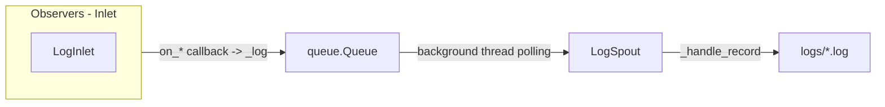

# src/celestialflow/persist/core_log.py

> 📅 Last Updated: 2026/10/09

The `persist/core_log.py` module provides a thread-safe logging system that, via a producer-consumer pattern, uniformly collects, formats, and persists logs to text files under the `logs/` directory. The core components are `LogSpout` and `LogInlet`.

## Architecture Design

### Data Flow

The logging system uses a producer-consumer pattern. The complete data flow is as follows:



### Log Level Filtering

The `LogInlet._log()` method performs level filtering before writing to the queue: the level must be a known level in `LEVEL_DICT` and not lower than the `log_level` threshold; otherwise it is dropped.

### Observer Pattern

`LogInlet` inherits `BaseInlet, Observer`, wiring the logging system into the event bus:

1. **LogInlet (producer + observer)**:
   - Overrides all event callbacks (graph / node / task / termination signal / worker crash), calling `_log()` in the callbacks to record the corresponding logs.
   - When recording node start/stop, reads node summaries through `metrics_view` (such as input totals, success / failure / skip counts).
   - Supports log-level-based filtering to reduce unnecessary communication.

2. **LogSpout (consumer)**:
   - Inherits `BaseSpout`, runs in an independent background thread.
   - Retrieves log records from the queue and writes them to a file.

## Log Levels

The system supports the following standard log levels (higher value = higher priority, see `runtime.util_constant.LEVEL_DICT`):

| Level | Value | Description |
|------|----|------|
| TRACE | 0 | Most detailed trace information, such as termination signal merging |
| DEBUG | 10 | Debug information, such as task input, termination signal input |
| SUCCESS | 20 | Key operation successes, such as task completion |
| INFO | 30 | General information, such as node / graph start-stop, graph structure printing |
| WARNING | 40 | Warnings, such as task retry |
| ERROR | 50 | Error information, such as task failure |
| CRITICAL | 60 | Critical errors, such as node / worker crash |

## LogSpout

`LogSpout` inherits `BaseSpout` and is responsible for log file configuration and write thread management.

### Initialization

```python
spout = LogSpout()
spout.start()
```

After startup, logs are written to the `logs/flow_log({date}).log` file, opened with line buffering (`buffering=1`) so readers can see newly appended logs in a timely manner.

### File Path

```text
logs/
└── flow_log(2026-10-09).log
```

## LogInlet

`LogInlet` inherits `BaseInlet, Observer`, consuming all events as an observer and handing the logs to the spout via the queue for persistence.

### Initialization

```python
inlet = LogInlet(metrics_view, log_level="INFO").bind_spout(log_spout)
```

- `metrics_view`: metric read-only view (`MetricsView`), used to record node summaries at node start/stop.
- `log_level`: the minimum log level; logs below this level are not recorded; an invalid level throws `InvalidOptionError`.

### Event Callbacks and Log Levels

All methods are grouped by event domain as follows:

#### Task Graph (Graph)

| Callback | Log Level | Description |
|------|---------|------|
| `on_graph_start(event)` | INFO | Records task graph startup and structure information (rendered via `util_render`) |
| `on_graph_end(event)` | INFO | Records task graph completion and elapsed time |

#### Node (Node)

| Callback | Log Level | Description |
|------|---------|------|
| `on_node_start(event)` | INFO | Records node startup, and outputs the number of executed tasks and the execution mode |
| `on_node_end(event)` | INFO | Records node completion, and outputs success / failure / skip statistics and elapsed time |

#### Worker Thread (Worker)

| Callback | Log Level | Description |
|------|---------|------|
| `on_worker_crash(event)` | CRITICAL | Records a worker crash |

#### Task (Task)

| Callback | Log Level | Description |
|------|---------|------|
| `on_task_input(event)` | DEBUG | Records a task entering the input queue and its source |
| `on_task_success(event)` | SUCCESS | Records a successful task completion |
| `on_task_skip(event)` | SUCCESS | Records a task being skipped |
| `on_task_retry(event)` | WARNING | Records a task that failed but triggered a retry |
| `on_task_fail(event)` | ERROR | Records a task that failed and cannot be retried |

> Split and Router no longer have dedicated logs: the input dispatch of `TaskSplitter` / `TaskRouter` uniformly goes through `on_task_input`, and success uniformly goes through `on_task_success`.

#### Termination Signal (Termination)

| Callback | Log Level | Description |
|------|---------|------|
| `on_termination_input(event)` | DEBUG | Records termination signal input |
| `on_termination_merge(event)` | TRACE | Records termination signal merge |

### Usage Example

```python
from celestialflow.persist import LogSpout, LogInlet
from celestialflow.observer import MetricsObserver

metrics_view = MetricsObserver()
log_spout = LogSpout()
log_spout.start()

inlet = LogInlet(metrics_view, log_level="INFO").bind_spout(log_spout)
# Register the inlet on the node's ObserverHub to consume events and record logs
# hub.on_node_start(NodeStartEvent(node="NodeA", ...)) -> writes a log

log_spout.stop()
```

Recording logs through observer callbacks (rather than generic `info()` / `debug()`) ensures the generated logs are structured, readable, and easy to parse by machines.

## Notes

1. **The constructor requires `metrics_view`**: `LogInlet(metrics_view, log_level)` must be passed a metric read-only view, used for the summary output at node start/stop.
2. **Observer-callback driven**: no longer provides manual invocation methods such as `task_input` / `node_start`; instead logs are recorded through `on_*` event callbacks.
3. **Line-buffered writes**: the log file is opened with `buffering=1`, so writes are immediately visible.