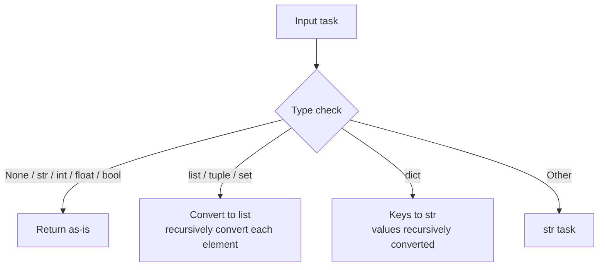

# src/celestialflow/persist/util_payload.py

> 📅 Last Updated: 2026/10/09

`persist/util_payload.py` provides a persistence serialization utility for task data, recursively converting arbitrary Python objects into JSON-friendly structures.

## Core Function

### to_persisted_payload

```python
def to_persisted_payload(task: Any) -> Any:
    """
    Convert a task into a JSON-friendly persistable structure.

    :param task: Task data to be serialized
    :return: A JSON-friendly persistable structure
    """
```

**Conversion Rules:**

| Input Type | Output | Description |
|---------|------|------|
| `None` / `str` / `int` / `float` / `bool` | Returned as-is | Already JSON-native types |
| `list` / `tuple` / `set` | `list` | Recursively convert each element |
| `dict` | `dict` | Keys converted to `str`, values recursively converted |
| Other types | `str(task)` | Converted to string representation |



## Usage Examples

### Primitive Types Pass Through Directly

```python
from celestialflow.persist.util_payload import to_persisted_payload

print(to_persisted_payload(42))  # 42
print(to_persisted_payload("hello"))  # "hello"
print(to_persisted_payload(True))  # True
print(to_persisted_payload(None))  # None
```

### Compound Types Recursively Converted

```python
from celestialflow.persist.util_payload import to_persisted_payload

# List
result = to_persisted_payload([1, "a", True])
print(result)  # [1, 'a', True]

# Nested dict
result = to_persisted_payload({"score": 95, "tags": ["a", "b"]})
print(result)  # {'score': 95, 'tags': ['a', 'b']}


# Custom object
class MyTask:
    def __str__(self):
        return "MyTask(id=1)"


result = to_persisted_payload(MyTask())
print(result)  # "MyTask(id=1)"
```

### Usage in LifecycleInlet

`to_persisted_payload` is mainly called internally by `LifecycleInlet` to convert task data into JSON strings storable in SQLite:

```python
# Internal flow of LifecycleInlet.on_task_input (observer callback):
from datetime import datetime

pending_item = {
    "__op__": "insert",
    "record": {
        "event_id": event.input_id,
        "ts": datetime.now().timestamp(),
        "node": event.node,
        "status": "pending",
        "task_json": to_persisted_payload(event.task),  # auto-serialized
    },
}
```

## Notes

- The serialization strategy is **best-effort**: for objects that cannot be directly JSON-serialized, it falls back to `str()` string representation.
- The function result is finally written by `LifecycleSpout` via the `util_sqlite` layer as `json.dumps` into the SQLite `task_json` field.
- This module is only responsible for data format conversion; it does not involve any file I/O.