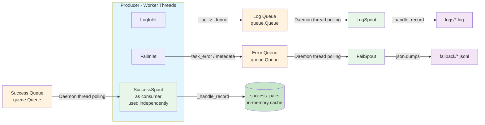

# Persistence Module

> 📅 Last Updated: 2026/05/24

The Persistence module provides data persistence features for CelestialFlow, including execution log recording, error information storage, success result caching, and configuration constant management. It ensures that critical data from task execution can be reliably saved and retrieved.

## Module Overview

The Persistence module is responsible for persisting runtime data to the local file system, supporting log recording, error tracking, and success result caching. The module adopts a producer-consumer (Spout/Inlet) pattern, seamlessly integrating into the task execution flow without affecting main flow performance.

## Exports

| Exported Symbol | Source Module | Description |
|----------------|---------------|-------------|
| `FailSpout` | `core_fail` | Failure record listener, writes error information to JSONL files in the fallback directory |
| `FailInlet` | `core_fail` | Thread-safe failure record collector, sends errors to `FailSpout` for writing via a queue |
| `LogSpout` | `core_log` | Log listener thread, writes logs to text files in the `logs/` directory |
| `LogInlet` | `core_log` | Thread-safe log collector, provides rich semantic logging methods |
| `SuccessSpout` | `core_success` | Success result listener thread, continuously reads the success queue and caches task-result pairs |

## File Description

### Log Persistence

1. **core_log.py** (`LogSpout`, `LogInlet`)
   - **Purpose**: Infrastructure for log recording and storage
   - **Core Components**:
     - `LogSpout`: Log listener thread, receives log messages from the queue and writes to text files in the `logs/` directory
     - `LogInlet`: Thread-safe log collector, provides semantic logging methods (task success/failure/retry, stage start/stop, queue operations, etc.)
   - **Log Format**: Plain text format, each line containing `timestamp level message`
   - **Key Features**: Asynchronous writing, level filtering, rich lifecycle logging methods

### Error Persistence

2. **core_fail.py** (`FailSpout`, `FailInlet`)
   - **Purpose**: Infrastructure for error information recording and storage
   - **Core Components**:
     - `FailSpout`: Failure record listener, receives error information from the queue and writes to JSONL files in the `fallback/` directory
     - `FailInlet`: Thread-safe error collector, sends error information to `FailSpout` for writing via a queue
   - **Error Format**: JSONL (JSON Lines), containing fields such as `ts`, `error_type`, `error_message`, `error_repr`, `stage`, `task`
   - **Key Features**: JSONL file storage, error counter, metadata recording

### Success Result Persistence

3. **core_success.py** (`SuccessSpout`)
   - **Purpose**: Success result listener thread, continuously reads from the success result queue and caches task-result pairs
   - **Core Components**:
     - `SuccessSpout`: Inherits from `BaseSpout`, caches `(task, result)` pairs
   - **Key Features**: Success result caching, task-result pair extraction

### Data Format and Configuration

4. **util_jsonl.py**
   - **Purpose**: JSON Lines format support for efficient structured data storage and reading
   - **Key Functions**:
     - `load_jsonl_logs()`: Loads log data from JSONL files, supports selective field reading and line offset
     - `parse_jsonl_value()`: Intelligently parses JSONL field values (supports `ast.literal_eval` deserialization)
     - `load_jsonl_by_key()`: Loads JSONL data grouped by a specified field
     - `load_jsonl_grouped_by_keys()`: Loads JSONL data grouped by multiple fields
     - `load_task_by_stage()`: Loads error records grouped by stage
     - `load_task_by_error()`: Loads error records grouped by error and stage
     - `load_task_error_pairs()`: Loads error records, returning a list of `(task, error)` pairs
   - **Use Cases**: Error log reading, error record analysis, Web interface data display

5. **util_constant.py**
   - **Purpose**: Persistence-related constants and configuration definitions
   - **Contents**:
     - `LEVEL_DICT`: Log level dictionary defining log levels and their corresponding numeric values
     - Log levels include: TRACE(0), DEBUG(10), SUCCESS(20), INFO(30), WARNING(40), ERROR(50), CRITICAL(60)
   - **Key Features**: Unified log level management, level comparison, log filtering

## Module Dependencies

### Internal Dependencies
- All persistence classes inherit from `BaseSpout`/`BaseInlet` (defined in the Funnel module)
- `LogSpout`/`LogInlet` and `FailSpout`/`FailInlet` are used in pairs
- `SuccessSpout` is used independently for caching success results
- Utility classes are used by core classes, providing format support and configuration management

### External Dependencies
- **Runtime Module**: Monitors logs and errors generated at runtime
- **Stage Module**: Records task execution status and results
- **Observability Module**: Provides raw data for monitoring and analysis
- **Utils Module**: Uses utility functions for data processing and formatting

## Architecture Characteristics

### Asynchronous Non-Blocking Design
- Spouts run in background threads without blocking the main flow
- Inlets send data via queues, non-blocking writes
- Batch commits to improve storage efficiency

### Producer-Consumer Pattern



### JSONL Format (Error Persistence)
- One JSON record per line, facilitating streaming processing
- Supports selective field reading
- Compatible with `ast.literal_eval` deserialization

### File Naming Convention

| Persistence Type | File Path Pattern |
|-----------------|-------------------|
| Logs | `logs/task_logger({date}).log` |
| Errors | `fallback/{date}/{source}({time}).jsonl` |

## Usage Patterns

### Basic Configuration
```python
from celestialflow.persistence import LogSpout, LogInlet, FailSpout, FailInlet

# Configure log persistence
log_spout = LogSpout()
log_spout.start()
log_inlet = LogInlet(log_spout.get_queue())

# Configure error persistence
fail_spout = FailSpout(error_source="graph_errors")
fail_spout.start()
fail_inlet = FailInlet(fail_spout.get_queue())
```

### Recording Logs
```python
# Record stage start/stop
log_inlet.start_stage("StageA", "thread", "thread", 4)
log_inlet.end_stage("StageA", "thread", "thread", 12.5, 100, 2, 0)

# Record task lifecycle
log_inlet.task_success("func", "task1", "thread", "result", 0.05, 1, 2)
log_inlet.task_error("func", "task2", ValueError("bad"), 3, 4)
```

### Recording Errors
```python
fail_inlet.start_graph([{"name": "StageA", ...}])
fail_inlet.start_executor("Executor-1")
fail_inlet.task_error("StageA", 1, ValueError("invalid"), task_data)
```

### Reading Error Data
```python
from celestialflow.persistence.util_jsonl import (
    load_jsonl_logs,
    load_task_error_pairs,
    parse_jsonl_value,
)

# Read error logs
errors = load_jsonl_logs("fallback/2026-01-01/errors(10-00-00-000).jsonl")

# Get (task, error) pairs
pairs = load_task_error_pairs("fallback/2026-01-01/errors(10-00-00-000).jsonl")

# Parse task value
task = parse_jsonl_value("[1, 2, 3]")  # returns (1, 2, 3)
```
