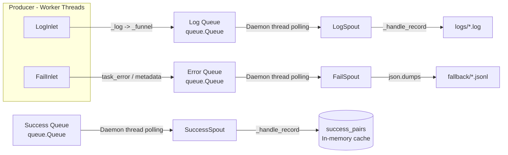

# Persistence Module

> 📅 Last Updated: 2026/06/11

The Persistence module provides CelestialFlow's data persistence functionality, including execution log recording, error information storage, and success result caching. It ensures that key data from task execution can be reliably saved and retrieved.

## Exported Symbols

| Exported Symbol | Source Module | Description |
|---------|---------|------|
| `FailSpout` | `core_fail` | Failure record listener, writes error information to JSONL files in the fallback directory |
| `FailInlet` | `core_fail` | Thread-safe failure record collector, sends errors to `FailSpout` via queue for writing |
| `LogSpout` | `core_log` | Log listening thread, writes logs to text files in the `logs/` directory |
| `LogInlet` | `core_log` | Thread-safe log collector, providing rich semantic logging methods |
| `SuccessSpout` | `core_success` | Success result listening thread, continuously reads from the success queue and caches task-result pairs |

## File Descriptions

### Log Persistence

1. **core_log.py** (`LogSpout`, `LogInlet`)
   - **Purpose**: Infrastructure for log recording and storage
   - **Core Components**:
     - `LogSpout`: Log listening thread, receives log messages from the queue and writes them to text files in the `logs/` directory
     - `LogInlet`: Thread-safe log collector, providing semantic logging methods (task success/failure/retry, stage start/stop, queue operations, etc.)
   - **Log Format**: Plain text format, each line contains `timestamp level message`

### Error Persistence

2. **core_fail.py** (`FailSpout`, `FailInlet`)
   - **Purpose**: Infrastructure for error information recording and storage
   - **Core Components**:
     - `FailSpout`: Failure record listener, receives error information from the queue and writes it to JSONL files in the `fallback/` directory
     - `FailInlet`: Thread-safe error collector, sends error information to `FailSpout` via queue for writing
   - **Error Format**: JSONL (JSON Lines), one record per line

### Success Result Persistence

3. **core_success.py** (`SuccessSpout`)
   - **Purpose**: Success result listening thread, continuously reads from the success result queue and caches task-result pairs
   - **Core Components**:
     - `SuccessSpout`: Inherits from `BaseSpout`, caches `(task, result)` pairs

### JSONL Utility

4. **util_jsonl.py**
   - **Purpose**: JSON Lines format support for efficient structured data storage and reading
   - **Key Functions**:
     - `load_jsonl_logs()`: Load log data from JSONL files, supporting selective field reading and line offsets
     - `parse_jsonl_value()`: Smart parsing of JSONL field values (supports `ast.literal_eval` deserialization)
     - `load_jsonl_by_key()`: Load JSONL data grouped by a specified field
     - `load_jsonl_grouped_by_keys()`: Load JSONL data grouped by multiple fields
     - `load_task_by_stage()`: Load error records grouped by stage
     - `load_task_by_error()`: Load error records grouped by error and stage
     - `load_task_error_pairs()`: Load error records, returning a list of `(task, error)` pairs


## Module Relationships

### Internal Relationships
- All persistence classes inherit from `BaseSpout`/`BaseInlet` (defined in the Funnel module)
- `LogSpout`/`LogInlet` and `FailSpout`/`FailInlet` are used in pairs
- `SuccessSpout` is used independently, caching success results

### External Relationships
- **With Runtime Module**: Listens to logs and errors generated at runtime, references `LEVEL_DICT`
- **With Stage Module**: Records task execution status and results
- **With Observability Module**: Provides raw data for monitoring and analysis
- **With Funnel Module**: Inherits from `BaseSpout`/`BaseInlet` base classes

## Architecture Features

### Async Non-Blocking Design
- Spout runs in a background thread, not blocking the main flow
- Inlet sends data via queue, non-blocking writes
- Batch flushing reduces I/O frequency

### Producer-Consumer Pattern



### File Naming Convention

| Persistence Type | File Path Pattern |
|-----------|-------------|
| Log | `logs/task_logger({date}).log` |
| Error | `fallback/{date}/{source}({time}).jsonl` |

### Batch Flush Strategy

| Component | Flush Threshold | Description |
|------|---------|------|
| `LogSpout` | Every 5 records | High log volume, higher threshold |
| `FailSpout` | Every 1 record | Error data is critical, immediate flush |

## Usage Examples

### Basic Configuration

```python
from celestialflow.persistence import LogSpout, LogInlet, FailSpout, FailInlet

# Configure log persistence
log_spout = LogSpout()
log_spout.start()
log_inlet = LogInlet(log_spout.get_queue(), log_level="SUCCESS")

# Configure error persistence
fail_spout = FailSpout(error_source="graph_errors")
fail_spout.start()
fail_inlet = FailInlet(fail_spout.get_queue())
```

### Recording Logs

```python
# Record stage start/stop
log_inlet.start_stage("StageA", "thread", "thread-4")
log_inlet.end_stage("StageA", "thread", "thread-4", 12.5, 100, 2, 0)

# Record task lifecycle
log_inlet.task_success("func", "task1", "thread", "result", 0.05, 1, 2)
log_inlet.task_error("func", "task2", ValueError("bad"), 3, 4)
```

### Recording Errors

```python
fail_inlet.start_graph("my_graph", {"stages": ["A", "B"], "edges": [("A","B")]})
fail_inlet.start_executor("Executor-1")
fail_inlet.task_error("StageA", 1, ValueError("invalid"), task_data)
```

### Reading Error Data

```python
from celestialflow.persistence.util_jsonl import (
    load_jsonl_logs,
    load_task_error_pairs,
    parse_jsonl_value,
)

# Read error logs
errors = load_jsonl_logs("fallback/2026-01-01/errors(10-00-00-000).jsonl")

# Get (task, error) pairs
pairs = load_task_error_pairs("fallback/2026-01-01/errors(10-00-00-000).jsonl")

# Parse task value
task = parse_jsonl_value("[1, 2, 3]")  # Returns (1, 2, 3)
```
