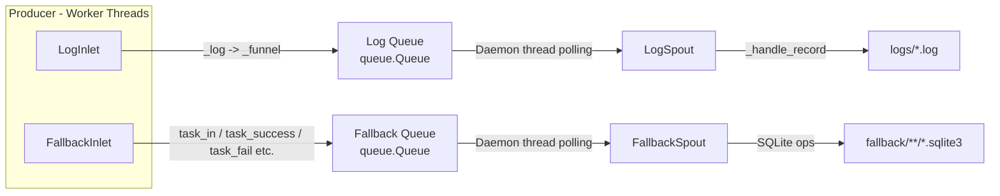

# Persistence Module

> 📅 Last Updated: 2026/06/18

The Persistence module provides CelestialFlow's data persistence functionality, including execution log recording and fallback persistence. It ensures that key data from task execution can be reliably saved and retrieved.

> ⚠️ **Changed**: This module has undergone a major refactoring. `FailSpout`/`FailInlet` → `FallbackSpout`/`FallbackInlet`, `SuccessSpout` has been removed (functionality merged into `FallbackSpout`), JSONL file storage → SQLite database. Old docs `core_fail.md`, `core_success.md`, `util_jsonl.md` are still retained but marked as deprecated.

## Exported Symbols

| Exported Symbol | Source Module | Description |
|---------|---------|------|
| `FallbackInlet` | `core_fallback` | Thread-safe fallback record collector, sends task lifecycle events to `FallbackSpout` via queue |
| `FallbackSpout` | `core_fallback` | Fallback record listener, writes task lifecycle to SQLite database |
| `LogInlet` | `core_log` | Thread-safe log collector, providing rich semantic logging methods |
| `LogSpout` | `core_log` | Log listening thread, writes logs to text files in the `logs/` directory |

## File Descriptions

### Log Persistence

1. **core_log.py** (`LogSpout`, `LogInlet`)
   - **Purpose**: Infrastructure for log recording and storage
   - **Core Components**:
     - `LogSpout`: Log listening thread, receives log messages from the queue and writes them to text files in the `logs/` directory
     - `LogInlet`: Thread-safe log collector, providing semantic logging methods (task success/failure/retry, stage start/stop, queue operations, etc.)
   - **Log Format**: Plain text format, each line contains `timestamp level message`

### Fallback Persistence

2. **core_fallback.py** (`FallbackSpout`, `FallbackInlet`)
   - **Purpose**: Task lifecycle fallback persistence, uniformly handling success and failure results
   - **Core Components**:
     - `FallbackSpout`: Inherits `BaseSpout`, persists task lifecycle events via SQLite
     - `FallbackInlet`: Thread-safe collector, providing `task_in`/`task_success`/`task_fail`/`task_retry`/`task_duplicate` methods
   - **Storage Format**: SQLite database (WAL mode)

### Data Serialization

3. **util_payload.py**
   - **Purpose**: Recursively converts task data into JSON-friendly persistable structures
   - **Key Function**: `to_persisted_payload(task)` — Converts arbitrary Python objects into JSON-serializable structures

### SQLite Utilities

4. **util_sqlite.py**
   - **Purpose**: SQLite database connection management and CRUD operation utilities
   - **Key Functions**: `connect_db`, `insert_record`, `load_records`, `query_records`, `load_task_error_records`, etc.

## Module Relationships

### Internal Relationships
- All persistence classes inherit from `BaseSpout`/`BaseInlet` (defined in the Funnel module)
- `FallbackSpout`/`FallbackInlet` and `LogSpout`/`LogInlet` are used in pairs
- `FallbackSpout` uniformly handles success and failure results, replacing the old standalone `SuccessSpout`

### External Relationships
- **With Runtime Module**: Listens to logs and errors generated at runtime, references `LEVEL_DICT`
- **With Stage Module**: Records task execution status and results
- **With Observability Module**: Provides raw data for monitoring and analysis
- **With Funnel Module**: Inherits from `BaseSpout`/`BaseInlet` base classes

## Architecture Features

### Async Non-Blocking Design
- Spout runs in a background thread, not blocking the main flow
- Inlet sends data via queue, non-blocking writes

### Producer-Consumer Pattern



### File Naming Convention

| Persistence Type | File Path Pattern |
|-----------|-------------|
| Log | `logs/task_logger({date}).log` |
| Fallback | `fallback/{date}/{source}({time}).sqlite3` |

## Usage Examples

### Basic Configuration

```python
from celestialflow.persistence import LogSpout, LogInlet, FallbackSpout, FallbackInlet

# Configure log persistence
log_spout = LogSpout()
log_spout.start()
log_inlet = LogInlet(log_spout.get_queue(), log_level="SUCCESS")

# Configure fallback persistence
fallback_spout = FallbackSpout(error_source="graph_errors")
fallback_spout.start()
fallback_inlet = FallbackInlet(fallback_spout.get_queue())
```

### Recording Logs

```python
# Record stage start/stop
log_inlet.start_stage("StageA", "thread", "thread-4")
log_inlet.end_stage("StageA", "thread", "thread-4", 12.5, 100, 2, 0)

# Record task lifecycle
log_inlet.task_success("func", "task1", "thread", "result", 0.05, 1, 2)
log_inlet.task_fail("func", "task2", ValueError("bad"), 3, 4)
```

### Recording Fallback

```python
# Task enters
fallback_inlet.task_in("StageA", event_id=1, task="hello")

# Task succeeds
fallback_inlet.task_success(event_id=1, result="OK", persist=True)

# Task fails
fallback_inlet.task_fail(event_id=2, error_id=10, error=ValueError("bad"))
```

### Reading Persisted Data

```python
from celestialflow.persistence.util_sqlite import load_records, load_task_error_records

# Read failure records
errors = load_task_error_records("fallback/2026-06-18/errors.sqlite3", "StageA")
for task, (error_type, error_msg) in errors:
    print(f"{task}: {error_type} - {error_msg}")
```
