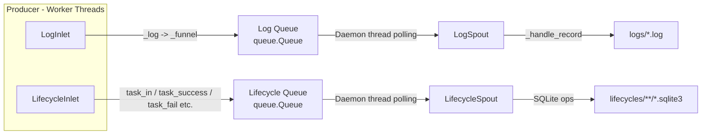

# Persistence Module

> 📅 Last Updated: 2026/08/26

The Persistence module provides CelestialFlow's data persistence capabilities, including task Lifecycle recording and execution Logs. It ensures that key data from task execution can be reliably saved and retrieved.

## Exported Symbols

| Exported Symbol | Source Module | Description |
|---------|---------|------|
| `LifecycleInlet` | `core_lifecycle` | Thread-safe lifecycle record collector, sends task lifecycle events to `LifecycleSpout` via queue |
| `LifecycleSpout` | `core_lifecycle` | Lifecycle record listener, writes task lifecycle to SQLite database |
| `LogInlet` | `core_log` | Thread-safe log collector, providing rich semantic logging methods |
| `LogSpout` | `core_log` | Log listening thread, writes logs to text files in the `logs/` directory |
| `funnel_scope` | `core_scope` | Context manager that manages the lifecycle of the global `LifecycleSpout` and `LogSpout` |
| `get_lifecycle_inlet` | `core_lifecycle` | Get the global unique `LifecycleInlet` instance |
| `get_lifecycle_spout` | `core_lifecycle` | Get the global unique `LifecycleSpout` instance |
| `get_log_inlet` | `core_log` | Get the global unique `LogInlet` instance |
| `get_log_spout` | `core_log` | Get the global unique `LogSpout` instance |

## File Descriptions

### Lifecycle Persistence

1. **core_lifecycle.py** (`LifecycleSpout`, `LifecycleInlet`)
   - **Purpose**: Persistence of task lifecycle, uniformly records task pending / success / failed / duplicate states
   - **Core Components**:
     - `LifecycleSpout`: Inherits `BaseSpout`, persists task lifecycle events via SQLite
     - `LifecycleInlet`: Thread-safe collector, providing `task_in` / `task_success` / `task_fail` / `task_duplicate` methods
   - **Storage Format**: SQLite database (WAL mode), files located under the `lifecycles/` directory

### Log Persistence

2. **core_log.py** (`LogSpout`, `LogInlet`)
   - **Purpose**: Infrastructure for log recording and storage
   - **Core Components**:
     - `LogSpout`: Log listening thread, receives log messages from the queue and writes them to text files under the `logs/` directory
     - `LogInlet`: Thread-safe log collector, providing semantic logging methods (task success/failure/retry, graph/layer start/stop, reporter events, etc.)
   - **Log Format**: Plain text format, each line contains `timestamp level message`

### Scope Management

3. **core_scope.py** (`funnel_scope`)
   - **Purpose**: Context manager that manages the lifecycle of the global `LifecycleSpout` and `LogSpout`
   - **Key Features**: Starts the two spouts on entry, stops and collects exceptions on exit; throws uniformly as `ExceptionGroup`

### Data Serialization

4. **util_payload.py**
   - **Purpose**: Recursively converts task data into JSON-friendly persistable structures
   - **Key Function**: `to_persisted_payload(task)` — Converts arbitrary Python objects into JSON-serializable structures

### SQLite Utilities

5. **util_sqlite.py**
   - **Purpose**: SQLite database connection management and CRUD operation utilities
   - **Key Functions**: `connect_db`, `insert_record`, `promote_record_to_*`, `load_records`, `query_records`, `load_task_error_records`, etc.

## Module Relationships

### Internal Relationships
- All persistence classes inherit from `BaseSpout`/`BaseInlet` (defined in the Funnel module)
- `LifecycleSpout`/`LifecycleInlet` and `LogSpout`/`LogInlet` are used in pairs, with their lifecycle uniformly managed by `funnel_scope`

### External Relationships
- **With Runtime Module**: Listens to logs and errors generated at runtime, references `LEVEL_DICT`
- **With Stage Module**: Records task execution status and results; `TaskExecutor` writes records via `get_log_inlet()` / `get_lifecycle_inlet()`
- **With Observability Module**: Provides raw data for monitoring and analysis; `TaskReporter` reads failure records from the lifecycle database and pushes them incrementally
- **With Funnel Module**: Inherits `BaseSpout`/`BaseInlet` base classes

## Architecture Features

### Async Non-Blocking Design
- Spout runs in a background thread, not blocking the main flow
- Inlet sends data via queue, non-blocking writes

### Producer-Consumer Pattern


```mermaid
flowchart LR
    subgraph Producer[Producer - Worker Threads]
        LogInlet[LogInlet]
        LifecycleInlet[LifecycleInlet]
    end

    LogInlet -->|_log -> _funnel| LogQueue[Log Queue<br/>queue.Queue]
    LifecycleInlet -->|task_in / task_success / task_fail etc.| LifecycleQueue[Lifecycle Queue<br/>queue.Queue]

    LogQueue -->|Daemon thread polling| LogSpout[LogSpout]
    LifecycleQueue -->|Daemon thread polling| LifecycleSpout[LifecycleSpout]

    LogSpout -->|_handle_record| LogFile[logs/*.log]
    LifecycleSpout -->|SQLite ops| SQLiteFile[lifecycles/**/*.sqlite3]
```

### File Naming Convention

| Persistence Type | File Path Pattern |
|-----------|-------------|
| Log | `logs/flow_log({date}).log` |
| Lifecycle | `./lifecycles/{date}/flow_lifecycle({time}).sqlite3` |

### Batch Refresh Strategy

- Log files are written with **line buffering** (`buffering=1`), so readers can see new logs in a timely manner without an explicit refresh counter.
- Lifecycle SQLite writes use **immediate commit**: `LifecycleSpout._handle_record()` calls `commit()` immediately after each operation actually modifies a record, ensuring no data is lost; `_after_stop()` performs one final `commit()` as a safety net.
- Global spouts do not start/stop with individual executors; they are started and stopped together by `funnel_scope` (or inside `TaskGraph.run()`) for the entire runtime, avoiding frequent file handle opens/closes.

## Usage Examples

### Basic Configuration

```python
from celestialflow.persistence import funnel_scope

# Use funnel_scope to uniformly manage lifecycle
with funnel_scope():
    # LifecycleSpout and LogSpout are automatically started
    # Run business logic...
    ...
# Both spouts are automatically stopped when the scope exits
```

### Recording Logs

```python
from celestialflow.persistence import get_log_inlet

log_inlet = get_log_inlet()

# Record executor start/stop
log_inlet.start_executor("StageA", 100, "thread")
log_inlet.end_executor("StageA", "thread", 12.5, 98, 2, 0)

# Record task lifecycle
log_inlet.task_success("func", "task1", "thread", "result", 0.05, 1, 2)
log_inlet.task_fail("func", "task2", ValueError("bad"), 3, 4)
```

### Recording Lifecycle

```python
from celestialflow.persistence import get_lifecycle_inlet

lifecycle_inlet = get_lifecycle_inlet()

# Task enters
lifecycle_inlet.task_in("StageA", event_id=1, task="hello")

# Task succeeds
lifecycle_inlet.task_success(event_id=1, result="OK")

# Task fails
lifecycle_inlet.task_fail(event_id=2, error_id=10, error=ValueError("bad"))
```

### Reading Persisted Data

```python
from celestialflow.persistence.util_sqlite import load_records, load_task_error_records

# Read failure records
errors = load_task_error_records(
    "lifecycles/2026-08-26/flow_lifecycle(10-00-00-123).sqlite3", "StageA"
)
for task, (error_type, error_msg) in errors:
    print(f"{task}: {error_type} - {error_msg}")
```
