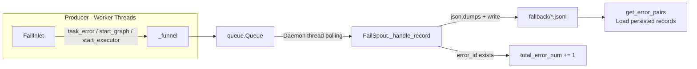
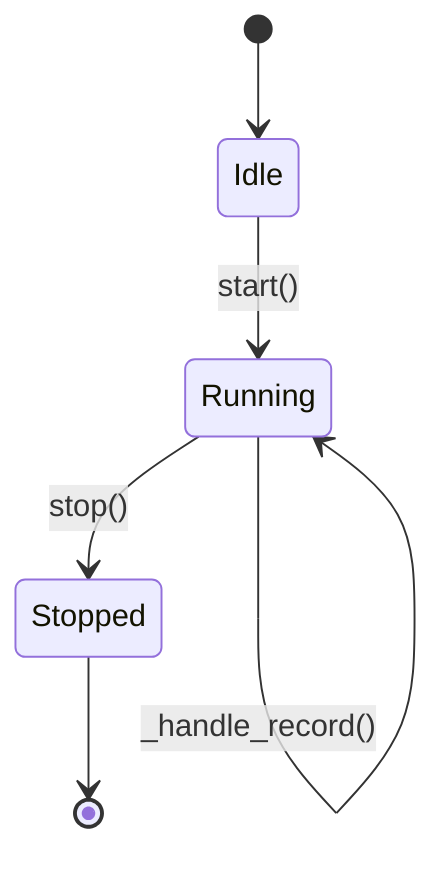

# Error Persistence (Fail Persistence)

> 📅 Last Updated: 2026/06/11

The `celestialflow.persistence` module provides a robust error collection and persistence mechanism, ensuring that all exception information can be safely and orderly recorded during multi-threaded concurrent task execution for subsequent analysis or retry.

The core components include `FailSpout` and `FailInlet`.

## Architecture Design

### Data Flow



The system uses a **Producer-Consumer** pattern to handle error logs:

1.  **FailInlet (Producer)**:
    -   Held by individual Worker threads.
    -   Responsible for encapsulating error information and task metadata into dictionaries.
    -   Places the encapsulated data into a thread-safe queue (`queue.Queue`).

2.  **FailSpout (Consumer)**:
    -   Runs in an independent daemon thread.
    -   Continuously listens to the queue; once a new error record arrives, immediately writes it to a local file.
    -   File format is JSONL (JSON Lines) for convenient streaming read and processing.

This design avoids the problem of multiple threads competing directly for file write locks, guaranteeing high performance and data integrity.

## FailSpout

`FailSpout` is responsible for managing the creation and writing of error log files.

### Initialization and Startup

```python
listener = FailSpout(error_source="graph_errors")
listener.start()
```

-   `error_source`: Error source identifier, used as part of the filename.
-   After startup, a file named `{error_source}({time}).jsonl` is created in the `./fallback/{date}/` directory.
-   Batch flush threshold: flushed every 1 record (`_flush_every = 1`).

### Lifecycle



### File Path

Error logs are saved by default in the `./fallback/` directory, archived by date:

```text
./fallback/
└── 2026-05-24/
    └── graph_errors(14-30-05-123).jsonl
```

### Stopping the Listener

```python
listener.stop()
```

Sends a termination signal to the queue and waits for the background thread to safely exit after processing remaining data.

### Error Counter

`FailSpout` maintains a `total_error_num` counter that automatically increments for each record written with an `error_id`.

### Reading Persisted Records

```python
error_pairs = listener.get_error_pairs()
# Returns list[tuple[Any, PersistedErrorRecord]]
```

## FailInlet

`FailInlet` is the interface for sending data to the error queue.

### Recording Task Errors

When a task execution fails and cannot be retried, `TaskExecutor` calls the `task_error` method to record the error:

```python
sinker.task_error(
    stage_name="MyStage",
    err_id=12345,
    error=ValueError("Invalid input"),
    task=[1, 2, 3]
)
```

The recorded JSONL line contains the following fields:

| Field | Type | Description |
|------|------|------|
| `timestamp` | `str` | Error occurrence time (ISO format) |
| `ts` | `float` | Error occurrence time (Unix timestamp) |
| `stage` | `str` | Name of the stage where the error occurred |
| `error_id` | `int` | Unique error identifier |
| `error_type` | `str` | Exception type name (e.g., `ValueError`) |
| `error_message` | `str` | Exception message text |
| `task` | `Any` | Task data converted via `_to_retry_payload()` (JSON-friendly structure that can be backfilled to the injection page) |

> **Changed**: Previous documentation listed fields such as `error`, `error_repr`, and `task_repr`, but the current source code `FailInlet.task_error()` only writes the above 7 fields. Task data is converted to a JSON-compatible structure via `_to_retry_payload()` before being stored in the `task` field.

### Recording Metadata

`FailInlet` also supports recording startup metadata to help reconstruct the execution environment:

#### start_graph

Records task graph structure information.

```python
sinker.start_graph(
    graph_name="my_pipeline",
    structure_graph={"stages": ["A", "B"], "edges": [("A", "B")]}
)
```

> **Changed**: The signature of `start_graph` is `(graph_name: str, structure_graph: dict[str, Any])`. Previous documentation recorded the parameter `structure_json: list[Any]`, which does not match the current source code.

#### start_executor

Records executor startup information.

```python
sinker.start_executor("Executor-1")
```

## Data Recovery

Since error logs use the standard JSONL format, you can easily write scripts to read these files and extract failed task data for retry or analysis. The framework-provided `celestialflow.persistence.util_jsonl` module offers a wealth of reading helper functions.

```python
from celestialflow.persistence.util_jsonl import (
    load_jsonl_logs,        # General JSONL reading, supports field filtering
    load_task_error_pairs,  # Load (task, error) pairs
    load_task_by_stage,     # Group by stage
)
```
