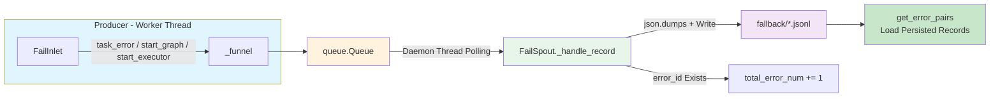
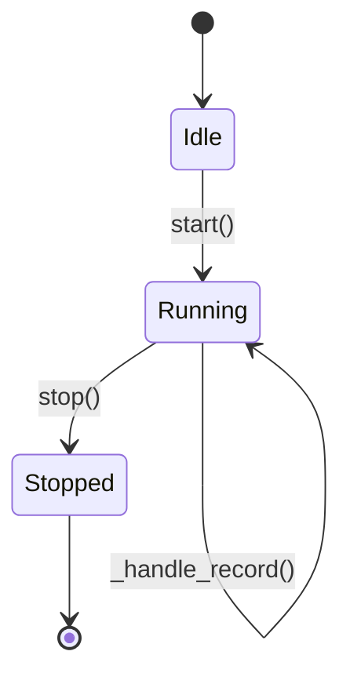

# Fail Persistence

> 📅 Last Updated: 2026/05/28

The `celestialflow.persistence` module provides a robust error collection and persistence mechanism, ensuring that all exception information can be safely and orderly recorded during multi-process concurrent task execution for subsequent analysis or retry.

The core components include `FailSpout` and `FailInlet`.

## Architecture Design

### Data Flow



The system uses a **producer-consumer** pattern to handle error logs:

1.  **FailInlet (Producer)**:
    -   Held by each Worker thread.
    -   Responsible for packaging error information and task metadata into dictionaries.
    -   Places the packaged data into a thread-safe queue (`queue.Queue`).

2.  **FailSpout (Consumer)**:
    -   Runs in an independent daemon thread.
    -   Continuously listens to the queue; once a new error record arrives, it immediately writes it to a local file.
    -   File format is JSONL (JSON Lines), convenient for streaming reads and processing.

This design avoids multiple threads competing for file write locks, ensuring high performance and data integrity.

## FailSpout

`FailSpout` manages error log file creation and writing.

### Initialization and Startup

```python
listener = FailSpout(error_source="graph_errors")
listener.start()
```

-   `error_source`: Error source identifier, used as part of the filename.
-   After startup, a file named `{error_source}({time}).jsonl` will be created in the `./fallback/{date}/` directory.

### Lifecycle



### File Path

Error logs are saved by default in the `./fallback/` directory, archived by date:

```text
./fallback/
└── 2026-05-24/
    └── graph_errors(14-30-05-123).jsonl
```

### Stopping the Listener

```python
listener.stop()
```

Sends a termination signal to the queue, waits for the background thread to finish processing remaining data, then exits safely.

### Error Counter

`FailSpout` maintains a `total_error_num` counter that increments automatically for each record written with an `error_id`.

## FailInlet

`FailInlet` is the interface for sending data to the error queue.

### Recording Task Errors

When a task fails and cannot be retried, `TaskExecutor` calls the `task_error` method to record the error:

```python
sinker.task_error(
    stage_name="MyStage",
    err_id=12345,
    error=ValueError("Invalid input"),
    task=[1, 2, 3]
)
```

The recorded JSONL line contains the following fields:

| Field | Type | Description |
|-------|------|-------------|
| `timestamp` | `str` | Time the error occurred (ISO format) |
| `ts` | `float` | Time the error occurred (Unix timestamp) |
| `stage` | `str` | Name of the stage where the error occurred |
| `error_id` | `int` | Unique identifier for the error |
| `error_type` | `str` | Exception type name (e.g., `ValueError`) |
| `error_message` | `str` | Exception message text |
| `error` | `str` | Full error representation (`error_type(error_message)`) |
| `error_repr` | `str` | Truncated error representation (max 100 characters) |
| `task_repr` | `str` | Truncated task data string representation (max 100 characters) |
| `task` | `str` | String form of the original task data |

### Recording Metadata

`FailInlet` also supports recording startup metadata to help reconstruct the execution environment at the time:

#### start_graph

Records task graph structure information. The parameter `structure_json` is `list[Any]` (JSON representation of the task graph structure).

```python
sinker.start_graph([
    {"name": "StageA", "depends_on": []},
    {"name": "StageB", "depends_on": ["StageA"]},
])
```

#### start_executor

Records executor startup information. The parameter is an executor name string.

```python
sinker.start_executor("Executor-1")
```

## Data Recovery

Since error logs use the standard JSONL format, you can easily write scripts to read these files and extract failed task data for retry or analysis. The framework provides the `celestialflow.persistence.util_jsonl` module with rich read helper functions.

```python
from celestialflow.persistence.util_jsonl import (
    load_jsonl_logs,        # General JSONL reading, supports field filtering
    load_task_error_pairs,  # Load (task, error) pairs
    load_task_by_stage,     # Group by stage
)
```
