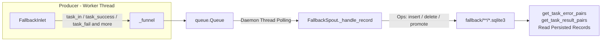
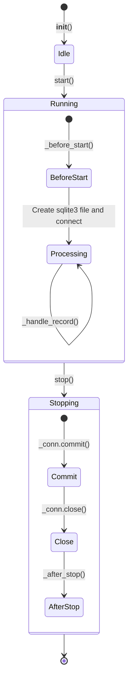

# Fallback Persistence

> 📅 Last Updated: 2026/06/18

`persistence/core_fallback.py` provides the fallback persistence mechanism for tasks. It records task state transitions throughout the lifecycle (pending → success / failed) and persists the data into SQLite database files.

> ⚠️ **Changed**: This file replaces the old `core_fail.py` (`FailSpout`/`FailInlet`). The old `core_success.py` (`SuccessSpout`) functionality has been merged into this module. `FallbackSpout` handles both failure and success results uniformly.

## Architecture

### Data Flow



The system follows a **Producer-Consumer** pattern:

1.  **FallbackInlet (Producer)****: Held by individual Worker threads, responsible for wrapping task lifecycle events into operation dictionaries and placing them into a thread-safe queue.
2.  **FallbackSpout (Consumer)**: Runs in a dedicated daemon thread, continuously monitors the queue, and executes corresponding SQLite write operations based on the operation type.

## FallbackSpout

`FallbackSpout` is responsible for managing the creation and writing of SQLite database files.

### Initialization and Startup

```python
class FallbackSpout(BaseSpout):
    def __init__(self, error_source: str) -> None:
        """
        :param error_source: Error source identifier (used for file naming)
        """
```

After startup, it creates a `{error_source}({time}).sqlite3` file under the `./fallback/{date}/` directory.

```python
fallback_spout = FallbackSpout("executor_fallbacks")
fallback_spout.start()
```

### Lifecycle



### _handle_record Operation Types

`FallbackSpout._handle_record` executes different SQLite operations based on `record["__op__"]`:

| Operation | Triggered By | Description |
|------|---------|------|
| `insert` | `task_in()` | New task enters a stage, writes a `pending` record |
| `delete` | `task_success(persist=False)` / `task_duplicate()` | Deletes the corresponding pending record |
| `update_event_id` | `task_retry()` | Migrates the pending record to a new retry event ID |
| `promote_success` | `task_success(persist=True)` | Promotes pending to success, writes the result |
| `promote_failed` | `task_fail()` | Promotes pending to failed, writes error information |

### File Path

Fallback data is saved under `./fallback/` directory by default, archived by date:

```text
./fallback/
└── 2026-06-18/
    └── executor_fallbacks(14-30-05-123).sqlite3
```

### Reading Persisted Records

```python
# Get error records
error_pairs: list[tuple[Any, tuple[str, str]]] = fallback_spout.get_task_error_pairs("StageA")
# Returns [(task, (error_type, error_message)), ...]

# Get success results
result_pairs: list[tuple[Any, Any]] = fallback_spout.get_task_result_pairs("StageA")
# Returns [(task, result), ...]
```

## FallbackInlet

`FallbackInlet` inherits from `BaseInlet` and provides a thread-safe write wrapper for the fallback queue.

### Core Methods

```python
class FallbackInlet(BaseInlet):
    def __init__(self, fallback_queue: Queue[Any]) -> None:
        """Initializes the fallback collector"""

    def task_in(self, stage_name: str, event_id: int, task: Any) -> None:
        """Writes a pending record, indicating the task has entered a stage."""

    def task_success(self, event_id: int, result: Any, persist: bool = False) -> None:
        """
        Task processed successfully.
        - persist=False (default): deletes the pending record.
        - persist=True: promotes pending to success and writes the result.
        """

    def task_retry(self, event_id: int, retry_id: int) -> None:
        """Migrates the pending record to a new retry event ID."""

    def task_duplicate(self, event_id: int) -> None:
        """Deletes the pending record for a deduplicated task."""

    def task_fail(self, event_id: int, error_id: int, error: Exception) -> None:
        """Promotes pending to failed, binding error information."""
```

## Usage Example

### Full Lifecycle Tracking

```python
from celestialflow.persistence import FallbackSpout, FallbackInlet

# 1. Create and start FallbackSpout
fallback_spout = FallbackSpout("my_errors")
fallback_spout.start()

# 2. Create FallbackInlet
fallback_inlet = FallbackInlet(fallback_spout.get_queue())

# 3. Record task lifecycle
# Task enters stage
fallback_inlet.task_in("StageA", event_id=1, task="hello")

# Task succeeds (without persisting result)
fallback_inlet.task_success(event_id=1, result="OK", persist=False)

# Task retry
fallback_inlet.task_in("StageA", event_id=2, task="world")
fallback_inlet.task_retry(event_id=2, retry_id=3)

# Task fails
fallback_inlet.task_fail(event_id=3, error_id=10, error=ValueError("bad input"))

# 4. Get persisted data
errors = fallback_spout.get_task_error_pairs("StageA")
for task, (error_type, error_msg) in errors:
    print(f"Failed task: {task}, error: {error_type}: {error_msg}")

# 5. Stop
fallback_spout.stop()
```

## Notes

1. **SQLite storage**: Uses WAL mode + `check_same_thread=False`, supporting multi-threaded reads and writes.
2. **Immediate commit**: Commits immediately after each write operation to ensure data is not lost.
3. **FallbackInlet is write-only to the queue**: It does not directly operate on the database; all I/O is completed in `FallbackSpout`'s background thread.
4. **persist control**: The `persist` parameter of `task_success` controls whether result data is retained. The default `False` only deletes the pending record to save space.
