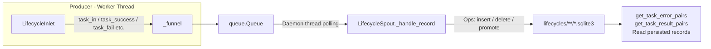

# Lifecycle Persistence

> 📅 Last Updated: 2026/08/31

`persistence/core_lifecycle.py` handles task lifecycle persistence: it records task state transitions throughout the lifecycle (pending → success / failed / deleted), and writes the data into SQLite database files under the `lifecycles/` directory. The core components are `LifecycleSpout` and `LifecycleInlet`.

## Architecture

### Data Flow



The system follows a **Producer-Consumer** pattern:

1.  **LifecycleInlet (Producer)**: held by individual executors; responsible for wrapping task lifecycle events into operation dictionaries and placing them into a thread-safe queue.
2.  **LifecycleSpout (Consumer)**: runs in a dedicated daemon thread, continuously monitoring the queue and performing the corresponding SQLite write operations according to the operation type (`__op__`).

## LifecycleSpout

`LifecycleSpout` inherits from `BaseSpout` and is responsible for managing the creation and writing of SQLite database files.

### Initialization and Startup

```python
class LifecycleSpout(BaseSpout):
    def __init__(self) -> None:
        """Initialize the lifecycle record listener."""
```

After startup (`_before_start()`), a `flow_lifecycle({time}).sqlite3` file is created under the `./lifecycles/{date}/` directory and a sqlite connection is established:

```python
from celestialflow.persistence import LifecycleSpout

lifecycle_spout = LifecycleSpout()
lifecycle_spout.start()
```

`_after_stop()` calls `commit()` first and then closes the connection, ensuring remaining transactions are flushed to disk.

### _handle_record Operation Types

`LifecycleSpout._handle_record` executes different SQLite operations based on `record["__op__"]`:

| Operation | Triggered By | Description |
|-----------|--------------|-------------|
| `insert` | `LifecycleInlet.task_in()` | A new task enters a stage; writes a `pending` record |
| `delete` | `LifecycleInlet.task_duplicate()` | Deletes the pending record for a duplicate task |
| `promote_success` | `LifecycleInlet.task_success()` | Promotes the pending record to `success`; writes the result JSON |
| `promote_failed` | `LifecycleInlet.task_fail()` | Promotes the pending record to `failed`; updates event_id and writes the error type and message |

Each operation calls `commit()` immediately after the record is actually modified.

### File Path

Lifecycle data is saved under `./lifecycles/` by default, archived by date:

```text
./lifecycles/
└── 2026-08-26/
    └── flow_lifecycle(14-30-05-123).sqlite3
```

### Reading Persisted Records

```python
# Get error records
error_pairs: list[tuple[Any, tuple[str, str]]] = lifecycle_spout.get_task_error_pairs(
    "StageA"
)
# Returns [(task, (error_type, error_message)), ...]

# Get success results
result_pairs: list[tuple[Any, Any]] = lifecycle_spout.get_task_result_pairs("StageA")
# Returns [(task, result), ...]
```

Both methods return an empty list when `db_path` has not yet been initialized.

## LifecycleInlet

`LifecycleInlet` inherits from `BaseInlet` and is a thread-safe write wrapper for the lifecycle queue.

### Core Methods

```python
class LifecycleInlet(BaseInlet):
    def task_in(self, stage_name: str, event_id: int, task: Any) -> None:
        """Write a pending record indicating that a task has entered a stage."""

    def task_success(self, event_id: int, result: Any) -> None:
        """Promote the pending record to success and write the result."""

    def task_duplicate(self, event_id: int) -> None:
        """Delete the pending record for a deduplicated task."""

    def task_fail(self, event_id: int, error_id: int, error: Exception) -> None:
        """Promote the pending record to failed, binding the final error information."""
```

Notes:

- In `task_in`, `task` is serialized via `to_persisted_payload()` into a JSON-friendly structure and stored in the `task_json` field.
- `task_fail` persists `error_type` (exception class name) together with `error_message` (`str(error)`).
- `LifecycleInlet` only writes to the queue and does not directly operate on the database; all I/O is performed in the background thread of `LifecycleSpout`.

## Global Singletons

```python
get_lifecycle_spout() -> LifecycleSpout  # The globally unique LifecycleSpout instance
get_lifecycle_inlet() -> LifecycleInlet  # The globally unique LifecycleInlet instance (already bound to the global spout)
```

The framework's execution components (`TaskExecutor` / `TaskSplitter` / `TaskRouter` / `TaskGraph`) uniformly use `get_lifecycle_inlet()` to record lifecycle events, while `TaskExecutor.get_success_pairs()` and `get_error_pairs()` read results through `get_lifecycle_spout()`.

## Usage Examples

### Lifecycle Operations

```python
from celestialflow.persistence import LifecycleInlet, LifecycleSpout

# 1. Create and start LifecycleSpout
lifecycle_spout = LifecycleSpout()
lifecycle_spout.start()

# 2. Create LifecycleInlet and bind it
lifecycle_inlet = LifecycleInlet().bind_spout(lifecycle_spout)

# 3. Record task lifecycle
lifecycle_inlet.task_in("StageA", event_id=1, task="hello")

# Task succeeded: pending -> success
lifecycle_inlet.task_success(event_id=1, result="OK")

# Task failed: pending -> failed
lifecycle_inlet.task_fail(event_id=2, error_id=10, error=ValueError("bad input"))

# 4. Get persisted data
errors = lifecycle_spout.get_task_error_pairs("StageA")
for task, (error_type, error_msg) in errors:
    print(f"Failed task: {task}, error: {error_type}: {error_msg}")

# 5. Stop
lifecycle_spout.stop()
```

In actual usage, you usually obtain the global singletons through `get_lifecycle_inlet()` / `get_lifecycle_spout()` without manually creating them.

## Notes

1. **SQLite storage**: uses WAL mode + `check_same_thread=False`, supporting cross-thread read/write (see `util_sqlite.connect_db`).
2. **Immediate commit**: each write operation commits immediately after the record is actually modified, ensuring no data is lost.
3. **Inlet only writes the queue**: it does not directly operate on the database; all I/O is performed in the background thread of `LifecycleSpout`.
