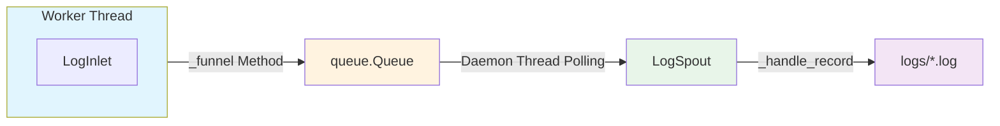

# Log Persistence

> 📅 Last Updated: 2026/05/28

The `celestialflow.persistence` module provides a multi-process-safe logging system designed to solve the problems of unified log collection, formatting, and persistence in multi-process environments.

The core components include `LogSpout` and `LogInlet`.

## Architecture Design

### Data Flow

The logging system uses a producer-consumer pattern. The complete data flow is as follows:



### Log Level Filtering

The `LogInlet._log()` method performs level-based filtering before writing to the queue:

```mermaid
flowchart LR
    Call[_log Called] --> Check{level in
LEVEL_DICT?}
    Check -->|No| Skip[Discard]
    Check -->|Yes| Compare{LEVEL_DICT[level] <
LEVEL_DICT[log_level]?}
    Compare -->|Yes - Level Too Low| Skip
    Compare -->|No| Funnel[Call _funnel
Write to Queue]

    style Call fill:#e3f2fd
    style Skip fill:#ffcdd2
    style Funnel fill:#c8e6c9
```

Similar to error persistence, the logging system also uses the **Logger-Listener** pattern:

1.  **LogInlet (Producer)**:
    -   A wrapper class held by each Worker thread.
    -   Provides rich semantic methods (such as `task_success`, `start_stage`, etc.).
    -   Packages log messages and levels, then places them into a thread-safe queue (`queue.Queue`).
    -   Supports log-level-based filtering to reduce unnecessary communication.

2.  **LogSpout (Consumer)**:
    -   Runs in an independent daemon thread.
    -   Retrieves log records from the queue and writes them to files.

## Log Levels

The system supports the following standard log levels (higher values indicate higher priority):

| Level | Value | Description |
|-------|-------|-------------|
| TRACE | 0 | Most detailed trace information, such as queue `put`/`get` operations |
| DEBUG | 10 | Debug information, such as task input |
| SUCCESS | 20 | Key operation success, such as task completion, split success |
| INFO | 30 | General information, such as stage start/end, graph structure printing |
| WARNING | 40 | Warning information, such as task retry, queue operation exceptions |
| ERROR | 50 | Error information, such as task failure, loop exceptions |
| CRITICAL | 60 | Critical errors |

## LogSpout

`LogSpout` manages log file configuration and the writing thread.

### Initialization

```python
listener = LogSpout()
listener.start()
```

After startup, logs will be written to the `logs/task_logger({date}).log` file.

### File Path

```text
logs/
└── task_logger(2026-05-24).log
```

## LogInlet

`LogInlet` provides specialized log methods for different components, ensuring log content is structured and consistent.

### Initialization

```python
sinker = LogInlet(log_queue, log_level="SUCCESS")
```

-   `log_queue`: The queue returned by `LogSpout.get_queue()`.
-   `log_level`: Sets the minimum log level for this Inlet; logs below this level will not be sent to the queue.

### Method Categories

All methods are grouped by component domain as follows:

#### Task Graph

| Method | Log Level | Description |
|--------|-----------|-------------|
| `start_graph(structure_list)` | INFO | Records task graph startup and structure info |
| `end_graph(use_time)` | INFO | Records task graph completion and elapsed time |

#### Layered Scheduling (Layer)

| Method | Log Level | Description |
|--------|-----------|-------------|
| `start_layer(layer, layer_level)` | INFO | Records layer startup |
| `end_layer(layer, use_time)` | INFO | Records layer completion and elapsed time |

#### Stage Nodes

| Method | Log Level | Description |
|--------|-----------|-------------|
| `start_stage(stage_name, stage_mode, execution_mode_desc)` | INFO | Records stage node startup |
| `end_stage(stage_name, stage_mode, execution_mode_desc, use_time, success_num, failed_num, duplicated_num)` | INFO | Records stage node completion and statistics |

#### Executor

| Method | Log Level | Description |
|--------|-----------|-------------|
| `start_executor(name, func_name, task_num, execution_mode_desc)` | INFO | Records executor startup |
| `end_executor(name, func_name, execution_mode_desc, use_time, success_num, failed_num, duplicated_num)` | INFO | Records executor completion and statistics |

#### Task Lifecycle

| Method | Log Level | Description |
|--------|-----------|-------------|
| `task_input(func_name, task_repr, source, input_id)` | DEBUG | Records task entering the input queue |
| `task_success(func_name, task_repr, exec_mode, result_repr, use_time, parent_id, success_id)` | SUCCESS | Records successful task completion |
| `task_retry(func_name, task_repr, retry_times, exception, parent_id, retry_id)` | WARNING | Records task failure triggering retry |
| `task_error(func_name, task_repr, exception, parent_id, error_id)` | ERROR | Records task failure with no retry possible |
| `task_duplicate(func_name, task_repr, parent_id, duplicate_id)` | WARNING | Records detection of a duplicate task |

#### Splitter

| Method | Log Level | Description |
|--------|-----------|-------------|
| `split_trace(func_name, part_index, part_total, parent_id, split_id)` | TRACE | Records split subtask dispatch |
| `split_success(func_name, task_repr, split_count, use_time)` | SUCCESS | Records split success |

#### Router

| Method | Log Level | Description |
|--------|-----------|-------------|
| `route_success(func_name, task_repr, target_node, use_time, parent_id, route_id)` | SUCCESS | Records successful task routing |

#### Termination Signals

| Method | Log Level | Description |
|--------|-----------|-------------|
| `termination_input(func_name, source, termination_id)` | DEBUG | Records termination signal input |
| `termination_merge(func_name, parent_ids, termination_id)` | TRACE | Records termination signal merge |

#### Reporter

| Method | Log Level | Description |
|--------|-----------|-------------|
| `stop_reporter()` | DEBUG | Records reporter stop |
| `loop_failed(exception)` | ERROR | Records reporter loop error |
| `pull_interval_failed(exception)` | WARNING | Records pull interval fetch failure |
| `pull_history_limit_failed(exception)` | WARNING | Records pull history limit fetch failure |
| `pull_tasks_failed(exception)` | WARNING | Records pull task injection fetch failure |
| `inject_tasks_success(target_node, task_datas)` | INFO | Records successful task injection |
| `inject_tasks_failed(target_node, task_datas, exception)` | WARNING | Records failed task injection |
| `push_errors_failed(exception)` | WARNING | Records push error info failure |
| `push_status_failed(exception)` | WARNING | Records push status info failure |
| `push_structure_failed(exception)` | WARNING | Records push structure info failure |
| `push_analysis_failed(exception)` | WARNING | Records push analysis info failure |
| `push_summary_failed(exception)` | WARNING | Records push summary info failure |
| `push_history_failed(exception)` | WARNING | Records push history info failure |

### Usage Example

```python
# Graph lifecycle
sinker.start_graph(["NodeA -> NodeB", "NodeB -> NodeC"])
sinker.end_graph(12.34)

# Stage lifecycle
sinker.start_stage("ProcessStage", "thread", "thread-4")
sinker.end_stage("ProcessStage", "thread", "thread-4", 5.2, 100, 2, 0)

# Executor lifecycle
sinker.start_executor("Executor1", "process_func", 50, "thread")
sinker.end_executor("Executor1", "process_func", "thread", 4.8, 48, 1, 1)

# Task lifecycle
sinker.task_input("process_func", "task_1", "queue", 1)
sinker.task_success("process_func", "task_1", "thread", "OK", 0.05, 1, 2)
sinker.task_retry("process_func", "task_2", 1, TimeoutError("timeout"), 1, 3)
sinker.task_error("process_func", "task_3", ValueError("bad"), 1, 4)
sinker.task_duplicate("process_func", "task_2", 1, 5)

# Termination signals
sinker.termination_input("process_func", "queue", 1)
sinker.termination_merge("process_func", [1, 2], 3)

# Reporter events
sinker.inject_tasks_success("StageA", ["task_10", "task_11"])
sinker.inject_tasks_failed("StageA", ["task_10"], RuntimeError("conflict"))
sinker.push_errors_failed(ConnectionError("timeout"))
sinker.push_history_failed(ConnectionError("timeout"))
```

Using these specialized methods instead of generic `info()` or `debug()` ensures that generated logs are easy to read and parse by machines.
