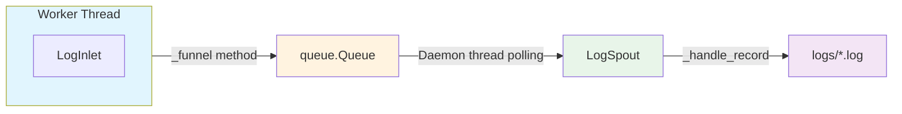

# src/celestialflow/persistence/core_log.py

> 📅 Last Updated: 2026/09/24

`persistence/core_log.py` provides a thread-safe logging system that, via a producer-consumer pattern, uniformly collects, formats, and persists logs to text files under the `logs/` directory.

The core components include `LogSpout` and `LogInlet`.

## Architecture Design

### Data Flow

The logging system uses a producer-consumer pattern. The complete data flow is as follows:


```mermaid
flowchart LR
    subgraph Worker[Worker Thread]
        Inlet[LogInlet]
    end
    Worker -->|_funnel method| Queue[queue.Queue]
    Queue -->|Daemon thread polling| Spout[LogSpout]
    Spout -->|_handle_record| File[logs/*.log]

    style Worker fill:#e1f5fe
    style Queue fill:#fff3e0
    style Spout fill:#e8f5e9
    style File fill:#f3e5f5
```

### Log Level Filtering

The `LogInlet._log()` method performs level filtering before writing to the queue:

```mermaid
flowchart LR
    Call[_log called] --> Check{level in
LEVEL_DICT?}
    Check -->|No| Skip[Drop]
    Check -->|Yes| Compare{LEVEL_DICT[level] <
LEVEL_DICT[log_level]?}
    Compare -->|Yes - level too low| Skip
    Compare -->|No| Funnel[Call _funnel
write to queue]

    style Call fill:#e3f2fd
    style Skip fill:#ffcdd2
    style Funnel fill:#c8e6c9
```

The logging system uses the **Logger-Listener** pattern:

1.  **LogInlet (Producer)**:
    -   Wrapper class, held by individual Worker threads.
    -   Provides rich semantic methods (such as `task_success`, `graph_start`, etc.).
    -   Encapsulates log messages and levels before placing them into a thread-safe queue (`queue.Queue`).
    -   Supports log-level-based filtering to reduce unnecessary communication.

2.  **LogSpout (Consumer)**:
    -   Runs in an independent daemon thread.
    -   Retrieves log records from the queue and writes them to a file.

## Log Levels

The system supports the following standard log levels (higher value = higher priority):

| Level | Value | Description |
|-------|-------|-------------|
| TRACE | 0 | Most detailed trace information, such as termination signal merging |
| DEBUG | 10 | Debug information, such as task input, reporter stop |
| SUCCESS | 20 | Key operation successes, such as task completion |
| INFO | 30 | General information, such as node start/stop, graph structure printing |
| WARNING | 40 | Warnings, such as task retries, reporting failures |
| ERROR | 50 | Error information, such as task failures, loop exceptions |
| CRITICAL | 60 | Critical errors, such as node / worker crashes |

## LogSpout

`LogSpout` is responsible for log file configuration and write thread management.

### Initialization

```python
listener = LogSpout()
listener.start()
```

After startup, logs are written to the `logs/flow_log({date}).log` file, opened with line buffering (`buffering=1`) so readers can see new logs in a timely manner.

### File Path

```text
logs/
└── flow_log(2026-05-24).log
```

## LogInlet

`LogInlet` provides dedicated logging methods for different components, ensuring log content is structured and consistent.

### Initialization

```python
sinker = LogInlet(log_level="SUCCESS").bind_spout(log_spout)
```

-   `log_queue`: The queue returned by `LogSpout.get_queue()`.
-   `log_level`: Sets the minimum log level for this Inlet; logs below this level will not be sent to the queue; an invalid level throws `InvalidOptionError`.

### Method Categories

All methods are grouped by component domain as follows:

#### Task Graph (Graph)

| Method | Log Level | Description |
|------|---------|------|
| `graph_start(graph_name, graph_mode, structure_list)` | INFO | Records task graph startup and structure information |
| `graph_end(graph_name, use_time)` | INFO | Records task graph completion and elapsed time |

#### Node

| Method | Log Level | Description |
|------|---------|------|
| `node_start(node_name, task_num, execution_mode_desc)` | INFO | Records node startup and execution mode |
| `node_end(node_name, execution_mode_desc, use_time, success_num, failed_num, duplicated_num)` | INFO | Records node completion and statistics |
| `node_crash(node_name, exception)` | CRITICAL | Records node crash |

#### Worker Thread (Worker)

| Method | Log Level | Description |
|------|---------|------|
| `worker_crash(exception)` | CRITICAL | Records worker crash |

#### Task Lifecycle (Task)

| Method | Log Level | Description |
|------|---------|------|
| `task_input(node_name, task_repr, input_id)` | DEBUG | Records a task entering the input queue |
| `task_success(node_name, task_repr, result_repr, use_time, parent_id, success_id)` | SUCCESS | Records successful task completion |
| `task_retry(node_name, task_repr, fail_times, exception, task_id)` | WARNING | Records a task failure that triggered a retry |
| `task_fail(node_name, task_repr, exception, parent_id, error_id)` | ERROR | Records a task failure that cannot be retried |

> Split and Router no longer have dedicated logging methods: `TaskSplitter` / `TaskRouter` input dispatch uniformly goes through `task_input`, and success uniformly goes through `task_success`. The duplicate task log `task_duplicate` has also been removed.

#### Termination Signal

| Method | Log Level | Description |
|------|---------|------|
| `termination_input(node_name, termination_id)` | DEBUG | Records termination signal input |
| `termination_merge(node_name, parent_ids, termination_id)` | TRACE | Records termination signal merge |

#### Reporter

| Method | Log Level | Description |
|------|---------|------|
| `stop_reporter()` | DEBUG | Records reporter stop |
| `loop_failed(exception)` | ERROR | Records reporter loop error |
| `pull_interval_failed(exception)` | WARNING | Records pull interval failure |
| `pull_tasks_failed(exception)` | WARNING | Records pull task injection failure |
| `inject_tasks_success(target_node, task_datas)` | INFO | Records successful task injection |
| `inject_tasks_failed(target_node, task_datas, exception)` | WARNING | Records task injection failure |
| `push_errors_failed(exception)` | WARNING | Records push error info failure |
| `push_status_failed(exception)` | WARNING | Records push status info failure |
| `push_graph_meta_failed(exception)` | WARNING | Records push graph metadata failure |

### Usage Example

```python
from celestialflow.persistence import LogSpout, LogInlet

log_spout = LogSpout()
log_spout.start()
sinker = LogInlet(log_level="SUCCESS").bind_spout(log_spout)

# 图生命周期
sinker.graph_start("my_graph", "thread", ["NodeA -> NodeB", "NodeB -> NodeC"])
sinker.graph_end("my_graph", 12.34)

# 节点周期
sinker.node_start("NodeA", 50, "thread")
sinker.node_end("NodeA", "thread", 4.8, 48, 1, 1)

# 任务生命周期
sinker.task_input("NodeA", "task_1", 1)
sinker.task_success("NodeA", "task_1", "OK", 0.05, 1, 2)
sinker.task_retry("NodeA", "task_2", 1, TimeoutError("timeout"), 1)
sinker.task_fail("NodeA", "task_3", ValueError("bad"), 1, 4)

# 终止信号
sinker.termination_input("NodeA", 1)
sinker.termination_merge("NodeA", [1, 2], 3)

# 上报器事件
sinker.inject_tasks_success("NodeA", ["task_10", "task_11"])
sinker.inject_tasks_failed("NodeA", ["task_10"], RuntimeError("conflict"))
sinker.push_errors_failed(ConnectionError("timeout"))
sinker.push_status_failed(ConnectionError("timeout"))
sinker.push_graph_meta_failed(ConnectionError("timeout"))

log_spout.stop()
```

By using these dedicated methods instead of generic `info()` or `debug()`, the generated logs are easy to read and machine-parse.
