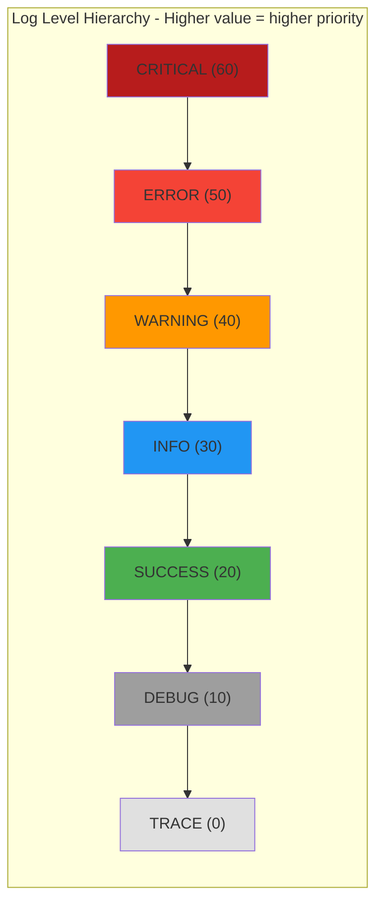

# PersistenceConstant

> 📅 Last Updated: 2026/05/24

`persistence/util_constant.py` defines the log level mapping constant `LEVEL_DICT`.

## Level Hierarchy

Log levels are arranged from low to high numeric value, forming a strict filtering hierarchy:



This constant is used by `LogInlet` for log filtering and level comparison. When `LogInlet`'s `log_level` is set to a certain level, all logs with a level value lower than that level are discarded.

## Usage Examples

### Using LEVEL_DICT for Filtering and Comparison

The following example shows how to use `LEVEL_DICT` for log level filtering and comparison:

```python
from celestialflow.persistence.util_constant import LEVEL_DICT

# 1. View all levels and their corresponding values
print("Log Level Mapping:")
for name, value in LEVEL_DICT.items():
    print(f"  {name:>8} = {value:>2}")
# Output:
#     TRACE =  0
#     DEBUG = 10
#    SUCCESS = 20
#      INFO = 30
#   WARNING = 40
#     ERROR = 50
#  CRITICAL = 60

# 2. Simulate LogInlet's log filtering logic
#    Assuming the current log level is INFO, only keep logs with value >= 30
log_level_name = "INFO"
current_level = LEVEL_DICT[log_level_name]

# Simulate a batch of log records
log_records = [
    ("DEBUG", "Debug information"),
    ("INFO", "User login successful"),
    ("WARNING", "Disk space low"),
    ("ERROR", "Database connection failed"),
    ("SUCCESS", "Data export completed"),
    ("CRITICAL", "System crash"),
]

filtered = []
for level_name, message in log_records:
    level_value = LEVEL_DICT.get(level_name, 0)
    if level_value >= current_level:
        filtered.append((level_name, message))

print(f"\nFiltering results with log level set to {log_level_name}({current_level}):")
for level_name, message in filtered:
    print(f"  [{level_name:>8}] {message}")
# Output:
#   [    INFO] User login successful
#   [ WARNING] Disk space low
#   [   ERROR] Database connection failed
#   [ CRITICAL] System crash
# Note: SUCCESS(20) and DEBUG(10) are lower than INFO(30) and have been filtered out

# 3. Level comparison helper function
def is_level_enabled(current: str, target: str) -> bool:
    """Determine whether target level is at or above the current level"""
    return LEVEL_DICT.get(target, 0) >= LEVEL_DICT.get(current, 0)

print("\nLevel Comparison:")
print(f"  ERROR >= WARNING ? {is_level_enabled('WARNING', 'ERROR')}")  # True
print(f"  DEBUG >= INFO    ? {is_level_enabled('INFO', 'DEBUG')}")     # False
print(f"  TRACE >= CRITICAL? {is_level_enabled('CRITICAL', 'TRACE')}") # False
```
