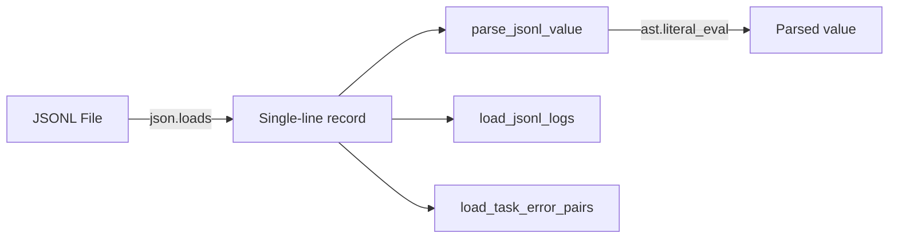

# PersistenceJSONL

> 📅 Last Updated: 2026/05/24

`persistence/util_jsonl.py` provides JSONL persistence and reading utilities.

## Reading Interface

| Function | Description |
|----------|-------------|
| `load_jsonl_logs(path, start_seq=1, keys=None)` | Reads line by line with optional field filtering, supports starting from a specified line number |
| `load_jsonl_by_key(jsonl_path, extract_key="stage", extract_value="task")` | Loads grouped by a specified field, supports custom grouping keys and value extraction fields |
| `load_jsonl_grouped_by_keys(jsonl_path, group_keys, extract_field)` | Reads grouped by multiple fields, supports field extraction and `ast.literal_eval` deserialization |
| `load_task_by_stage(jsonl_path)` | Loads error records, categorized by stage, returns `{stage_name: [task_list]}` |
| `load_task_by_error(jsonl_path)` | Loads error records, categorized by error and stage, returns `{(error, stage): [task_list]}` |
| `load_task_error_pairs(jsonl_path)` | Loads error records, returns a list of `(task, error)` pairs |

### Utility Functions

| Function | Description |
|----------|-------------|
| `parse_jsonl_value(val)` | Intelligently parses JSONL field values, supports `ast.literal_eval` deserialization of string-form lists/tuples |

#### parse_jsonl_value in Detail

This function intelligently parses raw field values from JSONL into Python objects:

```python
from celestialflow.persistence.util_jsonl import parse_jsonl_value

# String-form list → tuple
parse_jsonl_value("[1, 2, 3]")       # → (1, 2, 3)
parse_jsonl_value("(a, b, c)")       # → ("a", "b", "c")

# Plain string unchanged
parse_jsonl_value("hello")           # → "hello"

# Already a list/tuple → directly converted
parse_jsonl_value([1, 2, 3])         # → (1, 2, 3)
parse_jsonl_value((1, 2, 3))         # → (1, 2, 3)
```

## Data Flow


