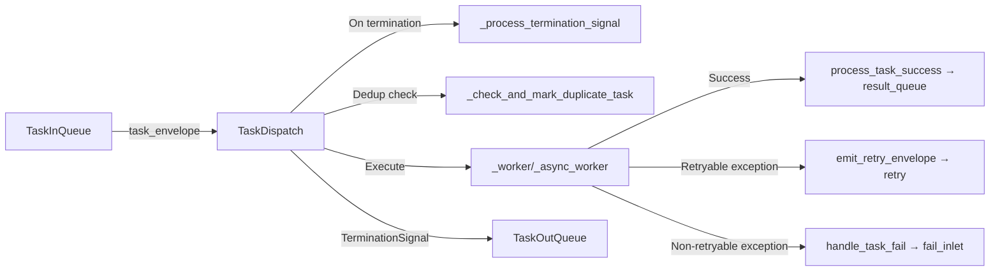

# TaskDispatch

> 📅 Last Updated: 2026/05/24

`TaskDispatch` is the task scheduler, responsible for executing individual tasks in serial, thread, or async modes. It is an internal component of `TaskExecutor`, fetching tasks from `TaskInQueue`, calling user functions, and sending results through `TaskOutQueue`.

## Initialization

```python
class TaskDispatch:
    def __init__(self, task_executor: TaskExecutor, func: Callable[..., Any], max_workers: int):
        """
        Initialize the task runner.

        :param task_executor: TaskExecutor instance
        :param func: Task function
        :param max_workers: Worker thread/coroutine count limit
        """
```

## Dispatch Modes

### dispatch_serial

Executes tasks serially, processing one at a time.

```python
def dispatch_serial(self) -> None:
    """Execute tasks serially."""
```

Execution flow:
1. Fetch task from `task_queue.get()`
2. If a `TerminationIdPool` is received, call `_process_termination_signal()` and terminate
3. If a `TaskEnvelope` is received, check for duplicates (`_check_and_mark_duplicate_task`)
4. Call `_worker()` to execute synchronously
5. Put the merged `TerminationSignal` into `result_queue`

### dispatch_thread

Executes tasks in parallel using a thread pool.

```python
def dispatch_thread(self) -> None:
    """Execute tasks in parallel using a thread pool."""
```

Execution flow:
1. Initialize `ThreadPoolExecutor` as needed
2. Fetch tasks from the queue and `submit` them to the thread pool
3. When the futures list reaches `max_workers * 2`, filter out completed ones (prevents memory leaks)
4. Wait for all futures to complete, then handle termination signals
5. Shut down the thread pool

### dispatch_async

Executes tasks asynchronously using coroutines and semaphores for concurrency control.

```python
async def dispatch_async(self) -> None:
    """Execute tasks asynchronously with limited concurrency."""
```

Execution flow:
1. Create `asyncio.Semaphore(self.max_workers)` to limit concurrency
2. Use `asyncio.to_thread(task_queue.get)` to fetch tasks asynchronously (avoids blocking the event loop)
3. Wrap each task as `asyncio.Task` and track the pending set
4. Use `asyncio.gather` to wait for all pending tasks
5. Handle termination signals

## Internal Methods

### _worker / _async_worker

Sync/async worker functions that process a single task with retry support:

```python
def _worker(self, task_envelope: TaskEnvelope) -> None:
    """Execute a single task synchronously, with retry support."""

async def _async_worker(self, task_envelope: TaskEnvelope) -> None:
    """Execute a single task asynchronously, with retry support."""
```

Retry logic:
- Loop within `max_retries + 1` attempts
- On success, call `process_task_success`
- If an exception is in `retry_exceptions` and the limit is not reached, emit a retry envelope and continue
- Otherwise, call `handle_task_fail`

### _process_termination_signal

```python
def _process_termination_signal(self, termination_pool: TerminationIdPool) -> TerminationSignal:
    """
    Process termination signal and generate merge events.

    :param termination_pool: Pool containing multiple termination signal IDs
    :return: Merged termination signal
    """
```

### _check_and_mark_duplicate_task

```python
def _check_and_mark_duplicate_task(self, task_envelope: TaskEnvelope) -> bool:
    """
    Perform deduplication check before the worker.

    :param task_envelope: Task envelope
    :return: Whether a duplicate task was hit
    """
```

### _init_pool / _release_pool

```python
def _init_pool(self, execution_mode: str) -> None:
    """Initialize the thread pool as needed."""

def _release_pool(self) -> None:
    """Shut down the thread pool and release resources."""
```

## Data Flow



## Relationship with TaskExecutor


`TaskExecutor` selects the dispatch method based on `execution_mode`:
- `serial` → `dispatch_serial()`
- `thread` → `dispatch_thread()`
- `async` → `dispatch_async()`

## Usage Examples

`TaskDispatch` is an internal component of `TaskExecutor` and is used indirectly through `TaskExecutor`'s `start()` method.
The following examples demonstrate the differences between the three execution modes:

### Serial Mode

```python
from celestialflow import TaskExecutor

# serial mode: single-threaded sequential execution, suitable for debugging
executor = TaskExecutor(
    "SerialWorker",
    func=lambda x: x ** 2,
    execution_mode="serial",
)
executor.start([1, 2, 3, 4, 5])

success_pairs = executor.get_success_pairs()
for task, result in success_pairs:
    print(f"Task {task} -> {result}")

print(f"Success: {executor.get_counts()['tasks_succeeded']}")
```

### Thread Mode (Thread Pool Concurrency)

```python
from celestialflow import TaskExecutor
import time

def io_task(x: int) -> int:
    time.sleep(0.1)  # Simulates I/O operation
    return x * 10

# thread mode: thread pool concurrency, suitable for I/O-intensive tasks
executor = TaskExecutor(
    "ThreadWorker",
    func=io_task,
    execution_mode="thread",
    max_workers=4,
)
executor.start([1, 2, 3, 4, 5])

counts = executor.get_counts()
print(f"Success: {counts['tasks_succeeded']}, Failed: {counts['tasks_failed']}")
```

### Async Mode (Async Coroutines)

```python
import asyncio
from celestialflow import TaskExecutor

async def async_task(x: int) -> int:
    await asyncio.sleep(0.05)  # Simulates async I/O
    return x * 100

# async mode: async coroutines, suitable for network I/O
executor = TaskExecutor(
    "AsyncWorker",
    func=async_task,
    execution_mode="async",
    max_workers=4,
)
executor.start([1, 2, 3])

counts = executor.get_counts()
print(f"Success: {counts['tasks_succeeded']}")
```

### Retry Configuration

```python
from celestialflow import TaskExecutor

# Configure retry strategy: automatically retry on ConnectionError or TimeoutError
unstable_func = lambda x: 100 // x if x != 0 else exec("raise ConnectionError('network error')")

executor = TaskExecutor(
    "RetryWorker",
    func=unstable_func,
    execution_mode="serial",
    max_retries=3,  # Maximum 3 retries
)
executor.add_retry_exceptions(ConnectionError, TimeoutError)
executor.start([1, 2, 0, 4])

counts = executor.get_counts()
print(f"Success: {counts['tasks_succeeded']}, Failed: {counts['tasks_failed']}")
```

## Notes

1. **Serial mode**: Synchronous blocking, suitable for debugging
2. **Thread mode**: Suitable for I/O-intensive tasks; `_release_pool` ensures resource release
3. **Async mode**: Function must be a coroutine; uses `asyncio.to_thread` to avoid blocking
4. **Futures cleanup**: In `dispatch_thread`, when the list reaches `max_workers * 2`, completed futures are filtered out
5. **Deduplication**: Performed before entering the worker, reducing unnecessary computation
6. **Retry**: Implemented via looping and `change_id` within the worker
