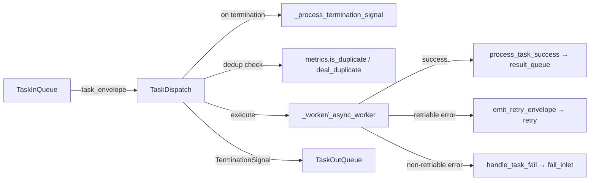
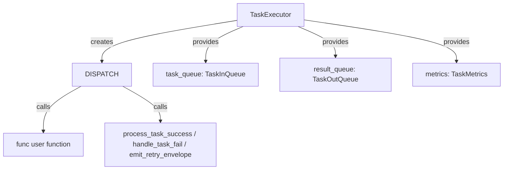

# TaskDispatch

> 📅 Last Updated: 2026/06/22

`TaskDispatch` is the task dispatcher, responsible for executing individual tasks in serial, thread, or async mode. It is an internal component of `TaskExecutor`, fetching tasks from `TaskInQueue`, invoking the user function, and sending results through `TaskOutQueue`.

## Initialization

```python
class TaskDispatch:
    def __init__(self, task_executor: TaskExecutor, func: Callable[..., Any], max_workers: int):
        """
        Initialize the task runner.

        :param task_executor: TaskExecutor instance
        :param func: Task function
        :param max_workers: Worker thread/coroutine count limit
        """
```

## Dispatch Modes

### dispatch_serial

Execute tasks serially, one by one.

```python
def dispatch_serial(self) -> None:
    """Execute tasks serially"""
```

Execution flow:
1. Fetch task from `task_queue.get()`
2. If `TerminationIdPool` received, call `_process_termination_signal()` then terminate
3. If `TaskEnvelope` received, check for duplicates via `task_executor.metrics.is_duplicate()`
4. If duplicate, handle via `task_executor.deal_duplicate()`
5. Otherwise, call `_worker()` to execute synchronously
6. Put merged `TerminationSignal` into `result_queue`

### dispatch_thread

Execute tasks in parallel using a thread pool.

```python
def dispatch_thread(self) -> None:
    """Execute tasks in parallel using a thread pool."""
```

Execution flow:
1. Initialize `ThreadPoolExecutor` on demand
2. Fetch tasks from queue and `submit` to thread pool
3. When futures list reaches `max_workers * 2`, filter out completed ones (prevents memory leak)
4. Wait for all futures to complete, then process termination signals
5. Shut down thread pool

### dispatch_async

Execute tasks asynchronously, using coroutines and a semaphore to control concurrency.

```python
async def dispatch_async(self) -> None:
    """Execute tasks asynchronously, limiting concurrency count."""
```

Execution flow:
1. Create `asyncio.Semaphore(self.max_workers)` to control concurrency
2. Fetch tasks asynchronously via `asyncio.to_thread(task_queue.get)` (avoids blocking the event loop)
3. Wrap each task as `asyncio.Task` and track the pending set
4. Use `asyncio.gather` to wait for all pending tasks
5. Process termination signals

## Internal Methods

### _worker / _async_worker

Synchronous/asynchronous worker functions that process a single task with retry support:

```python
def _worker(self, task_envelope: TaskEnvelope) -> None:
    """Execute a single task synchronously, with retry support."""

async def _async_worker(self, task_envelope: TaskEnvelope) -> None:
    """Execute a single task asynchronously, with retry support."""
```

Retry logic:
- Loop within `max_retries + 1` attempts
- On success, call `process_task_success`
- If exception is in `retry_exceptions` and limit not reached, emit retry envelope and continue
- Otherwise, call `handle_task_fail`

### _process_termination_signal

```python
def _process_termination_signal(self, termination_pool: TerminationIdPool) -> TerminationSignal:
    """
    Process termination signal, generating merge event.

    :param termination_pool: Pool containing multiple termination signal IDs
    :return: Merged termination signal
    """
```

### Duplicate Check

Dedup logic is inlined within each dispatch method, not in a separate method:

```python
# Inline dedup (shared pattern across dispatch_serial / dispatch_thread / dispatch_async)
task_hash = envelope.get_hash()
if self.task_executor.metrics.is_duplicate(task_hash):
    self.task_executor.deal_duplicate(envelope)
    continue
```

`is_duplicate()` is an atomic operation: if the hash is not in `processed_set`, it is added and `False` is returned; if already present, `True` is returned.

### _init_pool / _release_pool

```python
def _init_pool(self, execution_mode: str) -> None:
    """Initialize thread pool on demand."""

def _release_pool(self) -> None:
    """Shut down thread pool, release resources."""
```

## Data Flow



## Relationship with TaskExecutor



`TaskExecutor` chooses the invocation method based on `execution_mode`:
- `serial` → `dispatch_serial()`
- `thread` → `dispatch_thread()`
- `async` → `dispatch_async()`

## Usage Examples

`TaskDispatch` is an internal component of `TaskExecutor` and is used indirectly via `TaskExecutor`'s `start()` method.
The following examples illustrate the differences between the three execution modes:

### Serial Mode (Sequential Execution)

```python
from celestialflow import TaskExecutor

# serial mode: single-threaded sequential execution, suitable for debugging
executor = TaskExecutor(
    "SerialWorker",
    func=lambda x: x ** 2,
    execution_mode="serial",
)
executor.start([1, 2, 3, 4, 5])

success_pairs = executor.get_success_pairs()
for task, result in success_pairs:
    print(f"Task {task} -> {result}")

print(f"Success: {executor.get_counts()['tasks_succeeded']}")
```

### Thread Mode (Thread Pool Concurrency)

```python
from celestialflow import TaskExecutor
import time

def io_task(x: int) -> int:
    time.sleep(0.1)  # Simulate I/O operation
    return x * 10

# thread mode: thread pool concurrency, suitable for I/O-bound tasks
executor = TaskExecutor(
    "ThreadWorker",
    func=io_task,
    execution_mode="thread",
    max_workers=4,
)
executor.start([1, 2, 3, 4, 5])

counts = executor.get_counts()
print(f"Success: {counts['tasks_succeeded']}, Failed: {counts['tasks_failed']}")
```

### Async Mode (Async Coroutines)

```python
import asyncio
from celestialflow import TaskExecutor

async def async_task(x: int) -> int:
    await asyncio.sleep(0.05)  # Simulate async I/O
    return x * 100

# async mode: async coroutines, suitable for network I/O
executor = TaskExecutor(
    "AsyncWorker",
    func=async_task,
    execution_mode="async",
    max_workers=4,
)
executor.start([1, 2, 3])

counts = executor.get_counts()
print(f"Success: {counts['tasks_succeeded']}")
```

### Retry Configuration

```python
from celestialflow import TaskExecutor

# Configure retry policy: auto-retry on ConnectionError or TimeoutError
unstable_func = lambda x: 100 // x if x != 0 else exec("raise ConnectionError('network error')")

executor = TaskExecutor(
    "RetryWorker",
    func=unstable_func,
    execution_mode="serial",
    max_retries=3,  # Retry up to 3 times
)
executor.set_retry_exceptions(ConnectionError, TimeoutError)
executor.start([1, 2, 0, 4])

counts = executor.get_counts()
print(f"Success: {counts['tasks_succeeded']}, Failed: {counts['tasks_failed']}")
```

## Notes

1. **Serial mode**: Synchronous blocking, suitable for debugging
2. **Thread mode**: Suitable for I/O-bound tasks; `_release_pool` ensures resource release
3. **Async mode**: Functions must be coroutines; use `asyncio.to_thread` to avoid blocking
4. **Futures cleanup**: In `dispatch_thread`, completed futures are cleaned up when the list reaches `max_workers * 2`
5. **Dedup**: Done before entering the worker to reduce wasted computation
6. **Retry**: Implemented inside the worker via a loop and `emit_retry_envelope`
