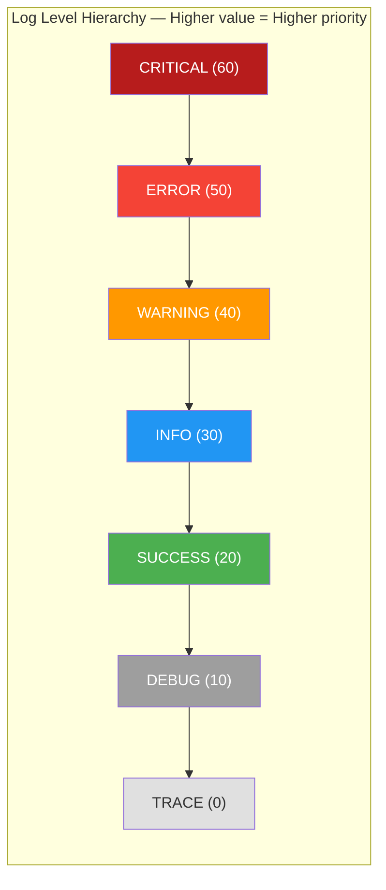

# RuntimeConstant

> 📅 Last Updated: 2026/06/11

`runtime/util_constant.py` defines runtime global constants, including the log level mapping table `LEVEL_DICT` and the node label style `STAGE_STYLE`.

## Core Constants

### LEVEL_DICT

A dictionary mapping log level names to numeric values, where higher values indicate higher priority. This constant is used by `LogInlet` for log filtering and level comparison — when `LogInlet`'s `log_level` is set to a certain level, all logs with a numeric level lower than that level are discarded.

```python
LEVEL_DICT = {
    "TRACE": 0,
    "DEBUG": 10,
    "SUCCESS": 20,
    "INFO": 30,
    "WARNING": 40,
    "ERROR": 50,
    "CRITICAL": 60,
}
```

#### Level Hierarchy



### STAGE_STYLE

Node label style configuration, used for CelestialTree visualization. Defines the template format and missing-value placeholder for each node.

```python
from celestialtree import NodeLabelStyle

STAGE_STYLE: NodeLabelStyle = NodeLabelStyle(
    template="{base}  {payload.name}  ‹{type}›", missing="-"
)
```

> **Note**: `STAGE_STYLE` depends on the `NodeLabelStyle` from the external `celestialtree` package. The `{base}`, `{payload.name}`, `{type}` variables in the template string are injected by the CelestialTree rendering engine for node tree visualization.

## Usage Examples

### Log Level Filtering Logic

```python
from celestialflow.runtime.util_constant import LEVEL_DICT

# 1. View all levels and their values
for name, value in LEVEL_DICT.items():
    print(f"  {name:>8} = {value:>2}")

# 2. Simulate LogInlet's log filtering logic
log_level_name = "INFO"
current_level = LEVEL_DICT[log_level_name]

log_records = [
    ("DEBUG", "Debug info"),
    ("INFO", "User login successful"),
    ("WARNING", "Disk space low"),
    ("ERROR", "Database connection failed"),
    ("SUCCESS", "Data export successful"),
    ("CRITICAL", "System crash"),
]

filtered = [
    (name, msg)
    for name, msg in log_records
    if LEVEL_DICT.get(name, 0) >= current_level
]
# Result retains only INFO and above
print(filtered)
# [('INFO', 'User login successful'), ('WARNING', 'Disk space low'),
#  ('ERROR', 'Database connection failed'), ('CRITICAL', 'System crash')]

# 3. Helper function for level comparison
def is_level_enabled(current: str, target: str) -> bool:
    return LEVEL_DICT.get(target, 0) >= LEVEL_DICT.get(current, 0)

print(is_level_enabled("WARNING", "ERROR"))    # True
print(is_level_enabled("INFO", "DEBUG"))        # False
```

### Log Level Validation

```python
from celestialflow.runtime.util_constant import LEVEL_DICT

# Validate whether a user-supplied log level is valid
def validate_level(level: str) -> bool:
    return level in LEVEL_DICT

print(validate_level("INFO"))     # True
print(validate_level("VERBOSE"))  # False
```

## Notes

- `LEVEL_DICT` is the core basis for `LogInlet` log filtering; do not modify the level values arbitrarily.
- `STAGE_STYLE` depends on the `NodeLabelStyle` from the external `celestialtree` package. The `{base}`, `{payload.name}`, `{type}` variables in the template string are injected by the CelestialTree rendering engine.
