# TaskErrors

> 📅 Last Updated: 2026/07/16

The TaskErrors module defines the complete exception class system used in the CelestialFlow framework.

## Exception Hierarchy

```mermaid
classDiagram
    direction TB

    class CelestialFlowError {
        +Base class
    }

    class ConfigurationError {
        +Configuration error base class
    }
    class InvalidOptionError {
        +field: str
        +value: Any
        +allowed: tuple
        Invalid configuration value
    }
    class ExecutionModeError {
        +execution_mode: str
        +valid_modes: tuple
        Invalid execution_mode
    }
    class StageModeError {
        +stage_mode: str
        +valid_modes: tuple
        Invalid stage_mode
    }
    class LogLevelError {
        +log_level: str
        +valid_levels: tuple
        Invalid log_level
    }
    class ScheduleModeError {
        +schedule_mode: str
        +valid_modes: tuple
        Invalid schedule_mode
    }
    class CallableParameterKindError {
        +callable_name: str
        +parameter_kind: Any
        +valid_kinds: tuple
        Invalid callable parameter kind
    }
    class GraphStructureError {
        +Graph structure error base class
    }
    class DuplicateNodeError {
        +Duplicate node name
    }
    class UnknownNodeError {
        +Unknown node name
    }
    class NodeNotFoundError {
        +Specified node not found in graph
    }
    class RuntimeStateError {
        +Runtime state error base class
    }
    class InitializationError {
        +Initialization failure
    }
    class GraphManagedError {
        +Graph management error
    }
    class PersistedError {
        +error_type: str
        +error_message: str
        +Persisted error summary
    }
    class RemoteWorkerError {
        +Remote Worker execution failure
    }
    class ReporterError {
        +Reporter error
    }
    class CelestialFlowTimeoutError {
        +Timeout error
    }
    class UnconsumedError {
        +Marks unconsumed tasks
    }
    class TerminationMergeError {
        +Termination signal merge error
    }

    CelestialFlowError <|-- ConfigurationError
    CelestialFlowError <|-- RuntimeStateError
    CelestialFlowError <|-- PersistedError
    CelestialFlowError <|-- RemoteWorkerError
    CelestialFlowError <|-- ReporterError
    CelestialFlowError <|-- CelestialFlowTimeoutError
    CelestialFlowError <|-- UnconsumedError
    CelestialFlowError <|-- TerminationMergeError

    ConfigurationError <|-- InvalidOptionError
    ConfigurationError <|-- GraphStructureError

    InvalidOptionError <|-- ExecutionModeError
    InvalidOptionError <|-- StageModeError
    InvalidOptionError <|-- LogLevelError
    InvalidOptionError <|-- ScheduleModeError
    InvalidOptionError <|-- CallableParameterKindError

    GraphStructureError <|-- DuplicateNodeError
    GraphStructureError <|-- UnknownNodeError
    GraphStructureError <|-- NodeNotFoundError

    RuntimeStateError <|-- InitializationError
    RuntimeStateError <|-- GraphManagedError
```



## Base Class

### CelestialFlowError

Base class for all custom exceptions.

```python
class CelestialFlowError(Exception):
    """Base class for all CelestialFlow custom exceptions"""
    pass
```

## Configuration-Related Exceptions (ConfigurationError)

### ConfigurationError

Base class for configuration errors (illegal parameters, unsupported combinations, etc.).

```python
class ConfigurationError(CelestialFlowError):
    """Configuration error (illegal parameters, unsupported combinations, etc.)"""
    pass
```

### InvalidOptionError

A specific configuration option has an invalid value.

```python
class InvalidOptionError(ConfigurationError):
    def __init__(
        self,
        field: str,
        value: Any,
        allowed: Iterable[Any],
        *,
        prefix: str = "Invalid",
    ):
        """
        :param field: Configuration item name
        :param value: Actual passed-in value
        :param allowed: Allowed value set
        :param prefix: Error message prefix
        """
        # Example: "Invalid execution mode: xxx. Valid options are ('serial', 'thread', 'async')."
```

### ExecutionModeError

`execution_mode` configuration error.

```python
class ExecutionModeError(InvalidOptionError):
    """Invalid execution_mode"""
    def __init__(self, execution_mode: str, valid_modes=None):
        # valid_modes defaults to ("serial", "thread", "async")
```

### StageModeError

`stage_mode` configuration error.

```python
class StageModeError(InvalidOptionError):
    """Invalid stage_mode"""
    def __init__(self, stage_mode: str, valid_modes=None):
        # valid_modes defaults to ("serial", "thread")
```

### LogLevelError

`log_level` configuration error.

```python
class LogLevelError(InvalidOptionError):
    """Invalid log_level"""
    def __init__(self, log_level: str, valid_levels=None):
        # valid_levels defaults to ("TRACE", "DEBUG", "SUCCESS", "INFO", "WARNING", "ERROR", "CRITICAL")
```

### ScheduleModeError

`schedule_mode` configuration error.

```python
class ScheduleModeError(InvalidOptionError):
    """Invalid schedule_mode"""
    def __init__(self, schedule_mode: str, valid_modes=None):
        # valid_modes defaults to ("eager", "staged")
```

### CallableParameterKindError

Callable parameter kind is invalid.

```python
class CallableParameterKindError(InvalidOptionError):
    def __init__(self, callable_name: str, parameter_kind: Any, valid_kinds: Iterable[Any]):
        """
        :param callable_name: Callable name
        :param parameter_kind: Actual parameter kind
        :param valid_kinds: Allowed parameter kind set
        """
```

## Graph Structure Exceptions (GraphStructureError)

### GraphStructureError

Base class for graph structure errors.

```python
class GraphStructureError(ConfigurationError):
    """Graph structure error"""
    pass
```

### DuplicateNodeError

Duplicate node name (triggered during `set_stages` or `add_source_name` / `add_queue`).

```python
class DuplicateNodeError(GraphStructureError):
    """Duplicate node name"""
    pass
```

### UnknownNodeError

Unknown node name (triggered during termination signal source validation).

```python
class UnknownNodeError(GraphStructureError):
    """Unknown node name"""
    pass
```

### NodeNotFoundError

Specified node not found in graph (triggered during `connect()` or queries).

```python
class NodeNotFoundError(GraphStructureError):
    """Specified node not found in graph"""
    pass
```

## Runtime Exceptions (RuntimeStateError)

### RuntimeStateError

Base class for runtime state errors (duplicate start, not initialized, etc.).

```python
class RuntimeStateError(CelestialFlowError):
    """Runtime state error"""
    pass
```

### InitializationError

Initialization error (e.g., using thread pool when not initialized).

```python
class InitializationError(RuntimeStateError):
    """Initialization error"""
    pass
```

### GraphManagedError

Thrown when a Stage that is managed by a TaskGraph attempts to call `start()` directly through the standalone path.

```python
class GraphManagedError(RuntimeStateError):
    """Stage is managed by a TaskGraph and should not be started via the standalone path."""
    def __init__(self, message: str = "This stage is managed by a TaskGraph. ..."):
        ...
```

## Persistence Exception

### PersistedError

Error summary object recovered from the persistence layer.

```python
class PersistedError(CelestialFlowError):
    def __init__(self, error_type: str, error_message: str) -> None:
        self.error_type = error_type
        self.error_message = error_message

    def __str__(self) -> str:
        """Return a compact representation in the form ``ErrorType(message)``."""
```

## External Service Exceptions

### RemoteWorkerError

Thrown when a remote Worker (e.g., Go Worker) execution fails.

```python
class RemoteWorkerError(CelestialFlowError):
    """Remote Worker execution failed"""
    pass
```

### ReporterError

Reporter error.

```python
class ReporterError(CelestialFlowError):
    """Reporter error"""
    pass
```

## Other Runtime Exceptions

### Timeout Exception

### CelestialFlowTimeoutError

Timeout error (inherits built-in `TimeoutError`).

```python
class CelestialFlowTimeoutError(CelestialFlowError, TimeoutError):
    """Timeout error"""
    pass
```

### UnconsumedError

Marks tasks that were not consumed.

```python
class UnconsumedError(CelestialFlowError):
    """Exception class used to mark unconsumed tasks"""
    pass
```

When `TaskGraph._finalize_nodes()` finds remaining tasks in queues, they are marked as `UnconsumedError` and persisted to the sqlite fallback database via `fallback_inlet` / `FallbackSpout`.

### TerminationMergeError

Termination signal merge error (triggered when upstream termination signals are missing).

```python
class TerminationMergeError(CelestialFlowError):
    """Termination signal merge error"""
    pass
```

## Usage Scenarios

### 1. Adding Retryable Exceptions

```python
executor = TaskExecutor("Processor", process, max_retries=3)
executor.set_retry_exceptions(ConnectionError, TimeoutError)
```

### 2. Catching Configuration Errors

```python
from celestialflow.runtime.util_errors import ExecutionModeError

try:
    stage.set_execution_mode("invalid_mode")
except ExecutionModeError as e:
    print(f"Invalid execution mode: {e.execution_mode}")
    print(f"Valid options: {e.valid_modes}")
```

### 3. Graph Structure Validation

```python
from celestialflow.runtime.util_errors import DuplicateNodeError

try:
    graph.set_stages([stage_a, stage_a])  # Duplicate node name
except DuplicateNodeError as e:
    print(f"Duplicate node: {e}")
```

## Usage Examples

The following examples demonstrate typical raise and catch patterns for CelestialFlow exceptions.

### Configuration Exceptions

```python
from celestialflow.runtime.util_errors import (
    ExecutionModeError,
    StageModeError,
    LogLevelError,
    ScheduleModeError,
    InvalidOptionError,
)

# Catch ExecutionModeError
try:
    stage.set_execution_mode("invalid")
except ExecutionModeError as e:
    print(f"Field: {e.field}")          # execution_mode
    print(f"Passed value: {e.value}")   # invalid
    print(f"Valid values: {e.allowed}") # ('serial', 'thread', 'async')

# Catch StageModeError
try:
    stage.set_stage_mode("invalid")
except StageModeError as e:
    print(f"Configuration error: {e}")

# Use InvalidOptionError directly
try:
    raise InvalidOptionError(
        field="strategy",
        value="aggressive",
        allowed=("conservative", "balanced"),
    )
except InvalidOptionError as e:
    print(f"Error: {e}")
```

### Graph Structure Exceptions

```python
from celestialflow import TaskGraph, TaskStage
from celestialflow.runtime.util_errors import DuplicateNodeError, UnknownNodeError

graph = TaskGraph(name="ErrorTestGraph")

stage_a = TaskStage("A", func=lambda x: x)
stage_b = TaskStage("A", func=lambda x: x * 2)  # Duplicate node name

try:
    graph.set_stages([stage_a, stage_b])
except DuplicateNodeError as e:
    print(f"Duplicate node: {e}")

try:
    from celestialflow.runtime.util_types import TerminationSignal
    # UnknownNodeError is triggered when in_queue._record_termination validates the source
    from celestialflow.runtime import TaskInQueue
    from queue import Queue
    in_queue = TaskInQueue(queue=Queue(), source_names=["known"], out_name="test")
    in_queue._record_termination(TerminationSignal(source="unknown_source"))
except UnknownNodeError as e:
    print(f"Unknown source: {e}")
```

### Runtime and Timeout Exceptions

```python
from celestialflow.runtime.util_errors import (
    RuntimeStateError,
    CelestialFlowTimeoutError,
    UnconsumedError,
    TerminationMergeError,
)

# Timeout error (inherits built-in TimeoutError)
try:
    raise CelestialFlowTimeoutError("Task execution timed out after 30s")
except CelestialFlowTimeoutError as e:
    print(f"Timeout: {e}")

# Termination signal merge error
try:
    raise TerminationMergeError("Missing termination from source: B")
except TerminationMergeError as e:
    print(f"Merge error: {e}")
```

### External Service Exceptions

```python
from celestialflow.runtime.util_errors import RemoteWorkerError

try:
    raise RemoteWorkerError("Go worker returned status code 500")
except RemoteWorkerError as e:
    print(f"Remote Worker error: {e}")
```

### Using with TaskExecutor

```python
from celestialflow import TaskExecutor
from celestialflow.runtime.util_errors import CelestialFlowError

# In a real executor, exceptions are uniformly caught and recorded
executor = TaskExecutor(
    "SafeWorker",
    func=lambda x: 10 // x,
    execution_mode="serial",
    max_retries=0,
)
executor.start([1, 0, 2])  # The middle task triggers ZeroDivisionError

counts = executor.get_counts()
print(f"Success: {counts['tasks_succeeded']}, Failed: {counts['tasks_failed']}")
```

## Handling Unconsumed Tasks

`UnconsumedError` is primarily used to mark tasks that were not properly consumed. During the `TaskGraph._finalize_nodes()` finalization phase, each stage's `drain_task_queue()` is called:

1. Drain the stage's task queue, collecting remaining tasks.
2. For each remaining task, call `handle_task_fail(source, UnconsumedError())`.
3. Failure information is written to `FallbackSpout` via `fallback_inlet`, and ultimately persisted to a date-organized sqlite fallback database.

Thus, the "persistence" of unconsumed tasks is not performed by `util_errors.py` itself, but relies on the fallback mechanism at the Stage / Graph layer.
