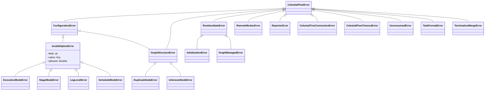

# TaskErrors

> 📅 Last Updated: 2026/06/11

The TaskErrors module defines the complete exception class system used in the CelestialFlow framework.

## Exception Hierarchy

```
CelestialFlowError
├── ConfigurationError
│   └── InvalidOptionError
│       ├── ExecutionModeError      # ("serial", "thread", "async")
│       ├── StageModeError          # ("serial", "thread")
│       ├── LogLevelError           # (TRACE/DEBUG/SUCCESS/INFO/...)
│       └── ScheduleModeError       # ("eager", "staged")
├── GraphStructureError
│   ├── DuplicateNodeError          # Duplicate node name
│   └── UnknownNodeError            # Unknown node name
├── RuntimeStateError
│   ├── InitializationError         # Initialization failure
│   └── GraphManagedError           # Graph management error
├── RemoteWorkerError               # Remote Worker execution failure
├── ReporterError                   # Reporter error
├── CelestialTreeConnectionError    # CelestialTree connection failure
├── CelestialFlowTimeoutError       # Timeout error
├── UnconsumedError                 # Marks unconsumed tasks
├── TaskFormatError                 # Task format error
└── TerminationMergeError           # Termination signal merge error
```



## Base Class

### CelestialFlowError

The base class for all custom exceptions.

```python
class CelestialFlowError(Exception):
    """Base class for all CelestialFlow custom exceptions"""
    pass
```

## Configuration-Related Exceptions (ConfigurationError)

### ConfigurationError

Base class for configuration errors (illegal parameters, unsupported combinations, etc.).

```python
class ConfigurationError(CelestialFlowError):
    """Configuration error (illegal parameters, unsupported combinations, etc.)"""
    pass
```

### InvalidOptionError

A specific configuration key has an illegal value.

```python
class InvalidOptionError(ConfigurationError):
    def __init__(
        self,
        field: str,
        value: Any,
        allowed: Iterable[Any],
        *,
        prefix: str = "Invalid",
    ):
        """
        :param field: Configuration key name
        :param value: Actual value passed
        :param allowed: Set of allowed values
        :param prefix: Error message prefix
        """
        # Example: "Invalid execution mode: xxx. Valid options are ('serial', 'thread', 'async')."
```

### ExecutionModeError

`execution_mode` configuration error.

```python
class ExecutionModeError(InvalidOptionError):
    """Illegal execution_mode"""
    def __init__(self, execution_mode: str, valid_modes=None):
        # valid_modes defaults to ("serial", "thread", "async")
```

### StageModeError

`stage_mode` configuration error.

```python
class StageModeError(InvalidOptionError):
    """Illegal stage_mode"""
    def __init__(self, stage_mode: str, valid_modes=None):
        # valid_modes defaults to ("serial", "thread")
```

### LogLevelError

`log_level` configuration error.

```python
class LogLevelError(InvalidOptionError):
    """Illegal log_level"""
    def __init__(self, log_level: str, valid_levels=None):
        # valid_levels defaults to ("TRACE", "DEBUG", "SUCCESS", "INFO", "WARNING", "ERROR", "CRITICAL")
```

### ScheduleModeError

`schedule_mode` configuration error.

```python
class ScheduleModeError(InvalidOptionError):
    """Illegal schedule_mode"""
    def __init__(self, schedule_mode: str, valid_modes=None):
        # valid_modes defaults to ("eager", "staged")
```

## Graph Structure Exceptions (GraphStructureError)

### GraphStructureError

Base class for graph structure errors.

```python
class GraphStructureError(ConfigurationError):
    """Graph structure error"""
    pass
```

### DuplicateNodeError

Duplicate node name (triggered during `set_stages` or `add_source_name` / `add_queue`).

```python
class DuplicateNodeError(GraphStructureError):
    """Duplicate node name"""
    pass
```

### UnknownNodeError

Unknown node name (triggered when validating termination signal sources).

```python
class UnknownNodeError(GraphStructureError):
    """Unknown node name"""
    pass
```

## Runtime Exceptions (RuntimeStateError)

### RuntimeStateError

Base class for runtime state errors (duplicate start, uninitialized, etc.).

```python
class RuntimeStateError(CelestialFlowError):
    """Runtime state error"""
    pass
```

### InitializationError

Initialization error (e.g., using an uninitialized thread pool).

```python
class InitializationError(RuntimeStateError):
    """Initialization error"""
    pass
```

### GraphManagedError

Thrown when attempting to call `start()` directly via the standalone path while the Stage is already managed by a TaskGraph.

```python
class GraphManagedError(RuntimeStateError):
    """Stage is already managed by a Graph; should not be started via the standalone path."""
    def __init__(self, message: str = "This stage is managed by a TaskGraph. ..."):
        ...
```

## External Service Exceptions

### RemoteWorkerError

Thrown when a remote Worker (e.g., Go Worker) fails to execute.

```python
class RemoteWorkerError(CelestialFlowError):
    """Remote Worker execution failure"""
    pass
```

### ReporterError

Reporter error.

```python
class ReporterError(CelestialFlowError):
    """Reporter error"""
    pass
```

### CelestialTreeConnectionError

CelestialTree client connection failure.

```python
class CelestialTreeConnectionError(CelestialFlowError):
    def __init__(self, message: str = "CelestialTreeClient is not available"):
        ...
```

## Other Runtime Exceptions

### CelestialFlowTimeoutError

Timeout error (inherits built-in `TimeoutError`).

```python
class CelestialFlowTimeoutError(CelestialFlowError, TimeoutError):
    """Timeout error"""
    pass
```

### UnconsumedError

Marks tasks that were not consumed.

```python
class UnconsumedError(CelestialFlowError):
    """Exception class used to mark unconsumed tasks"""
    pass
```

When `TaskGraph._finalize_nodes()` finds remaining tasks in the queue, it marks them as `UnconsumedError` and persists them.

### TaskFormatError

Task format error.

```python
class TaskFormatError(CelestialFlowError):
    """Task format error"""
    pass
```

### TerminationMergeError

Termination signal merge error (triggered when an upstream termination signal is missing).

```python
class TerminationMergeError(CelestialFlowError):
    """Termination signal merge error"""
    pass
```

## Usage Scenarios

### 1. Adding Retriable Exceptions

```python
executor = TaskExecutor("Processor", process, max_retries=3)
executor.add_retry_exceptions(ConnectionError, TimeoutError)
```

### 2. Catching Configuration Errors

```python
from celestialflow.runtime.util_errors import ExecutionModeError

try:
    stage.set_execution_mode("invalid_mode")
except ExecutionModeError as e:
    print(f"Invalid execution mode: {e.execution_mode}")
    print(f"Valid options: {e.valid_modes}")
```

### 3. Graph Structure Validation

```python
from celestialflow.runtime.util_errors import DuplicateNodeError

try:
    graph.set_stages([stage_a, stage_a])  # Duplicate node name
except DuplicateNodeError as e:
    print(f"Duplicate node: {e}")
```

## Usage Examples

The following examples demonstrate typical raise and catch patterns for various CelestialFlow exceptions.

### Configuration Exceptions

```python
from celestialflow.runtime.util_errors import (
    ExecutionModeError,
    StageModeError,
    LogLevelError,
    ScheduleModeError,
    InvalidOptionError,
)

# Catch ExecutionModeError
try:
    stage.set_execution_mode("invalid")
except ExecutionModeError as e:
    print(f"Field: {e.field}")          # execution_mode
    print(f"Value: {e.value}")          # invalid
    print(f"Allowed: {e.allowed}")      # ('serial', 'thread', 'async')

# Catch StageModeError
try:
    stage.set_stage_mode("invalid")
except StageModeError as e:
    print(f"Configuration error: {e}")

# Directly use InvalidOptionError
try:
    raise InvalidOptionError(
        field="strategy",
        value="aggressive",
        allowed=("conservative", "balanced"),
    )
except InvalidOptionError as e:
    print(f"Error: {e}")
```

### Graph Structure Exceptions

```python
from celestialflow import TaskGraph, TaskStage
from celestialflow.runtime.util_errors import DuplicateNodeError, UnknownNodeError

graph = TaskGraph(name="ErrorTestGraph")

stage_a = TaskStage("A", func=lambda x: x)
stage_b = TaskStage("A", func=lambda x: x * 2)  # Duplicate node name

try:
    graph.set_stages([stage_a, stage_b])
except DuplicateNodeError as e:
    print(f"Duplicate node: {e}")

try:
    from celestialflow.runtime.util_types import TerminationSignal
    # UnknownNodeError is triggered in in_queue._record_termination when validating the source
    from celestialflow.runtime import TaskInQueue
    from queue import Queue
    in_queue = TaskInQueue(queue=Queue(), source_names=["known"], out_name="test")
    in_queue._record_termination(TerminationSignal(source="unknown_source"))
except UnknownNodeError as e:
    print(f"Unknown source: {e}")
```

### Runtime and Timeout Exceptions

```python
from celestialflow.runtime.util_errors import (
    RuntimeStateError,
    CelestialFlowTimeoutError,
    UnconsumedError,
    TaskFormatError,
    TerminationMergeError,
)

# Timeout error (inherits built-in TimeoutError)
try:
    raise CelestialFlowTimeoutError("Task execution timed out after 30s")
except CelestialFlowTimeoutError as e:
    print(f"Timeout: {e}")

# Task format error
try:
    raise TaskFormatError("Expected (target, data) tuple, got str")
except TaskFormatError as e:
    print(f"Format error: {e}")

# Termination signal merge error
try:
    raise TerminationMergeError("Missing termination from source: B")
except TerminationMergeError as e:
    print(f"Merge error: {e}")
```

### External Service Exceptions

```python
from celestialflow.runtime.util_errors import (
    RemoteWorkerError,
    CelestialTreeConnectionError,
)

try:
    raise RemoteWorkerError("Go worker returned status code 500")
except RemoteWorkerError as e:
    print(f"Remote Worker error: {e}")

try:
    raise CelestialTreeConnectionError("Cannot connect to 127.0.0.1:7777")
except CelestialTreeConnectionError as e:
    print(f"Connection failed: {e}")
```

### Combined Usage with TaskExecutor

```python
from celestialflow import TaskExecutor
from celestialflow.runtime.util_errors import CelestialFlowError

# In real executors, exceptions are uniformly caught and recorded
executor = TaskExecutor(
    "SafeWorker",
    func=lambda x: 10 // x,
    execution_mode="serial",
    max_retries=0,
)
executor.start([1, 0, 2])  # The middle task triggers ZeroDivisionError

counts = executor.get_counts()
print(f"Success: {counts['tasks_succeeded']}, Failed: {counts['tasks_failed']}")
```

## Error Persistence

`TaskGraph` persists unhandled errors to a local JSONL file (via `FailSpout`) during `_finalize_nodes()`. Each error record contains error type, message, the Stage it belongs to, event ID, and timestamp, represented by `PersistedErrorRecord`.
