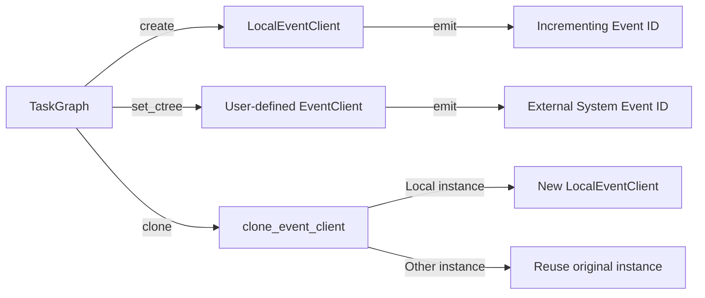

# RuntimeEvent

> 📅 Last Updated: 2026/06/18

`runtime/util_event.py` provides the event client abstraction interface and local implementation for event ID generation and tracking within task graphs.

## Core Classes

### EventClient (Protocol)

Minimal abstract interface for event clients.

```python
class EventClient(Protocol):
    def emit(
        self,
        type_: str,
        parents: list[int] | None = None,
        message: str | None = None,
        payload: list[Any] | dict[str, Any] | None = None,
    ) -> int:
        """Emit an event and return the corresponding event ID."""
        ...
```

| Parameter | Type | Description |
|------|------|------|
| `type_` | `str` | Event type (e.g., `"task.input"`, `"task.success"`, etc.) |
| `parents` | `list[int] \| None` | List of parent event IDs, used to establish causal chains between events |
| `message` | `str \| None` | Event message |
| `payload` | `list[Any] \| dict[str, Any] \| None` | Event payload |

Return value: Event ID (`int`).

### LocalEventClient

Local event client — **only responsible for generating incrementing event IDs**, without actually sending events to any external system. Suitable for scenarios that do not require full event tracking (e.g., CelestialTree).

```python
class LocalEventClient:
    def __init__(self, start_id: int = 1) -> None:
        """
        Initialize the local event client.

        :param start_id: Starting event ID, default 1
        """

    def emit(
        self,
        type_: str,
        parents: list[int] | None = None,
        message: str | None = None,
        payload: list[Any] | dict[str, Any] | None = None,
    ) -> int:
        """
        Emit a local event and return an incrementing ID.

        :param type_: Event type, unused in current implementation
        :param parents: List of parent event IDs, unused in current implementation
        :param message: Event message, unused in current implementation
        :param payload: Event payload, unused in current implementation
        :return: Incrementing event ID
        """
```

`LocalEventClient` internally maintains a `_next_id` counter, returning the current value and incrementing it on each `emit()` call. Thread safety is ensured via `threading.Lock`.

## Utility Functions

### clone_event_client

```python
def clone_event_client(client: EventClient) -> EventClient:
```

Clones an event client: for `LocalEventClient` instances, returns a new `LocalEventClient()`; for other implementations, directly reuses the original instance.

## Data Flow



## Relationship with TaskGraph / TaskExecutor

- `TaskGraph.__init__()` creates `LocalEventClient()` by default as the shared event client.
- Through `TaskGraph.set_ctree()`, it can be replaced with a user-defined `EventClient` (such as a CelestialTree client).
- `TaskDispatch._process_termination_signal()` calls `self.task_executor.ctree_client.emit()` to emit termination merge events.

## Usage Example

```python
from celestialflow.runtime.util_event import LocalEventClient, clone_event_client

# 1. Create a local event client
client = LocalEventClient(start_id=100)
print(f"First event ID: {client.emit(type_='task.input')}")   # 100
print(f"Second event ID: {client.emit(type_='task.success')}")  # 101
print(f"Third event ID: {client.emit(type_='task.error')}")    # 102

# 2. Clone the event client
cloned = clone_event_client(client)
print(f"Cloned instance type: {type(cloned).__name__}")  # LocalEventClient
print(f"Does the new instance reuse the original counter? {cloned.emit('') == client.emit('')}")  # False (two independent instances)
```

## Notes

- `EventClient` is a `Protocol`; any object implementing the `emit()` method satisfies this interface. Explicit inheritance is not required.
- `LocalEventClient`'s `emit()` method ignores all parameters (receiving them as `_ = type_, parents, message, payload`) and only returns an incrementing ID. Suitable as a default implementation when full event tracking is not needed.
- To report events to CelestialTree, you need to additionally install the `celestialtree` package, construct the corresponding client instance, and inject it via `TaskGraph.set_ctree()`.
