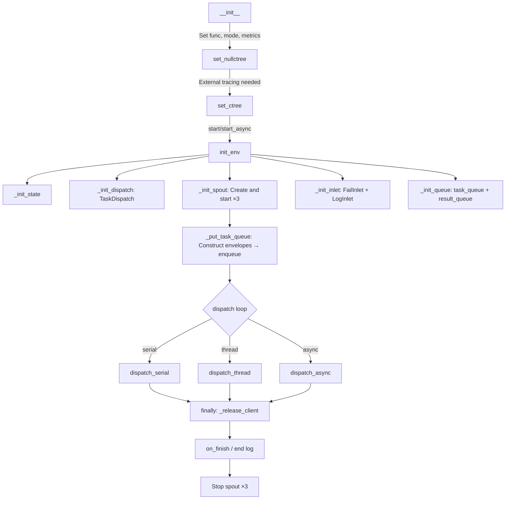

# TaskExecutor

> 📅 Last Updated: 2026/06/05

`TaskExecutor` is the core component for executing single task logic. It is responsible for task execution, concurrency control, error handling, retry mechanisms, and logging.

> Note: `TaskExecutor` should be treated as a one-shot object. After one `start()` / `start_async()` run, the same instance is not guaranteed to be safely reusable.

## Initialization

```python
class TaskExecutor:
    def __init__(
        self,
        name: str,
        func: Callable[..., Any],
        execution_mode: str = "serial",
        max_workers: int | None = None,
        max_retries: int = 1,
        max_info: int = 50,
        unpack_task_args: bool = False,
        enable_duplicate_check: bool = True,
        log_level: str = "INFO",
    ):
        ...
```

### Parameter Description

| Parameter | Default | Description |
|-----------|---------|-------------|
| `name` | — | Executor name, used for logging and tracing |
| `func` | — | Callable object that actually executes the task |
| `execution_mode` | `"serial"` | Execution mode: `"serial"` / `"thread"` / `"async"` |
| `max_workers` | `None` | Concurrency limit (dynamic when None: `min(32, cpu_count+4)`) |
| `max_retries` | `1` | Maximum retry count after task failure |
| `max_info` | `50` | Maximum length of each log message |
| `unpack_task_args` | `False` | Whether to unpack task arguments (`*args`) when passing to the function |
| `enable_duplicate_check` | `True` | Whether to enable hash-based duplicate checking |
| `log_level` | `"INFO"` | Log level |

## Observer Pattern

`TaskExecutor` broadcasts lifecycle events to external observers through the observer pattern.

### Register and Remove

```python
executor.add_observer(observer)     # Register observer
executor.remove_observer(observer)  # Remove observer
```

### Broadcast Events

| Event | Trigger Location | Description |
|-------|-----------------|-------------|
| `on_start(name, total)` | `start()`/`start_async()` | Execution starts |
| `on_task_success()` | `process_task_success()` | Task succeeds |
| `on_task_fail()` | `handle_task_fail()` | Task fails |
| `on_task_duplicate()` | `deal_duplicate()` | Duplicate detected |
| `on_tasks_added(count)` | `_put_task_queue()` | New tasks added (notified every 100) |
| `on_finish()` | `start()`/`start_async()` finally | Execution ends |

Note: `on_task_success`, `on_task_fail`, `on_task_duplicate` `_notify` calls do not pass count parameters; Observers should obtain them externally.

## Core Methods

### start / start_async

```python
def start(self, task_source: Iterable[Any]) -> None:
    """
    Synchronously start the executor. Flow:
    1. init_env() — Initialize metrics, dispatch, spout, inlet, queue
    2. _put_task_queue() — Construct envelopes and enqueue all tasks
    3. Call the dispatch method corresponding to execution_mode
    4. Stop spout in finally
    
    Note: async mode should not use this method (it would internally asyncio.run). Use start_async instead.
    """

async def start_async(self, task_source: Iterable[Any]) -> None:
    """
    Asynchronously start the executor. Internally sets execution_mode="async".
    """
```

Lifecycle note:
- Internal queues, spouts, inlets, counters, and runtime state are initialized for a single execution lifecycle.
- If you need to run the same task flow again, create a new `TaskExecutor` instead of restarting the same instance.

## Error Handling

### Retry Logic

Exceptions are classified in `TaskDispatch._worker`:
- **Retryable exceptions**: If in `retry_exceptions` and max_retries not reached, retry via `emit_retry_envelope()` with updated task ID
- **Non-retryable exceptions**: Task marked as failed, error logged, placed in `fail_inlet`

```python
def add_retry_exceptions(self, *exceptions: type[Exception]) -> None:
    """Add exception types that should trigger retries."""
```

### Result Handling (Overridable Methods)

```python
def process_result(self, task: Any, result: Any) -> Any:
    """Custom result processing logic (default returns as-is)."""

def get_args(self, task: Any) -> tuple[Any, ...]:
    """Custom argument extraction logic (default unpacks based on unpack_task_args)."""
```

### Retrieving Results

```python
def get_success_pairs(self) -> list[tuple[Any, Any]]:
    """Get success task (task, result) list (via SuccessSpout cache)."""

def get_error_pairs(self) -> list[tuple[Any, PersistedErrorRecord]]:
    """Get failed task (task, error_record) list (via FailSpout cache)."""

def process_result_dict(self) -> dict[Any, Any]:
    """Merge success and failure result dictionaries."""

def handle_error_dict(self) -> dict[tuple[str, str], list[Any]]:
    """Group errors by (error_type, error_message)."""
```

## CelestialTree Integration

```python
def set_ctree(self, host: str = "127.0.0.1", http_port: int = 7777, grpc_port: int = 7778) -> None:
    """Set up the CelestialTree client (gRPC transport only)."""

def set_nullctree(self, event_id: int | None = None) -> None:
    """Set up a null client (no external service connection, only generates event IDs)."""
```

## State Query Methods

```python
def get_name(self) -> str:           # Executor name
def get_full_name(self) -> str:      # "name(mode-workers)" or "name(serial)"
def get_func_name(self) -> str:      # Function name
def _get_class_name(self) -> str:    # Class name
def _get_execution_mode_desc(self) -> str:  # Execution mode description string
def get_summary(self) -> dict:       # Snapshot: name, func_name, class_name, execution_mode
def get_counts(self) -> dict:        # Counters: tasks_input/succeeded/failed/duplicated/processed/pending
```

## start / start_async Flow

### start (Synchronous Start)

```python
def start(self, task_source: Iterable[Any]) -> None:
```

Execution flow:
1. Record start time
2. `init_env()` — Initialize metrics → dispatch → spout → inlet → queue
3. Notify observer `on_start`
4. `_put_task_queue(task_source)` — Construct envelopes and enqueue all tasks
5. `fail_inlet.start_executor()` / `log_inlet.start_executor()` — Record start log
6. Call corresponding dispatch method based on `execution_mode`:
   - `serial` → `dispatch_serial()`
   - `thread` → `dispatch_thread()`
   - `async` → `asyncio.run(dispatch_async())` (not recommended, prefer `start_async`)
7. `finally` cleanup: Notify `on_finish` → Record end log → Stop all spouts

### start_async (Asynchronous Start)

```python
async def start_async(self, task_source: Iterable[Any]) -> None:
```

Similar to `start`, but:
- Automatically sets `execution_mode="async"`
- Uses `await dispatch.dispatch_async()` instead of `asyncio.run()`
- Suitable for calling within an existing event loop

## Lifecycle



## Notes

| Mode | Use Case | Notes |
|------|----------|-------|
| `serial` | Debugging, simple tasks | No concurrency, single thread |
| `thread` | I/O-intensive | Be aware of GIL limitations; uses thread pool internally |
| `async` | Network I/O | Function must be a coroutine; use `start_async` instead of `start` |

- `process_task_success` creates a result envelope and places it in `result_queue` (= `SuccessSpout`'s queue)
- `handle_task_fail` writes error records to `fail_inlet`
- `deal_duplicate` handles duplicate tasks and records a log
