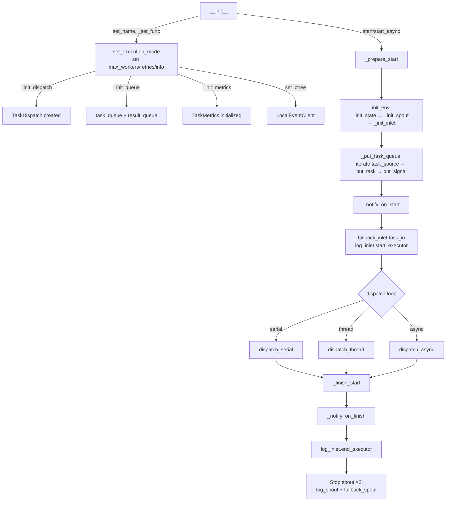

# TaskExecutor

> 📅 Last Updated: 2026/06/18

`TaskExecutor` is the core component for executing single-task logic. It is responsible for task execution, concurrency control, error handling, retry mechanisms, and logging.

> Note: `TaskExecutor` is a single-use object. After a single `start()` or `start_async()` completes, do not assume the current instance can be safely reused; if you need to run again, create a new `TaskExecutor`.

## Initialization

```python
class TaskExecutor[T, R]:
    def __init__(
        self,
        name: str,
        func: Callable[[T], R] | Callable[[T], Awaitable[R]],
        *,
        execution_mode: str = "serial",
        max_workers: int | None = None,
        max_retries: int = 1,
        max_info: int = 50,
        enable_duplicate_check: bool = True,
        persist_result: bool = False,
        log_level: str = "INFO",
    ):
        ...
```

### Parameters

| Parameter | Default | Description |
|------|--------|------|
| `name` | — | Executor name, used for logging and tracing |
| `func` | — | Callable that actually executes tasks (supports both sync functions and coroutine functions) |
| `execution_mode` | `"serial"` | Execution mode: `"serial"` / `"thread"` / `"async"` |
| `max_workers` | `None` | Concurrency limit (when None: dynamic `min(32, cpu_count+4)`) |
| `max_retries` | `1` | Maximum retry count after task failure (at most retries+1 executions) |
| `max_info` | `50` | Maximum length per log message |
| `enable_duplicate_check` | `True` | Whether to enable hash-based duplicate task checking |
| `persist_result` | `False` | Whether to persist task results to SQLite |
| `log_level` | `"INFO"` | Log level |

> **Changed**: Previous documentation did not include the `persist_result` parameter, which controls whether successful task results are persisted to SQLite. Previous documentation included the `unpack_task_args` parameter, which does not exist in the current source code and has been removed.

## Observer Pattern

`TaskExecutor` broadcasts lifecycle events to external observers via the observer pattern.

### Registration and Removal

```python
executor.add_observer(observer)     # Register observer
executor.remove_observer(observer)  # Remove observer
```

### Broadcast Events

| Event | Trigger Location | Description |
|------|---------|------|
| `on_start(name, total)` | `_prepare_start()` | Execution starts (note: total is fixed at 0; actual task count is notified via `on_tasks_added`) |
| `on_task_success()` | `process_task_success()` | Task succeeded (no parameters; Observer must obtain counts itself) |
| `on_task_fail()` | `handle_task_fail()` | Task failed (no parameters) |
| `on_task_duplicate()` | `deal_duplicate()` | Duplicate detected (no parameters) |
| `on_tasks_added(count)` | `_put_task_queue()` | New tasks added (notified every 100) |
| `on_finish()` | `_finish_start()` finally | Execution ended (no parameters) |

> **Changed**: Previous documentation stated that `on_start` passes the actual total task count; in the source code, it always passes `0`, with the actual task count notified batch-by-batch through subsequent `on_tasks_added` events. Success/failure/duplicate events also do not pass count parameters.

## Core Methods

### start / start_async / start_db

```python
def start(self, task_source: Iterable[T]) -> None:
    """
    Synchronously start the executor. Flow:
    1. _prepare_start() — init_env() + inject tasks + record start log
    2. Call dispatch method corresponding to execution_mode
    3. _finish_start() — notify on_finish + stop all spouts
    """

async def start_async(self, task_source: Iterable[T]) -> None:
    """
    Asynchronously start the executor. Internally sets execution_mode="async".
    Uses await dispatch.dispatch_async() instead of asyncio.run().
    """

def start_db(self, db_path: str | Path, status: str = "failed") -> None:
    """
    Read failed tasks for the current stage from a sqlite persistence database and start execution.

    :param db_path: sqlite database file path
    :param status: Record status filter condition, default "failed"
    """
```

Lifecycle constraints:

- During execution, queues, `spout/inlet` instances, statistical state, and dispatcher runtime resources are created and held.
- The current implementation is designed for single-run use and is not guaranteed to be fully resettable after one execution completes.
- If you need multiple rounds of the same logic, create a new executor instance rather than calling `start()` / `start_async()` / `start_db()` repeatedly on the same object.

## Error Handling

### Retry Logic

Exceptions are classified in `TaskDispatch._worker`:
- **Retryable exceptions**: If in `retry_exceptions` and `max_retries` not reached, update task ID via `emit_retry_envelope()` and retry
- **Non-retryable exceptions**: Task marked as failed, error logged, placed into `fallback_inlet`

```python
def set_retry_exceptions(self, *exceptions: type[Exception]) -> None:
    """Add exception types that should trigger retries."""
```

> **Changed**: Previous documentation referred to `add_retry_exceptions`; the method in the source code is named `set_retry_exceptions`.

### Result Handling (Core Methods)

Task result handling is implemented through the following methods:

```python
def process_task_success(self, task_envelope: TaskEnvelope[T], result: R, start_time: float) -> None:
    """Handle successful task: notify observer, write log, generate result envelope and put into result_queue."""

def handle_task_fail(self, task_envelope: TaskEnvelope[T], exception: Exception) -> None:
    """Handle failed task: notify observer, record to fallback_inlet and log_inlet."""

def deal_duplicate(self, task_envelope: TaskEnvelope[T]) -> None:
    """Handle duplicate task: notify observer, record log."""
```

> **Changed**: Previous documentation described overridable methods `process_result()` and `get_args()`, which do not exist in the current source code. Previous documentation also described `process_result_dict()` and `handle_error_dict()`, which also do not exist; actual result handling is done through `process_task_success()`.

### Getting Results

```python
def get_success_pairs(self) -> list[tuple[T, R]]:
    """
    Get the list of successful tasks (task, result) pairs.
    Requires persist_result=True, otherwise returns an empty list with a warning.
    """

def get_error_pairs(self) -> list[tuple[T, PersistedError]]:
    """Get the list of failed tasks (task, PersistedError) pairs."""
```

## CelestialTree Integration

```python
def set_ctree(self, ctree_client: EventClient) -> None:
    """Set the event client instance."""
```

> By default, `TaskExecutor` internally uses `LocalEventClient()` to generate local incrementing event IDs.
>
> If you need to connect to CelestialTree, first install `celestialtree` separately, then construct a client object and pass it to `set_ctree()`; there is no longer a separate `set_nullctree()` configuration entry point.

## State Query Methods

```python
def get_name(self) -> str:                    # Executor name
def get_full_name(self) -> str:               # "name(mode-workers)" or "name(serial)"
def get_func_name(self) -> str:               # Function name
def get_summary(self) -> dict:                # Snapshot: name, func_name, execution_mode, max_workers
def get_counts(self) -> dict:                 # Counters: tasks_input/succeeded/failed/duplicated/processed/pending
def get_fallback_path(self) -> Path:          # Absolute path to the fallback SQLite file
```

> **Changed**: `get_summary()` returns a dict with keys `name, func_name, execution_mode, max_workers`, not including `class_name`.

## Lifecycle



> **Changed**: The previous flowchart included a `_release_client` node (not present in the source code) and 3 spouts (`log_spout` + `fail_spout` + `success_spout`). Currently there are only 2 spouts: `log_spout` + `fallback_spout`.

## Usage Example

### Basic Task Execution

```python
from celestialflow import TaskExecutor

def process_item(x: int) -> int:
    return x * 10

executor = TaskExecutor(
    name="Calculator",
    func=process_item,
    execution_mode="serial",
)
executor.start([1, 2, 3])

# Get success/failure results
success = executor.get_success_pairs()
errors = executor.get_error_pairs()
print(f"Success: {len(success)}, Failed: {len(errors)}")
```

### Recovering Failed Tasks from SQLite

```python
from celestialflow import TaskExecutor

def process_item(x: int) -> int:
    return x * 10

executor = TaskExecutor("Recovery", process_item, execution_mode="thread")
# Resume execution from persisted failed records
executor.start_db("fallback/2026-06-18/executor_fallbacks.sqlite3", status="failed")
```

## Notes

| Mode | Use Case | Cautions |
|------|----------|---------|
| `serial` | Debugging, simple tasks | No concurrency, single thread |
| `thread` | I/O-intensive | Mind GIL constraints, internally uses thread pool |
| `async` | Network I/O | Function must be a coroutine; use `start_async` not `start` |

- `process_task_success` creates a result envelope and puts it into `result_queue`
- `handle_task_fail` writes error records to `fallback_inlet`
- `deal_duplicate` handles duplicate tasks and logs them
- `_init_spout` automatically creates and starts two background threads: `FallbackSpout` and `LogSpout`
