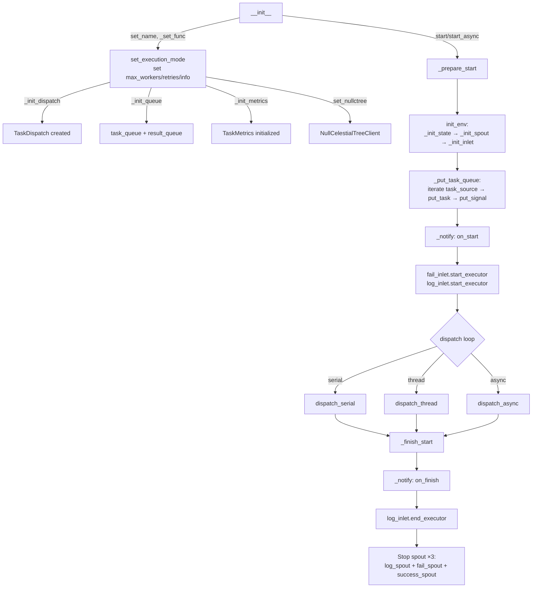

# TaskExecutor

> 📅 Last Updated: 2026/06/11

`TaskExecutor` is the core component for executing single-task logic. It is responsible for task execution, concurrency control, error handling, retry mechanisms, and logging.

> Note: `TaskExecutor` is a single-use object. Once `start()` or `start_async()` completes, the current instance should not be assumed safe for reuse; create a new `TaskExecutor` for subsequent executions.

## Initialization

```python
class TaskExecutor[T, R]:
    def __init__(
        self,
        name: str,
        func: Callable[[T], R] | Callable[[T], Awaitable[R]],
        execution_mode: str = "serial",
        max_workers: int | None = None,
        max_retries: int = 1,
        max_info: int = 50,
        enable_duplicate_check: bool = True,
        log_level: str = "INFO",
    ):
        ...
```

### Parameter Descriptions

| Parameter | Default | Description |
|------|--------|------|
| `name` | — | Executor name, used for logging and tracing |
| `func` | — | Callable that actually executes the task (supports sync functions and coroutine functions) |
| `execution_mode` | `"serial"` | Execution mode: `"serial"` / `"thread"` / `"async"` |
| `max_workers` | `None` | Concurrency limit (when None: dynamic `min(32, cpu_count+4)`) |
| `max_retries` | `1` | Maximum retry count after task failure (max retries+1 executions) |
| `max_info` | `50` | Maximum length of each info item in logs |
| `enable_duplicate_check` | `True` | Whether to enable task hash-based duplicate checking |
| `log_level` | `"INFO"` | Log level |

> **Changed**: Previous documentation included the `unpack_task_args` parameter, which does not exist in the current source code and has been removed.

## Observer Pattern

`TaskExecutor` broadcasts lifecycle events externally through the observer pattern.

### Registration and Removal

```python
executor.add_observer(observer)     # Register observer
executor.remove_observer(observer)  # Remove observer
```

### Broadcast Events

| Event | Trigger Location | Description |
|------|---------|------|
| `on_start(name, total)` | `_prepare_start()` | Execution start (note: total is fixed at 0, actual task count is notified via `on_tasks_added`) |
| `on_task_success()` | `process_task_success()` | Task success (no parameters, Observer should obtain counts itself) |
| `on_task_fail()` | `handle_task_fail()` | Task failure (no parameters) |
| `on_task_duplicate()` | `deal_duplicate()` | Duplicate detected (no parameters) |
| `on_tasks_added(count)` | `_put_task_queue()` | New tasks added (notified every 100) |
| `on_finish()` | `_finish_start()` finally | Execution finished (no parameters) |

> **Changed**: Previous documentation recorded `on_start` as passing the actual total task count; the source code always passes `0`, with actual task counts notified in batches through subsequent `on_tasks_added` events. Success/failure/duplicate events also do not pass count parameters.

## Core Methods

### start / start_async

```python
def start(self, task_source: Iterable[T]) -> None:
    """
    Synchronously start the executor. Flow:
    1. _prepare_start() — init_env() + inject tasks + record start log
    2. Call dispatch's corresponding method based on execution_mode
    3. _finish_start() — notify on_finish + stop all spouts
    """

async def start_async(self, task_source: Iterable[T]) -> None:
    """
    Asynchronously start the executor. Internally sets execution_mode="async".
    Uses await dispatch.dispatch_async() instead of asyncio.run().
    """
```

Lifecycle constraints:

- During execution, the executor creates and holds queues, spouts/inlets, statistics state, and scheduler runtime resources.
- The current implementation is designed for single-run use and is not guaranteed to be safely reset after execution completes.
- If multiple runs of the same logic are needed, create a new executor instance instead of repeatedly calling `start()` / `start_async()` on the same object.

## Error Handling

### Retry Logic

Exceptions are classified in `TaskDispatch._worker`:
- **Retryable Exceptions**: If in `retry_exceptions` and `max_retries` not reached, update task ID via `emit_retry_envelope()` and retry
- **Non-Retryable Exceptions**: Task is marked as failed, error log recorded, placed into `fail_inlet`

```python
def add_retry_exceptions(self, *exceptions: type[Exception]) -> None:
    """Add exception types that should trigger retry."""
```

### Result Processing (Core Methods)

Task result processing is implemented through the following methods:

```python
def process_task_success(self, task_envelope: TaskEnvelope[T, R], result: R, start_time: float) -> None:
    """Process successful task: notify observer, write log, generate result envelope and put into result_queue."""

def handle_task_fail(self, task_envelope: TaskEnvelope[T, R], exception: Exception) -> None:
    """Process failed task: notify observer, record to fail_inlet and log_inlet."""

def deal_duplicate(self, task_envelope: TaskEnvelope[T, R]) -> None:
    """Process duplicate task: notify observer, record log."""
```

> **Changed**: Previous documentation listed overridable methods `process_result()` and `get_args()`, neither of which exists in the current source code. Actual result processing is done through `process_task_success()`, and parameter extraction logic is handled internally by `TaskDispatch`.

### Retrieving Results

```python
def get_success_pairs(self) -> list[tuple[T, R]]:
    """Get list of successful task (task, result) pairs (via SuccessSpout cache)."""

def get_error_pairs(self) -> list[tuple[Any, PersistedErrorRecord]]:
    """Get list of failed task (task, error_record) pairs (via FailSpout cache)."""

def process_result_dict(self) -> dict[T, R | str]:
    """Merge success and failure result dictionaries."""

def handle_error_dict(self) -> dict[tuple[str, str], list[T]]:
    """Group errors by (error_type, error_message)."""
```

## CelestialTree Integration

```python
def set_ctree(self, host: str = "127.0.0.1", http_port: int = 7777, grpc_port: int = 7778) -> None:
    """Set CelestialTree client (gRPC transport only)."""

def set_nullctree(self, event_id: int | None = None) -> None:
    """Set null client (no external service connection, only generates event ID)."""
```

## State Query Methods

```python
def get_name(self) -> str:                    # Executor name
def get_full_name(self) -> str:               # "name(mode-workers)" or "name(serial)"
def get_func_name(self) -> str:               # Function name
def _get_class_name(self) -> str:             # Class name
def _get_execution_mode_desc(self) -> str:    # Execution mode description string
def get_summary(self) -> dict:                # Snapshot: name, func_name, execution_mode, max_workers
def get_counts(self) -> dict:                 # Counters: tasks_input/succeeded/failed/duplicated/processed/pending
```

> **Changed**: The dictionary keys returned by `get_summary()` are `name, func_name, execution_mode, max_workers` and do not include `class_name`.

## Lifecycle



> **Changed**: Previous flowchart included a `_release_client` node which does not exist in the current source code. `_finish_start` actually performs three steps: `_notify → log → stop spouts`.

## Notes

| Mode | Applicable Scenarios | Notes |
|------|----------|---------|
| `serial` | Debugging, simple tasks | No concurrency, single-threaded |
| `thread` | I/O intensive | Mind GIL limitations, internally uses thread pool |
| `async` | Network I/O | Function must be a coroutine; use `start_async` instead of `start` |

- `process_task_success` creates a result envelope and puts it into `result_queue` (= `SuccessSpout`'s queue)
- `handle_task_fail` writes error records to `fail_inlet`
- `deal_duplicate` handles duplicate tasks and logs them
- `_init_spout` automatically creates and starts three background threads: `FailSpout`, `LogSpout`, `SuccessSpout`
