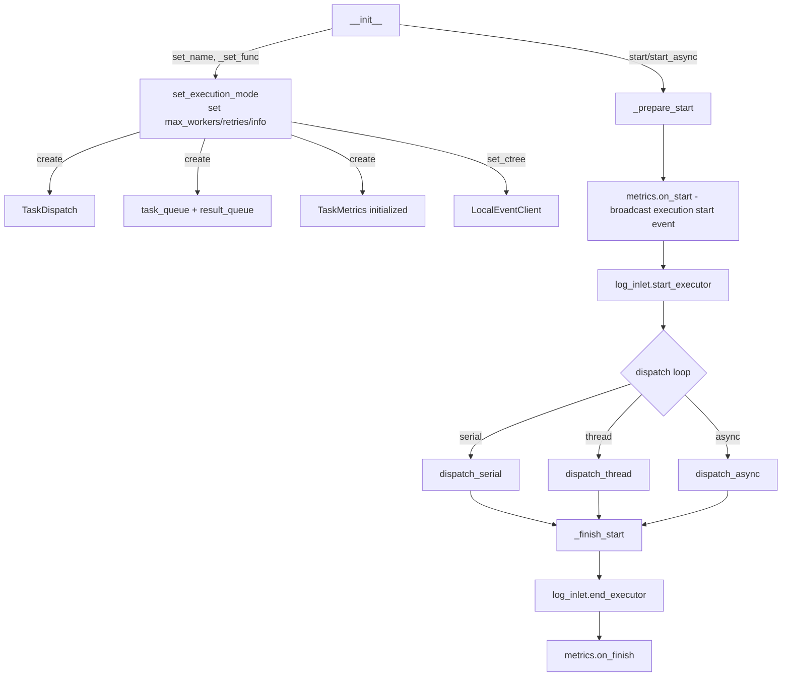

# TaskExecutor

> 📅 Last Updated: 2026/08/31

`TaskExecutor` is the core component for executing single-task logic. It is responsible for task execution, concurrency control, error handling, retry mechanisms, and logging.

> Note: `TaskExecutor` is a single-use object. After a single `start()` or `start_async()` completes, do not assume the current instance can be safely reused; if you need to run again, create a new `TaskExecutor`.

## Initialization

```python
class TaskExecutor[T, R]:
    def __init__(
        self,
        name: str,
        func: Callable[[T], R] | Callable[[T], Awaitable[R]],
        *,
        execution_mode: str = "serial",
        max_workers: int | None = None,
        max_retries: int = 1,
        max_queue_size: int = 0,
        max_info: int = 50,
        enable_duplicate_check: bool = False,
    ): ...
```

### Parameters

| Parameter | Default | Description |
|------|--------|------|
| `name` | — | Executor name, used for logging and tracing |
| `func` | — | Callable that actually executes tasks (supports both sync functions and coroutine functions) |
| `execution_mode` | `"serial"` | Execution mode: `"serial"` / `"thread"` / `"async"` |
| `max_workers` | `None` | Concurrency limit (when None: dynamic `min(32, cpu_count+4)`) |
| `max_retries` | `1` | Maximum retry count after task failure (at most retries+1 executions) |
| `max_queue_size` | `0` | Maximum capacity of the task input queue (0 means unlimited) |
| `max_info` | `50` | Maximum length per log message |
| `enable_duplicate_check` | `False` | Whether to enable hash-based duplicate task checking |

## Observer Pattern

`TaskExecutor` broadcasts lifecycle events to external observers via the observer pattern.

### Registration and Removal

```python
executor.add_observer(observer)  # Register observer
executor.remove_observer(observer)  # Remove observer
```

### Broadcast Events

| Event | Trigger Location | Description |
|------|---------|------|
| `on_start(name, total)` | `metrics.on_start()` | Execution starts (note: total is fixed at 0; actual task count is notified via `on_tasks_added`) |
| `on_task_success(count=1)` | `metrics.add_success_count()` | Task succeeded (count is the increment added in this call) |
| `on_task_fail(count=1)` | `metrics.add_fail_count()` | Task failed (count is the increment added in this call) |
| `on_task_duplicate(count=1)` | `metrics.add_duplicate_count()` | Duplicate detected (count is the increment added in this call) |
| `on_tasks_added(count)` | `metrics.add_task_count()` | New tasks added to the queue |
| `on_finish()` | `metrics.on_finish()` | Execution ended |

## Core Methods

### run / run_async / restore_db

```python
def run(self, task_source: Iterable[T], *, if_put_signal: bool = True) -> None:
    """
    Synchronously run the executor (with funnel_scope lifecycle). Internally calls
    put_task() to inject all tasks, put_signal() to inject termination signal, then start().
    """


async def run_async(
    self, task_source: Iterable[T], *, if_put_signal: bool = True
) -> None:
    """
    Asynchronously run the executor (with funnel_scope lifecycle). Internally calls
    put_task() to inject all tasks, put_signal() to inject termination signal, then await start_async().
    """


def restore_db(
    self,
    db_path: str | Path,
    statuses: Iterable[str] | None = None,
    *,
    filter_by_error_type: bool = False,
) -> None:
    """
    Read tasks for the current stage from a sqlite persistence database and start execution.

    :param db_path: Path to the sqlite database file
    :param statuses: Record status filter list, defaults to ["failed", "pending"]
    :param filter_by_error_type: Whether to filter error_type by the current
        executor's retry_exceptions, default False
    """
```

Lifecycle constraints:

- During execution, queues, `spout/inlet` instances, statistical state, and dispatcher runtime resources are created and held.
- The current implementation is designed for single-run use and is not guaranteed to be fully resettable after one execution completes.
- If you need multiple rounds of the same logic, create a new executor instance rather than calling `run()` / `run_async()` / `restore_db()` repeatedly on the same object.

## Error Handling

### Retry Logic

Exceptions are handled in the classification loop within `TaskDispatch._worker` / `_async_worker`:
- **Retryable exceptions**: If in `retry_exceptions` and not yet reaching `max_retries`, call `log_task_retry()` to log and enter the next loop iteration to retry
- **Non-retryable exceptions**: Call `handle_task_fail()` to write the record to `LifecycleInlet` (SQLite) and `LogInlet` (log file)

```python
def set_retry_exceptions(self, *exceptions: type[Exception]) -> None:
    """Add exception types that should trigger retries."""
```

### Result Handling (Core Methods)

Task result handling is implemented through the following methods:

```python
def process_task_success(
    self, task_envelope: TaskEnvelope[T], result: R, start_time: float
) -> None:
    """Handle successful task: notify observer, write log, generate result envelope and put into result_queue."""


def handle_task_fail(
    self, task_envelope: TaskEnvelope[T], exception: Exception
) -> None:
    """Handle failed task: notify observer, record to LifecycleInlet and LogInlet."""


def deal_duplicate(self, task_envelope: TaskEnvelope[T]) -> None:
    """Handle duplicate task: notify observer, record log."""
```

### Getting Results

```python
def get_success_pairs(self) -> list[tuple[T, R]]:
    """
    Get the list of successful tasks (task, result) pairs.
    Reads from the global LifecycleSpout's SQLite records filtered by this executor's name.
    """


def get_error_pairs(self) -> list[tuple[T, PersistedError]]:
    """Get the list of failed tasks (task, PersistedError) pairs."""
```

## CelestialTree Integration

```python
def set_ctree(self, ctree_client: EventClient) -> None:
    """Set the event client instance."""
```

> By default, `TaskExecutor` internally uses `LocalEventClient()` to generate local incrementing event IDs.
> If you need to connect to CelestialTree, first install `celestialtree` separately, then construct a client object and pass it to `set_ctree()`.

## State Query Methods

```python
def get_name(self) -> str:                    # Executor name
def get_full_name(self) -> str:               # "name(mode-workers)" or "name(serial)"
def get_func_name(self) -> str:               # Function name
def get_summary(self) -> dict:                # Snapshot: name, func_name, execution_mode, max_workers
def get_counts(self) -> dict:                 # Counters: tasks_input/succeeded/failed/duplicated/processed/pending
def get_lifecycle_path(self) -> Path:         # Absolute path to the global lifecycle SQLite file (empty Path when unset)
```

## Lifecycle


```mermaid
flowchart TD
    INIT[__init__] -->|set_name, _set_func| CONFIG[set_execution_mode<br/>set max_workers/retries/info]
    CONFIG -->|create| DISPATCH[TaskDispatch]
    CONFIG -->|create| QUEUE[task_queue + result_queue]
    CONFIG -->|create| METRICS[TaskMetrics initialized]
    CONFIG -->|set_ctree| CTREE[LocalEventClient]

    INIT -->|start/start_async| PREPARE[_prepare_start]
    PREPARE --> METRICS_START[metrics.on_start - broadcast execution start event]
    METRICS_START --> LOG_START[log_inlet.start_executor]
    LOG_START --> RUN{dispatch loop}
    RUN -->|serial| SERIAL[dispatch_serial]
    RUN -->|thread| THREAD[dispatch_thread]
    RUN -->|async| ASYNC[dispatch_async]

    SERIAL --> FINISH[_finish_start]
    THREAD --> FINISH
    ASYNC --> FINISH

    FINISH --> LOG_END[log_inlet.end_executor]
    LOG_END --> METRICS_FINISH[metrics.on_finish]
```

> The background threads of the global `LifecycleSpout` / `LogSpout` are started and stopped by `funnel_scope`. `TaskExecutor` itself does not directly manage these two spouts.

## Usage Examples

### Basic Task Execution

```python
from celestialflow import TaskExecutor


def process_item(x: int) -> int:
    return x * 10


executor = TaskExecutor(
    name="Calculator",
    func=process_item,
    execution_mode="serial",
)
executor.run([1, 2, 3])

# Get success/failure results
success = executor.get_success_pairs()
errors = executor.get_error_pairs()
print(f"Success: {len(success)}, Failed: {len(errors)}")
```

### Recovering Failed Tasks from SQLite

```python
from celestialflow import TaskExecutor


def process_item(x: int) -> int:
    return x * 10


executor = TaskExecutor("Recovery", process_item, execution_mode="thread")
# Resume execution from persisted failed and pending records
executor.restore_db("lifecycles/2026-08-26/flow_lifecycle(10-00-00-123).sqlite3")

# Alternatively, specify to recover only failed records
executor.restore_db(
    "lifecycles/2026-08-26/flow_lifecycle(10-00-00-123).sqlite3", statuses=["failed"]
)
```

## Notes

| Mode | Use Case | Cautions |
|------|----------|----------|
| `serial` | Debugging, simple tasks | No concurrency, single thread |
| `thread` | I/O-intensive | Mind GIL constraints, internally uses thread pool |
| `async` | Network I/O | Function must be a coroutine; use `start_async` not `start` |

- `process_task_success` creates a result envelope and puts it into `result_queue`
- `handle_task_fail` writes error records to `LifecycleInlet` and `LogInlet`
- `deal_duplicate` handles duplicate tasks and logs them
- The background threads of the global `LifecycleSpout` / `LogSpout` are started and stopped by `funnel_scope`; `TaskExecutor` itself does not directly create them
