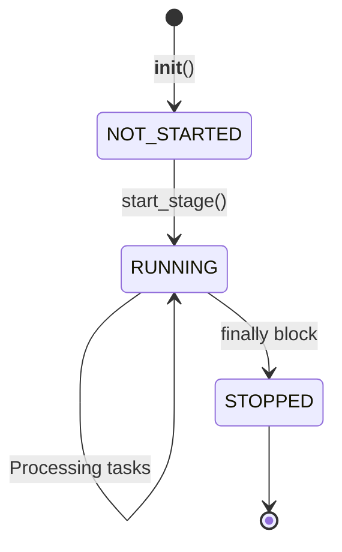

# TaskStage

> 📅 Last Updated: 2026/06/22

`TaskStage` is the fundamental building block for constructing a `TaskGraph`. It inherits from `TaskExecutor` and adds graph structure related connection capabilities and `stage_mode` control logic.

> Note: `TaskStage` is also a single-use object. It is typically managed by `TaskGraph` and participates in one complete run; after the run ends, its queue bindings, counting state, and in-graph relationships are not guaranteed to be safely reset.

## Inheritance

`TaskExecutor` -> `TaskStage`

`TaskStage` inherits all core capabilities of `TaskExecutor` (execution mode, retry, metrics monitoring, etc.) and adds inter-node connection logic.

## Core Concepts

- **Stage Mode**: The scheduling logic mode of a node within the task graph.
  - `serial`: Serial mode, runs in the main process.
  - `thread`: Thread mode, runs in a separate thread within the main process.
- **Execution Mode**: The concurrency mode for processing tasks within the node (`serial`, `thread`, `async`), inherited from `TaskExecutor`.
- **Topology Relationships**: The upstream/downstream connection relationships between nodes are managed by `TaskGraph`; `TaskStage` itself does not store adjacency lists.

## Initialization

```python
class TaskStage[T, R](TaskExecutor[T, R]):
    def __init__(
        self,
        name: str,
        func: Callable[[T], R] | Callable[[T], Awaitable[R]],
        stage_mode: str = "serial",
        **kwargs: Any,
    ):
        """
        :param name: Node name (unique identifier)
        :param func: Execution function
        :param stage_mode: Running mode within the graph ('serial' or 'thread')
        :param kwargs: Parameters forwarded to TaskExecutor (execution_mode, max_workers, max_retries, etc.)
        """
```

Example:
```python
stage_a = TaskStage("StageA", func=process_a, execution_mode="thread", stage_mode="thread")
stage_b = TaskStage("StageB", func=process_b, execution_mode="serial", stage_mode="thread")

# Create graph and connect nodes
graph = TaskGraph()
graph.set_stages(stages=[stage_a, stage_b])
graph.connect([stage_a], [stage_b])
```

## Configuration Methods

### set_stage_mode

```python
def set_stage_mode(self, stage_mode: str):
    """
    Set the node's execution mode within the task graph.
    :param stage_mode: 'serial' or 'thread'
    :raises StageModeError: If the mode is not supported
    """
```

### set_inlet

```python
def set_inlet(self, fallback_inlet: FallbackInlet, log_inlet: LogInlet) -> None:
    """
    Initialize collectors, connecting fallback/log collectors to the persistence layer.
    :param fallback_inlet: Fallback collector
    :param log_inlet: Log collector
    """
```

### Configuration Methods Inherited from TaskExecutor

| Method | Description |
|------|------|
| `set_execution_mode(mode)` | Set the node's internal task processing mode (`serial`/`thread`/`async`) |
| `set_name(name)` | Set the node name |
| `set_log_level(level)` | Set the log level |

## Connection Binding

### prev_binding

```python
def prev_binding(self, pending_prev_binding: TaskStage[Any, Any]) -> None:
    """
    Bind a single predecessor node, registering its counter into the current stage's task_counter.
    """
```

### get_binding_counter

```python
def get_binding_counter(self, _downstream_name: str) -> Any:
    """
    Return the counter that the downstream stage should bind to; subclasses may override (default returns success_counter).
    """
```

## State Management

`TaskStage` uses the `StageStatus` enum to maintain its lifecycle:



### State Methods

```python
# Mark as running
def mark_running(self) -> None:
    """Mark: stage is running."""

# Mark as stopped
def mark_stopped(self) -> None:
    """Mark: stage has stopped (called in finally block on normal completion)."""

# Get status
def get_status(self) -> StageStatus:
    """Read the current status (returns StageStatus enum)."""
```

## Execution Mechanisms

### start / start_async (prohibited from direct invocation)

When a `TaskStage` is managed by `TaskGraph`, directly calling `start()` or `start_async()` will raise `GraphManagedError`. Execution should be driven uniformly by `TaskGraph.start_graph()`.

### start_stage

When `TaskGraph` starts, it calls this method to launch the node's actual execution.

```python
def start_stage(self):
    """
    Based on the value of execution_mode, choose serial, thread, or async execution.
    Records start/end logs, manages state transitions.
    """
```

Lifecycle constraints:

- `TaskStage`'s runtime state is established and driven by `TaskGraph` during the startup phase.
- The current implementation does not provide thorough reset semantics for multi-round reuse.
- If you need to run the same node again, it is recommended to create a new `TaskStage` and reconnect it to a new `TaskGraph`.

### drain_task_queue

```python
def drain_task_queue(self) -> None:
    """Drain the task queue, moving all remaining tasks to the failed queue and marking them as UnconsumedError."""
```

## State Snapshot

```python
def get_summary(self) -> dict[str, Any]:
    """
    Get the current node's status summary.
    Returns fields inherited from TaskExecutor (name, func_name, execution_mode, max_workers)
    plus stage_mode.
    """
```

## Usage Examples

The following examples demonstrate full usage of `TaskStage`, including multiple execution modes, state management, and graph connections.

### Basic Usage (serial mode)

```python
from celestialflow import TaskGraph, TaskStage

def step1(x: int) -> int:
    return x + 5

def step2(x: int) -> int:
    return x * 3

stage1 = TaskStage("Step1", func=step1, execution_mode="serial", stage_mode="serial")
stage2 = TaskStage("Step2", func=step2, execution_mode="serial", stage_mode="serial")

chain = TaskGraph()
chain.set_stages([stage1, stage2])
chain.connect([stage1], [stage2])
chain.start_graph({stage1.get_name(): [1, 2, 3, 4, 5]})

for name, runtime in chain.stage_runtime_dict.items():
    pairs = runtime.stage.get_success_pairs()
    print(f"{name}: {len(pairs)} succeeded")
```

### Using thread Execution Mode (I/O-intensive)

```python
import time
from celestialflow import TaskGraph, TaskStage

def io_task(x: int) -> int:
    time.sleep(0.05)
    return x * 10

stage_a = TaskStage(
    name="IOWorker",
    func=io_task,
    execution_mode="thread",
    max_workers=4,
    stage_mode="thread",
)

graph = TaskGraph()
graph.set_stages([stage_a])
graph.start_graph({stage_a.get_name(): list(range(20))})
```

### Async Mode (async)

```python
import asyncio
from celestialflow import TaskStage

async def async_process(x: int) -> int:
    await asyncio.sleep(0.01)
    return x ** 2

async_stage = TaskStage(
    name="AsyncProcessor",
    func=async_process,
    execution_mode="async",
    max_workers=4,
)
print(f"Async stage summary: {async_stage.get_summary()}")
```

### State Management

```python
from celestialflow import TaskStage
from celestialflow.runtime.util_types import StageStatus

stage = TaskStage("StatusDemo", func=lambda x: x)

print(f"Initial state: {stage.get_status().name}")  # NOT_STARTED
stage.mark_running()
print(f"Running: {stage.get_status().name}")   # RUNNING
stage.mark_stopped()
print(f"Stopped: {stage.get_status().name}")   # STOPPED
```

## Notes

1. **Name uniqueness**: Within the same `TaskGraph`, each `TaskStage`'s `name` must be unique.
2. **Async support**: If `execution_mode` is set to `async`, then `func` must be a coroutine function.
3. **Graph management**: Stages managed by `TaskGraph` cannot directly call `start()` / `start_async()`.
4. **Single-use**: Do not reuse the same `TaskStage` instance after a run completes.
