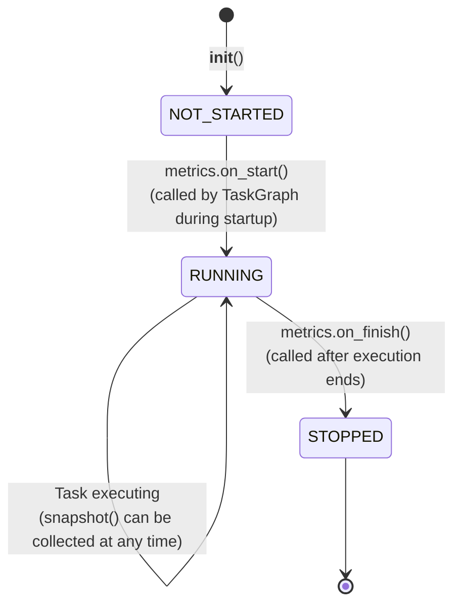

# TaskStage

> 📅 Last Updated: 2026/08/26

`TaskStage` is the fundamental building block for constructing a `TaskGraph`. It inherits from `TaskExecutor` and adds graph structure related connection capabilities.

> Note: `TaskStage` is also a single-use object. It is typically managed by `TaskGraph` and participates in one complete run; after the run ends, its queue bindings, counting state, and in-graph relationships are not guaranteed to be safely reset.

## Inheritance

`TaskExecutor` -> `TaskStage`

`TaskStage` inherits all core capabilities of `TaskExecutor` (execution mode, retry, metrics monitoring, etc.) and adds inter-node connection logic.

## Core Concepts

- **Execution Mode**: The concurrency mode for processing tasks within the node (`serial`, `thread`, `async`), inherited from `TaskExecutor`.
- **Topology Relationships**: The upstream/downstream connection relationships between nodes are managed by `TaskGraph`; `TaskStage` itself does not store adjacency lists.

## Initialization

```python
class TaskStage[T, R](TaskExecutor[T, R]):
    def __init__(
        self,
        name: str,
        func: Callable[[T], R] | Callable[[T], Awaitable[R]],
        **kwargs: Any,
    ) -> None:
        """
        :param name: Node name (unique identifier)
        :param func: Execution function
        :param kwargs: Parameters forwarded to TaskExecutor
            (execution_mode, max_workers, max_retries, max_queue_size,
            max_info, enable_duplicate_check, etc.)
        """
```

Example:
```python
stage_a = TaskStage("StageA", func=process_a, execution_mode="thread", max_workers=4)
stage_b = TaskStage("StageB", func=process_b, execution_mode="serial")

# Create graph and connect nodes
graph = TaskGraph("DemoGraph")
graph.set_stages(stages=[stage_a, stage_b])
graph.connect([stage_a], [stage_b])
```

## Configuration Methods

### Configuration Methods Inherited from TaskExecutor

| Method | Description |
|------|------|
| `set_execution_mode(mode)` | Set the node's internal task processing mode (`serial`/`thread`/`async`) |
| `set_name(name)` | Set the node name |

## Connection Binding

### prev_binding

```python
def prev_binding(self, pending_prev_binding: TaskStage[Any, Any]) -> None:
    """
    Bind a single predecessor node, registering its counter into the current stage's task_counter.
    """
```

### get_binding_counter

```python
def get_binding_counter(self, _downstream_name: str) -> Any:
    """
    Return the counter that the downstream stage should bind to; subclasses may override (default returns success_counter).
    """
```

## State Snapshot

`TaskStage` uses the `snapshot()` method to collect runtime snapshots, including state, counts, time estimation, etc.

### snapshot

```python
def snapshot(self, interval: float) -> dict[str, Any]:
    """
    Collect a runtime snapshot of the current stage.
    :param interval: Snapshot collection interval (seconds)
    :return: A snapshot dictionary containing state, counts, time estimation, etc.
    """
```

## Execution Mechanisms

### start / start_async

When `TaskStage` is managed by `TaskGraph`, execution is driven uniformly by `TaskGraph.run()` / `start()`.

Lifecycle constraints:

- `TaskStage`'s runtime state is established and driven by `TaskGraph` during the startup phase.
- The current implementation does not provide thorough reset semantics for multi-round reuse.
- If you need to run the same node again, it is recommended to create a new `TaskStage` and reconnect it to a new `TaskGraph`.

### drain_task_queue

```python
def drain_task_queue(self) -> None:
    """Drain the task queue, moving all remaining tasks to the failed queue and marking them as UnconsumedError."""
```

## State Transitions

The runtime state of `TaskStage` is provided by the internal `TaskMetrics.get_status()`, returning a `StageStatus` enum:


```mermaid
stateDiagram-v2
    [*] --> NOT_STARTED: __init__()
    NOT_STARTED --> RUNNING: metrics.on_start()<br/>(called by TaskGraph during startup)
    RUNNING --> RUNNING: Task executing<br/>(snapshot() can be collected at any time)
    RUNNING --> STOPPED: metrics.on_finish()<br/>(called after execution ends)
    STOPPED --> [*]
```

- The status is set to `RUNNING` by `metrics.on_start()` in `TaskExecutor._prepare_start()`, and to `STOPPED` by `metrics.on_finish()` in `_finish_start()`.
- The `status` field in the snapshot dictionary returned by `snapshot()` is the current status value.

## Connection and Queue Coordination

`TaskStage` itself does not store adjacency lists; graph connections are established uniformly by `TaskGraph.connect()`, which triggers three coordination actions:

1. `to_stage.prev_binding(from_stage)`: Append the predecessor's `get_binding_counter()` counter (default `metrics.success_counter`) to the current stage's `task_counter`, so the downstream pending statistics can sense in-flight upstream tasks.
2. `from_stage.result_queue.add_queue(to_stage.task_queue, to_name)`: Register the downstream input queue as the upstream result delivery target.
3. `to_stage.task_queue.add_source_name(from_name)`: Register the upstream source name.

After task execution ends, `TaskGraph._finish_start()` calls `drain_task_queue()` on each stage, uniformly marking any unconsumed tasks in the input queue as failed.

## State Summary

```python
def get_summary(self) -> dict[str, Any]:
    """
    Get the current node's status summary.
    Returns fields inherited from TaskExecutor
    (name, func_name, execution_mode, max_workers).
    """
```

## Usage Examples

The following examples demonstrate full usage of `TaskStage`, including multiple execution modes, state management, and graph connections.

### Basic Usage (serial mode)

```python
from celestialflow import TaskGraph, TaskStage


def step1(x: int) -> int:
    return x + 5


def step2(x: int) -> int:
    return x * 3


stage1 = TaskStage("Step1", func=step1, execution_mode="serial")
stage2 = TaskStage("Step2", func=step2, execution_mode="serial")

chain = TaskGraph("ChainDemo")
chain.set_stages([stage1, stage2])
chain.connect([stage1], [stage2])
chain.run({stage1.get_name(): [1, 2, 3, 4, 5]})

for name, stage in chain.stage_dict.items():
    pairs = stage.get_success_pairs()
    print(f"{name}: {len(pairs)} succeeded")
```

### Using thread Execution Mode (I/O-intensive)

```python
import time
from celestialflow import TaskGraph, TaskStage


def io_task(x: int) -> int:
    time.sleep(0.05)
    return x * 10


stage_a = TaskStage(
    name="IOWorker",
    func=io_task,
    execution_mode="thread",
    max_workers=4,
)

graph = TaskGraph("IOGraph")
graph.set_stages([stage_a])
graph.run({stage_a.get_name(): list(range(20))})
```

### Async Mode (async)

```python
import asyncio
from celestialflow import TaskStage


async def async_process(x: int) -> int:
    await asyncio.sleep(0.01)
    return x**2


async_stage = TaskStage(
    name="AsyncProcessor",
    func=async_process,
    execution_mode="async",
    max_workers=4,
)
print(f"Async stage summary: {async_stage.get_summary()}")
```

### Snapshot Collection

```python
from celestialflow import TaskStage

stage = TaskStage("SnapshotDemo", func=lambda x: x)

# Collect runtime snapshot
snapshot = stage.snapshot(interval=1.0)
print(f"Node: {snapshot['name']}")
print(f"Status: {snapshot['status']}")
print(f"Processed: {snapshot['tasks_processed']}")
print(f"Pending: {snapshot['tasks_pending']}")
```

## Notes

1. **Name uniqueness**: Within the same `TaskGraph`, each `TaskStage`'s `name` must be unique.
2. **Async support**: If `execution_mode` is set to `async`, then `func` must be a coroutine function.
3. **Graph management**: Stages managed by `TaskGraph` cannot directly call `start()` / `start_async()`.
4. **Single-use**: Do not reuse the same `TaskStage` instance after a run completes.
