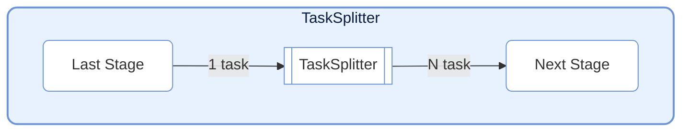
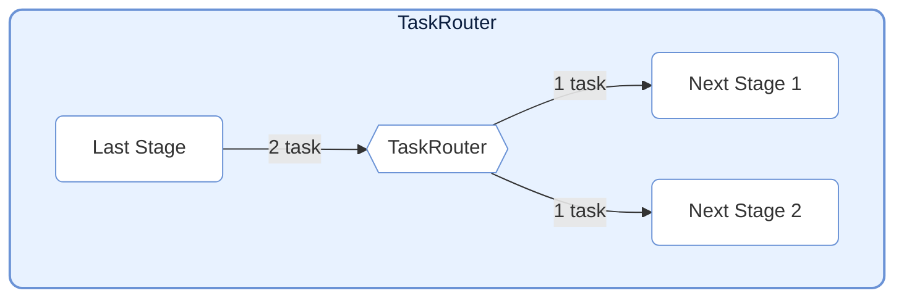

# TaskNodes

> 📅 Last Updated: 2026/06/18

The TaskNodes module provides various special-function `TaskStage` implementations for scenarios such as flow control and external system interaction.

## TaskSplitter



Splits a single input task into multiple output tasks. Suitable for one-to-many scenarios.

### Initialization

```python
class TaskSplitter[TItem, RItem](TaskStage[Iterable[TItem], Iterable[RItem]]):
    def __init__(
        self,
        name: str,
        split_item: Callable[[TItem], RItem] | None = None,
        stage_mode: str = "serial",
        enable_duplicate_check: bool = True,
        log_level: str = "INFO",
    ):
        """
        Initialize TaskSplitter.

        :param name: Node name
        :param split_item: Custom per-sub-task processing function, defaults to identity mapping
        :param stage_mode: Node running mode
        :param enable_duplicate_check: Whether to enable duplicate checking
        :param log_level: Log level
        """
```

> **Changed**: `execution_mode` is fixed to `"serial"`, `max_retries` is fixed to `0`, and neither should nor can be modified via external parameters. The `unpack_task_args=True` parameter mentioned in previous documentation does not exist in the current source code.

### Usage

```python
class MySplitter(TaskSplitter):
    def _split(self, *task):
        # Split input data into multiple parts
        return task[0], task[1]  # Returns a tuple; each element becomes an independent task
```

### Characteristics

- **Mechanism**: Receives one task as input; each element in the tuple returned by `_split` is wrapped into an independent `TaskEnvelope` and sent downstream.
- **Counting**: Internally maintains `split_counter` to track the total number of split tasks.
- **Fixed configuration**: `execution_mode="serial"`, `max_retries=0` (hardcoded in `__init__`).
- **split_item**: Optional custom sub-task processing function for preprocessing each split item.

---

## TaskRouter



Dispatches tasks to different downstream paths based on conditions.

### Initialization

```python
class TaskRouter(TaskStage):
    def __init__(
        self,
        name: str,
        router: Callable[[T], str],
        *,
        stage_mode: str = "serial",
    ):
        """
        Initialize TaskRouter.

        :param name: Node name
        :param router: Routing function that returns the target stage name based on task data
        :param stage_mode: Node running mode
        """
```

### Usage

`TaskRouter` no longer requires the upstream to pre-construct `(target_tag, data)` tuples; instead, it holds its own `router(task) -> str` function responsible for determining the downstream:

```python
# Define routing function: return downstream node name based on task content
def route_logic(data: int) -> str:
    if data > 0:
        return "positive_stage"
    else:
        return "negative_stage"

# Upstream only produces raw tasks
source = TaskStage("Source", func=lambda x: x)

# Router completes routing decisions internally
router = TaskRouter("Router", route_logic)

# Connect downstream (return value must match downstream stage name)
graph.connect([router], [pos_stage, neg_stage])
```

### Characteristics

- **Mechanism**: Receives raw task `task`, first calls `router(task)` to compute the target name, then sends the raw `task` to the corresponding downstream Stage.
- **Counting**: Maintains separate counters `route_counters` for each target.
- **Error handling**: If the target name returned by `router(task)` does not exist in the bound downstream list, `InvalidOptionError` is raised.
- **Fixed configuration**: `execution_mode="serial"`, `max_retries=0` (hardcoded in `__init__`).

---

## Usage Examples

### TaskSplitter: Split One Record into Many

```python
from celestialflow import TaskGraph, TaskStage, TaskSplitter

# Custom splitter: split text by lines
class LineSplitter(TaskSplitter):
    def _split(self, *task):
        return tuple(task[0].split("\\n"))

# Define downstream processing stages
source = TaskStage("Input", func=lambda x: x, stage_mode="serial")
splitter = LineSplitter("SplitLines")
processor = TaskStage("Process", func=lambda x: f">>> {x}", stage_mode="serial")

graph = TaskGraph()
graph.set_stages([source, splitter, processor])
graph.connect([source], [splitter])
graph.connect([splitter], [processor])

# Input a single text with three lines, split into three independent tasks
text_data = "line1\\nline2\\nline3"
graph.start_graph({source.get_name(): [text_data]})
```

### TaskRouter: Dispatch Tasks by Condition

```python
from celestialflow import TaskGraph, TaskStage, TaskRouter

# Define routing decision logic (returns target name only)
def classify_number(x: int) -> str:
    if x > 0:
        return "positive"
    elif x < 0:
        return "negative"
    else:
        return "zero"

# Build graph nodes
source = TaskStage("Source", func=lambda x: x, stage_mode="serial")
router = TaskRouter("Router", classify_number)
handler_pos = TaskStage("positive", func=lambda x: f"Positive: {x}", stage_mode="serial")
handler_neg = TaskStage("negative", func=lambda x: f"Negative: {x}", stage_mode="serial")
handler_zero = TaskStage("zero", func=lambda x: f"Zero: {x}", stage_mode="serial")

graph = TaskGraph()
graph.set_stages([source, router, handler_pos, handler_neg, handler_zero])
graph.connect([source], [router])
graph.connect([router], [handler_pos, handler_neg, handler_zero])

graph.start_graph({source.get_name(): [10, -5, 0, 3, -1]})
```

> **Note**: The return value of `router(task)` must exactly match the `name` of the downstream `TaskStage`.

---

## Notes

1. **Structural node positioning**: `TaskSplitter` and `TaskRouter` alter the graph structure and downstream dispatch semantics, and are suitable to retain as framework built-in nodes.
2. **Custom protocol implementations**: Interactions with external systems such as Redis, message queues, RPC, etc. are better implemented by the caller using ordinary `TaskStage` instances.
