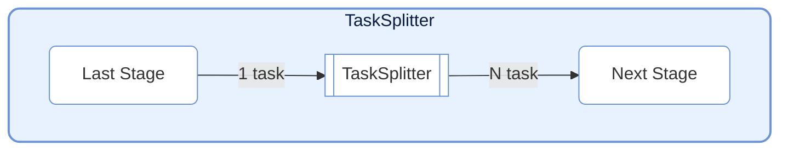
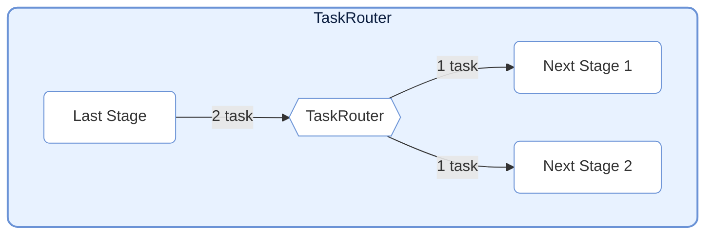
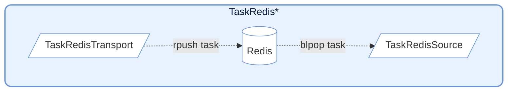
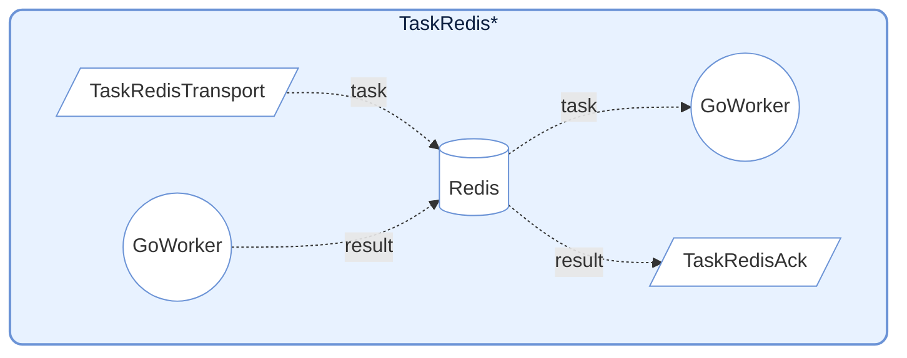

# TaskNodes

> 📅 Last Updated: 2026/06/11

The TaskNodes module provides various special-function `TaskStage` implementations for scenarios such as flow control and external system interaction.

## TaskSplitter



Splits a single input task into multiple output tasks. Suitable for one-to-many scenarios.

### Initialization

```python
class TaskSplitter[TItem, RItem](TaskStage[Iterable[TItem], Iterable[RItem]]):
    def __init__(
        self,
        name: str,
        split_item: Callable[[TItem], RItem] | None = None,
        stage_mode: str = "serial",
        enable_duplicate_check: bool = True,
        log_level: str = "INFO",
    ):
        """
        Initialize TaskSplitter.

        :param name: Node name
        :param split_item: Custom single sub-task processing function, defaults to identity mapping
        :param stage_mode: Node run mode
        :param enable_duplicate_check: Whether to enable duplicate checking
        :param log_level: Log level
        """
```

> **Changed**: `execution_mode` is fixed as `"serial"`, `max_retries` is fixed as `0`, and neither should be modified through external parameters. The `unpack_task_args=True` parameter mentioned in previous documentation does not exist in the current source code.

### Usage

```python
class MySplitter(TaskSplitter):
    def _split(self, *task):
        # Split input data into multiple parts
        return task[0], task[1]  # Returns a tuple, each element becomes an independent task
```

### Features

- **Mechanism**: Takes one input task, `_split` returns a tuple where each element is wrapped into an independent `TaskEnvelope` sent downstream.
- **Counting**: Internally maintains `split_counter` to count total split tasks.
- **Fixed Configuration**: `execution_mode="serial"`, `max_retries=0` (hardcoded in `__init__`).
- **split_item**: Optional custom sub-task processing function for preprocessing each split item.

---

## TaskRouter



Distributes tasks to different downstream paths based on conditions.

### Initialization

```python
class TaskRouter(TaskStage):
    def __init__(self, name: str, stage_mode: str = "serial"):
        """
        Initialize TaskRouter.

        :param name: Node name
        :param stage_mode: Node run mode
        """
```

### Usage

Routing tasks must return tuples in `(target_tag, data)` format:

```python
# Define upstream task that generates routing tuples
def route_logic(data):
    if data > 0:
        return ("positive_stage", data)
    else:
        return ("negative_stage", data)

# Create router node
router = TaskRouter("Router")

# Connect downstream (target must match the tag in routing logic)
graph.connect([router], [pos_stage, neg_stage])
```

### Features

- **Mechanism**: Receives tuples in `(target_tag, data)` form. Sends `data` to the corresponding downstream Stage based on `target_tag`.
- **Counting**: Maintains independent counters `route_counters` for each target.
- **Error Handling**: If `target_tag` does not exist in the downstream list, an error is recorded.

---

## Redis Integration



Provides nodes for interacting with Redis, commonly used for cross-language/cross-process collaboration (e.g., with Go Workers).

### TaskRedisTransport

Pushes tasks to a Redis List.

```python
class TaskRedisTransport(TaskStage):
    def __init__(
        self,
        name: str,        # Node name
        key: str = "",                  # Redis List name
        host: str = "localhost",        # Redis host address
        port: int = 6379,               # Redis port
        db: int = 0,                    # Redis database number
        password: str | None = None,    # Redis password
        unpack_task_args: bool = False, # Whether to unpack task arguments
        stage_mode: str = "serial",     # Node run mode
    ):
        ...
```

**Behavior**: Serializes tasks to JSON and `rpush` them to a Redis List. Internally uses `execution_mode="thread"` and `max_workers=4` for concurrent writes.

### TaskRedisSource

Pulls tasks from a Redis List as an input source.

```python
class TaskRedisSource(TaskStage):
    def __init__(
        self,
        name: str,     # Node name
        key: str = "",               # Redis List name
        host: str = "localhost",     # Redis host address
        port: int = 6379,            # Redis port
        db: int = 0,                 # Redis database number
        password: str | None = None, # Redis password
        timeout: int = 10,           # Block timeout in seconds, 0 means infinite wait
        stage_mode: str = "serial",  # Node run mode
    ):
        ...
```

**Behavior**: Uses `blpop` for blocking task pulling. Internally uses `execution_mode="serial"`, suitable as a pipeline entry node.

### TaskRedisAck



Waits for execution results from remote Workers.

```python
class TaskRedisAck(TaskStage):
    def __init__(
        self,
        name: str,     # Node name
        key: str = "",               # Redis Hash name (stores results)
        host: str = "localhost",     # Redis host address
        port: int = 6379,            # Redis port
        db: int = 0,                 # Redis database number
        password: str | None = None, # Redis password
        timeout: int = 10,           # Wait timeout in seconds, 0 means infinite wait
        stage_mode: str = "serial",  # Node run mode
    ):
        ...
```

**Behavior**: Polls a Redis Hash waiting for the corresponding `task_id` result. Supports processing successful results or raising `RemoteWorkerError`.

---

## Prerequisites

### 1. Start Redis Service

When running `TaskRedis*` nodes, Redis service needs to be started first.

### 2. Set Environment Variables (Optional)

Create a `.env` file in the project root directory:

```env
# .env
REDIS_HOST=127.0.0.1
REDIS_PORT=6379
REDIS_PASSWORD=your_redis_password
```

### 3. Configure Nodes

```python
import os
from dotenv import load_dotenv
from celestialflow import TaskRedisTransport, TaskRedisAck, TaskRedisSource

load_dotenv()

redis_host = os.getenv("REDIS_HOST", "127.0.0.1")
redis_password = os.getenv("REDIS_PASSWORD", "")

# Transport + Ack combination (push to Redis and wait for results)
redis_sink = TaskRedisTransport(
    "RedisTransport",
    key="testFibonacci:input",
    host=redis_host,
    password=redis_password
)
redis_ack = TaskRedisAck(
    "RedisAck",
    key="testFibonacci:output",
    host=redis_host,
    password=redis_password
)
```

---

## Redis Data Formats

### TaskRedisTransport Push Format

```json
{
    "id": 12345678,
    "task": ["arg1", "arg2"],
    "emit_ts": 1703001234.567
}
```

### TaskRedisAck Expected Result Format

```json
{
    "status": "success",
    "result": "computed_value"
}
```

Or error format:
```json
{
    "status": "error",
    "error": "Error message"
}
```

---

## Notes

1. **Connection Management**: Redis client is lazily initialized on first use.
2. **Timeout Handling**: `TaskRedisSource` and `TaskRedisAck` support timeout configuration; timeouts raise `TimeoutError`.
3. **Error Propagation**: Errors returned by remote Workers are propagated via `RemoteWorkerError`.
4. **Idempotency**: `TaskRedisAck` deletes the Redis record after retrieving the result, ensuring one-time consumption.

## Usage Examples

### TaskSplitter: Splitting One Record into Multiple

```python
from celestialflow import TaskGraph, TaskStage, TaskSplitter

# Custom splitter: split text by lines
class LineSplitter(TaskSplitter):
    def _split(self, *task):
        return tuple(task[0].split("\\n"))

# Define subsequent processing stages
source = TaskStage("Input", func=lambda x: x, stage_mode="serial")
splitter = LineSplitter("SplitLines")
processor = TaskStage("Process", func=lambda x: f">>> {x}", stage_mode="serial")

graph = TaskGraph()
graph.set_stages([source, splitter, processor])
graph.connect([source], [splitter])
graph.connect([splitter], [processor])

# Input a single text with three lines, split into three independent tasks
text_data = "line1\\nline2\\nline3"
graph.start_graph({source.get_name(): [text_data]})
```

### TaskRouter: Dispatching Tasks by Condition

```python
from celestialflow import TaskGraph, TaskStage, TaskRouter

# Define routing logic (generates tuples in (target_tag, data) format)
def classify_number(x: int) -> tuple:
    if x > 0:
        return ("positive", x)
    elif x < 0:
        return ("negative", x)
    else:
        return ("zero", x)

# Build graph nodes
source = TaskStage("Source", func=classify_number, stage_mode="serial")
router = TaskRouter("Router")
handler_pos = TaskStage("positive", func=lambda x: f"Positive: {x}", stage_mode="serial")
handler_neg = TaskStage("negative", func=lambda x: f"Negative: {x}", stage_mode="serial")
handler_zero = TaskStage("zero", func=lambda x: f"Zero: {x}", stage_mode="serial")

graph = TaskGraph()
graph.set_stages([source, router, handler_pos, handler_neg, handler_zero])
graph.connect([source], [router])
graph.connect([router], [handler_pos, handler_neg, handler_zero])

graph.start_graph({source.get_name(): [10, -5, 0, 3, -1]})
```

> **Note**: Route target tag must exactly match the downstream `TaskStage`'s `name`.

---

## Notes

1. **Connection Management**: Redis client is lazily initialized on first use (`init_redis()` method).
2. **Timeout Handling**: `TaskRedisSource` and `TaskRedisAck` support timeout configuration.
3. **Error Propagation**: Errors returned by remote Workers are propagated via `RemoteWorkerError`.
4. **Idempotency**: `TaskRedisAck` deletes the Redis record after retrieving the result, ensuring one-time consumption.
