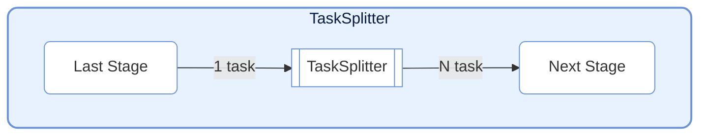
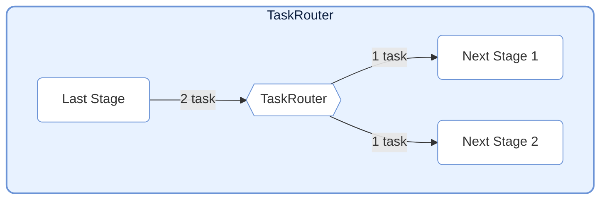
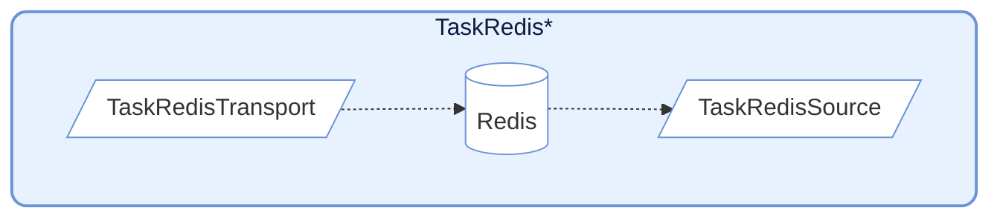
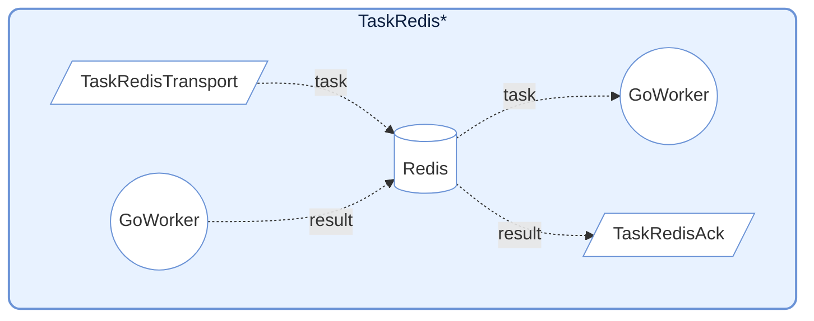

# TaskNodes

> 📅 Last updated: 2026/04/24

The TaskNodes module provides various special-purpose `TaskStage` implementations for flow control, external system interaction, and other scenarios.

## TaskSplitter



Splits a single input task into multiple output tasks. Suitable for one-to-many scenarios.

### Initialization

```python
class TaskSplitter(TaskStage):
    def __init__(self, name: str, stage_mode: str = "serial"):
        """
        Initialize TaskSplitter.

        :param name: Node name
        :param stage_mode: Node execution mode
        """
        # Defaults: execution_mode="serial", max_retries=0, unpack_task_args=True
```

### Usage

```python
class MySplitter(TaskSplitter):
    def _split(self, *task):
        # Split input data into multiple parts
        return task[0], task[1]  # Returns a tuple; each element becomes an independent task
```

### Features

- **Mechanism**: Takes one task as input and returns a tuple/list. Each element is wrapped into an independent `TaskEnvelope` and sent downstream.
- **Counting**: Internally maintains a `split_counter` to track the total number of split tasks.
- **Default configuration**: `execution_mode="serial"`, `max_retries=0`, `unpack_task_args=True`

---

## TaskRouter



Routes tasks to different downstream paths based on conditions.

### Initialization

```python
class TaskRouter(TaskStage):
    def __init__(self, name: str, stage_mode: str = "serial"):
        """
        Initialize TaskRouter.

        :param name: Node name
        :param stage_mode: Node execution mode
        """
        # Defaults: execution_mode="serial", max_retries=0
```

### Usage

Routing tasks requires returning a tuple in the format `(target_tag, data)`:

```python
# Define upstream task to generate routing tuples
def route_logic(data):
    if data > 0:
        return ("positive_stage", data)
    else:
        return ("negative_stage", data)

# Create router node
router = TaskRouter("Router")

# Connect downstream (target must match the tag in the routing logic)
graph.connect([router], [pos_stage, neg_stage])
```

### Features

- **Mechanism**: Receives tuples in the form `(target_tag, data)`. Routes `data` to the corresponding downstream Stage based on `target_tag`.
- **Counting**: Maintains independent counters `route_counters` for each target.
- **Error handling**: If `target_tag` does not exist in the downstream list, an `InvalidOptionError` is raised.

---

## Redis Integration



Provides nodes for interacting with Redis, commonly used for cross-language/cross-process collaboration (e.g., with Go Workers).

### TaskRedisTransport

Pushes tasks to a Redis List.

```python
class TaskRedisTransport(TaskStage):
    def __init__(
        self,
        name: str,        # Node name
        key: str = "",                  # Redis List name
        host: str = "localhost",        # Redis host address
        port: int = 6379,               # Redis port
        db: int = 0,                    # Redis database number
        password: str | None = None,    # Redis password
        unpack_task_args: bool = False, # Whether to unpack task arguments
        stage_mode: str = "serial",     # Node execution mode
    ):
        ...
```

**Behavior**: Serializes tasks to JSON and `rpush`es them to a Redis List. Internally uses `execution_mode="thread"` and `max_workers=4` for concurrent writes.

### TaskRedisSource

Pulls tasks from a Redis List as an input source.

```python
class TaskRedisSource(TaskStage):
    def __init__(
        self,
        name: str,     # Node name
        key: str = "",               # Redis List name
        host: str = "localhost",     # Redis host address
        port: int = 6379,            # Redis port
        db: int = 0,                 # Redis database number
        password: str | None = None, # Redis password
        timeout: int = 10,           # Blocking timeout in seconds; 0 means wait indefinitely
        stage_mode: str = "serial",  # Node execution mode
    ):
        ...
```

**Behavior**: Uses `blpop` for blocking task retrieval. Internally uses `execution_mode="serial"`, suitable as a pipeline entry node.

### TaskRedisAck



Waits for execution results from remote Workers.

```python
class TaskRedisAck(TaskStage):
    def __init__(
        self,
        name: str,     # Node name
        key: str = "",               # Redis Hash name (stores results)
        host: str = "localhost",     # Redis host address
        port: int = 6379,            # Redis port
        db: int = 0,                 # Redis database number
        password: str | None = None, # Redis password
        timeout: int = 10,           # Wait timeout in seconds; 0 means wait indefinitely
        stage_mode: str = "serial",  # Node execution mode
    ):
        ...
```

**Behavior**: Polls a Redis Hash waiting for the corresponding `task_id` result. Supports handling successful results or raising `RemoteWorkerError`.

---

## Prerequisites

### 1. Start the Redis Service

Before running `TaskRedis*` nodes, you need to start the Redis service.

### 2. Set Environment Variables (Optional)

Create a `.env` file in the project root directory:

```env
# .env
# Redis service address
REDIS_HOST=127.0.0.1
# Redis service port
REDIS_PORT=6379
# Redis service password; leave empty if none
REDIS_PASSWORD=your_redis_password
```

### 3. Configure Nodes

```python
import os
from dotenv import load_dotenv
from celestialflow import TaskRedisTransport, TaskRedisAck, TaskRedisSource

# Load environment variables
load_dotenv()

redis_host = os.getenv("REDIS_HOST", "127.0.0.1")
redis_password = os.getenv("REDIS_PASSWORD", "")

# Transport + Ack combination (push to Redis and wait for results)
redis_sink = TaskRedisTransport(
    "RedisTransport",
    key="testFibonacci:input",
    host=redis_host,
    password=redis_password
)
redis_ack = TaskRedisAck(
    "RedisAck",
    key="testFibonacci:output",
    host=redis_host,
    password=redis_password
)

# Source combination (pull tasks from Redis)
redis_source = TaskRedisSource(
    "RedisSource",
    key="test_redis",
    host=redis_host,
    password=redis_password
)
```

---

## Redis Data Formats

### TaskRedisTransport Push Format

```json
{
    "id": 12345678,
    "task": ["arg1", "arg2"],
    "emit_ts": 1703001234.567
}
```

### TaskRedisAck Expected Result Format

```json
{
    "status": "success",
    "result": "computed_value"
}
```

Or error format:
```json
{
    "status": "error",
    "error": "Error message"
}
```

---

## Notes

1. **Connection management**: The Redis client is lazily initialized on first use.
2. **Timeout handling**: `TaskRedisSource` and `TaskRedisAck` support timeout configuration; timeouts raise `TimeoutError`.
3. **Error propagation**: Errors returned by remote Workers are propagated via `RemoteWorkerError`.
4. **Idempotency**: `TaskRedisAck` deletes the record from Redis after retrieving the result, ensuring one-time consumption.
