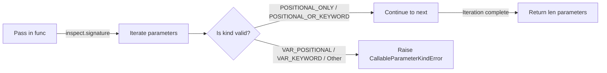

# StageCallable

> 📅 Last Updated: 2026/06/18

`stage/util_callable.py` provides executor function signature validation utilities, used during `TaskExecutor` initialization to verify that the passed-in function conforms to parameter specifications.

## Core Functions

### validate_executor_func_signature

```python
def validate_executor_func_signature(func: Callable[..., Any]) -> int:
    """
    Validate that the executor function's parameter kinds meet requirements,
    and return the number of parameters.

    :param func: Executor function
    :return: Number of parameters
    :raises CallableParameterKindError: Raised when parameters contain
           *args, **kwargs, or other non-pure-positional parameter types
    """
```

Uses `inspect.signature` to examine each parameter of the function signature, allowing only `POSITIONAL_ONLY` and `POSITIONAL_OR_KEYWORD` parameter types. If `VAR_POSITIONAL` (`*args`), `VAR_KEYWORD` (`**kwargs`), or other types are detected, `CallableParameterKindError` is raised.

**Validation flow:**



## Usage Example

### Automatically called during TaskExecutor initialization

`validate_executor_func_signature` is automatically executed in `TaskExecutor.__init__` through the call chain `_set_func` → `validate_executor_func_signature`:

```python
from celestialflow.stage.util_callable import validate_executor_func_signature
from celestialflow.runtime.util_errors import CallableParameterKindError


# Valid executor function (pure positional parameters)
def good_func(x: int, y: str) -> bool:
    return True

param_count = validate_executor_func_signature(good_func)
print(f"Parameter count: {param_count}")  # 2


# Invalid executor function (contains *args)
def bad_func(*args):
    return args

try:
    validate_executor_func_signature(bad_func)
except CallableParameterKindError as e:
    print(f"Signature validation failed: {e}")
```

## Notes

- This function is called internally by `TaskExecutor._set_func()`; users typically do not need to use it directly.
- Valid parameter kinds include `POSITIONAL_ONLY` and `POSITIONAL_OR_KEYWORD`.
- Invalid parameter kinds include `VAR_POSITIONAL` (`*args`), `VAR_KEYWORD` (`**kwargs`), `KEYWORD_ONLY`, etc.
