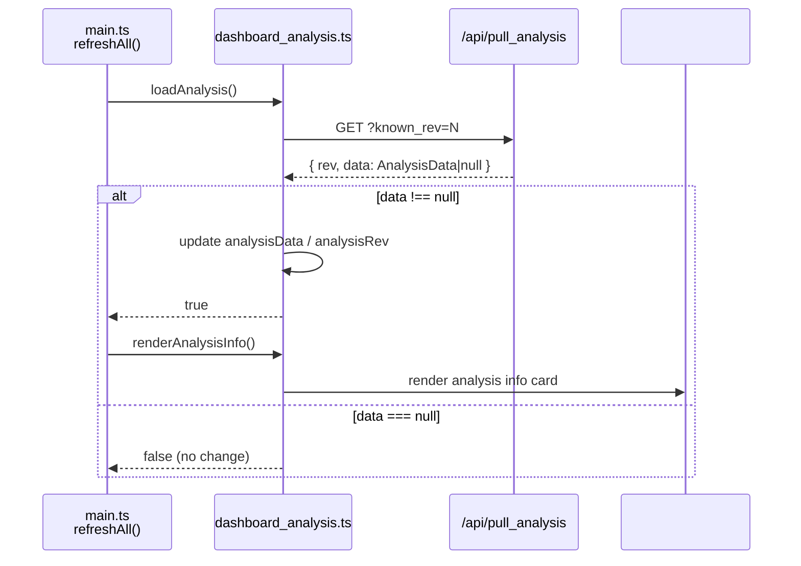

# dashboard_analysis.ts

> 📅 Last Updated: 2026/06/11

Manages the loading of graph analysis information and the rendering of the analysis panel. Provides deep insight into the TaskGraph topology, such as DAG detection, layer analysis, and scheduling modes.

## Type Definitions

```typescript
type AnalysisData = {
  name: string;                    // Task graph name
  startTime: number;               // Task graph start timestamp
  className: string;               // Graph structure classification name (Python class name)
  isDAG: boolean;                  // Whether the current task graph is a DAG
  scheduleMode: string;            // Graph-level scheduling mode name (eager / staged)
  layersDict: Record<string, unknown>; // Layer analysis results, key count used for layer count
};
```

## Global Variables

| Variable | Type | Description |
|------|------|------|
| `analysisData` | `AnalysisData \| null` | Topology analysis data; `null` when not loaded |
| `analysisRev` | `number` | Data revision number, initialized to `-1`, used for incremental fetch |
| `analysisRequestSeq` | `number` | Request sequence number, prevents old analysis responses from overwriting new results |

## Functions

### `loadAnalysis()`

Asynchronously fetches analysis data from `GET /api/pull_analysis?known_rev=N`.

- **Race protection**: Each call assigns an incremented `analysisRequestSeq`; responses with mismatched sequence numbers are discarded.
- **Incremental mechanism**: The backend returns full data (`body.data !== null`) only when `known_rev` is stale; otherwise returns `rev` with empty data.
- **Return value**: `Promise<boolean>` — returns `true` when the analysis revision changed and was successfully updated.

---

### `renderAnalysisInfo()`

Renders analysis data into the `#analysis-info` container. If `analysisData` is `null`, displays an internationalized empty-state placeholder.

**Displayed fields:**

| Display Label (i18n key) | Corresponding Field | Description |
|---------|---------|------|
| `analysis.graphName` | `name` | Task graph name |
| `analysis.startTime` | `startTime` | Graph start timestamp (formatted when `> 0`, otherwise displays `-`) |
| `analysis.structType` | `className` | The specific Python class name of the TaskGraph, with a tooltip bubble |
| `analysis.isDAG` | `isDAG` | Green `.ok` class when `true`, red `.warn` class when `false` |
| `analysis.scheduleMode` | `scheduleMode` | Graph-level scheduling mode, with a tooltip bubble |
| `analysis.layerCount` | `layersDict` | Derives total layer count via `Object.keys(layersDict).length` |

## Data Flow



## Usage Example

```typescript
// Simulated analysis data from backend
const mockAnalysis: AnalysisData = {
  name: "MyTaskGraph",
  startTime: 1718000000,
  className: "TaskGraph",
  isDAG: true,
  scheduleMode: "eager",
  layersDict: { "0": ["StageA"], "1": ["StageB", "StageC"] },
};

// loadAnalysis() fetches and updates global variables
// const changed = await loadAnalysis();
// if (changed) renderAnalysisInfo();

// renderAnalysisInfo() renders it to #analysis-info
// if analysisData === null → display empty-state placeholder
// otherwise render: graph name, start time, struct type, isDAG, schedule mode, layer count
```
