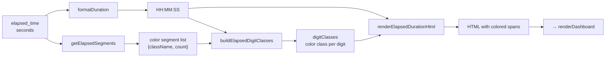

# dashboard_statuses.ts

> 📅 Last Updated: 2026/06/11

Manages the loading, syncing, and dynamic rendering of per-node runtime status data and the dashboard status cards. Provides colored segment rendering for elapsed time.

> ⚠️ **Changed**: The `draggingNodeName` variable and `initSortableDashboard()` function mentioned in older docs have been removed (drag-sort functionality migrated to `layout_editor.ts` layout editor). New functions added for pending value mode switching and remaining time display configuration.

## Type Definitions

```typescript
type NodeStatus = {
  status: number;              // Status code: 0-not running, 1-running, 2-stopped
  tasks_processed: number;     // Total tasks processed
  tasks_pending: number;       // Tasks waiting in queue
  tasks_succeeded: number;     // Tasks successfully processed
  tasks_failed: number;        // Tasks that failed processing
  tasks_duplicated: number;    // Tasks filtered by deduplication
  stage_mode: string;          // Node mode (serial/thread)
  execution_mode: string;      // Execution mode (serial/thread/async)
  max_workers: number;         // Maximum concurrency
  start_time: number;          // Start Unix timestamp
  elapsed_time: number;        // Elapsed seconds
  remaining_time: number;      // Estimated remaining seconds (current pipeline)
  total_tasks_pending: number; // Total pending tasks (including downstream pipelines)
  total_remaining_time: number;// Estimated total remaining seconds (considering all pipelines)
  task_avg_time: string;       // Average time per task text
};

type ElapsedSegment = {
  className: string; // Corresponding color CSS class name
  count: number;     // Count of tasks of this type
};
```

## Global Variables

| Variable | Type | Description |
|------|------|------|
| `nodeStatuses` | `Record<string, NodeStatus>` | Current status snapshot for all nodes |
| `lastNodeStatuses` | `Record<string, NodeStatus>` | Previous round status snapshot, used for computing incremental display |
| `statusRev` | `number` | Last fetched revision number, initialized to `-1`, used for incremental fetch |
| `statusesRequestSeq` | `number` | Request sequence number, prevents old status responses from overwriting new results |

## Configuration-Driven Functions

The following functions dynamically switch the data source for "pending tasks" and "remaining time" in node status cards based on `webConfig.dashboard.useTotalPendingInStatus`.

### `getStatusPendingField(): "tasks_pending" | "total_tasks_pending"`

Returns the pending field that the current status card should use. Returns `"total_tasks_pending"` (including downstream pipeline total) when `useTotalPendingInStatus` is enabled, otherwise returns `"tasks_pending"` (current node queue only).

### `getDisplayPending(status: NodeStatus): number`

Extracts the pending task count from a status snapshot based on the current configuration.

### `getDisplayRemainingTime(status: NodeStatus): number`

Extracts the remaining time from a status snapshot based on the current configuration. Uses `total_remaining_time` when total pending mode is enabled.

### `getPendingLabelHtml(): string`

Returns the HTML for the pending label and tooltip bubble, switching i18n keys based on the configuration mode (`status.pending` vs `status.pendingGlobal`).

---

## Helper Functions: Colored Segment Rendering for Elapsed Time

The following four functions together implement colored HTML rendering of `elapsed_time`. Color segments are assigned to each digit based on the ratio of succeeded/failed/duplicated task counts.

### `formatElapsedDuration(seconds, successCount, failedCount, duplicateCount): string`

Entry function. Calls `formatDuration()` to get the time format text, then generates HTML with colored `<span>` elements via `getElapsedSegments()`, `buildElapsedDigitClasses()`, and `renderElapsedDurationHtml()`.

### `getElapsedSegments(successCount, failedCount, duplicateCount): ElapsedSegment[]`

Generates a list of color segments driven by non-zero counts.

| CSS Class | Stat Field | Meaning |
|--------|---------|------|
| `elapsed-success` | `tasks_succeeded` | Succeeded tasks |
| `elapsed-error` | `tasks_failed` | Failed tasks |
| `elapsed-duplicate` | `tasks_duplicated` | Duplicate tasks |

Returns only segments where `count > 0`. If all are zero, returns an empty array.

### `buildElapsedDigitClasses(segments: ElapsedSegment[], digitCount: number): string[]`

Assigns a color class to each digit of `HH:MM:SS` (colons removed) proportionally by task status ratio.

- **Segments ≥ digits**: Take the first N segments directly.
- **Segments < digits**: Allocate remaining digits to each segment proportionally, then sort by remainder to fill in allocation gaps, ensuring every digit gets a color class.

### `renderElapsedDurationHtml(duration, digitClasses, defaultClassName): string`

Wraps each character of the time string in a `<span>`. Colons `:` use the color class of the digit to their left; digit characters sequentially use class names from `digitClasses`.

---

## Core Functions

### `loadStatuses(): Promise<boolean>`

Asynchronously fetches node statuses from `GET /api/pull_status?known_rev=N`.

- **Race protection**: Uses `statusesRequestSeq` to discard stale responses.
- **Status snapshot preservation**: On success, saves the previous round's statuses to `lastNodeStatuses`.
- **History integration**: On success, calls `appendStatusSnapshotToHistory()` to synchronize the frontend local history series.
- **Return value**: Returns `true` when the status revision changed and was successfully updated.

---

### `renderDashboard(): void`

Iterates over `nodeStatuses` to generate a status card for each node.

**Card rendering features:**

- **Real-time deltas**: Compares against `lastNodeStatuses` to automatically compute increments for succeeded/failed/pending/duplicated tasks and display them in color.
- **Status indicator**: Card left border color reflects node status (blue = running `status-running`, gray = stopped `status-stopped`).
- **Colored elapsed time segments**: Calls `formatElapsedDuration()` to generate HTML for `elapsed_time` colored by the ratio of task succeeded/failed/duplicated proportions.
- **Four-segment progress bar**: Intuitively displays the ratio of succeeded (green), error (red), duplicate (yellow), and pending (gray).
- **Time estimation**: Displays elapsed time, estimated remaining time, average task time, and progress percentage.
- **Interactive navigation**: Clicking the error count (`.error-clickable`) in a card auto-navigates to the "Error Log" tab with that node pre-selected as filter.

## Card Style Classes

| Status | CSS Class | Description |
|------|--------|------|
| Running | `node-card status-running` | Blue left border |
| Stopped | `node-card status-stopped` | Gray left border |
| Not started | `node-card` | Default gray left border |

## Elapsed Time Rendering Flow



## Usage Example

```typescript
// Construct a complete NodeStatus object
const nodeStatus: NodeStatus = {
  status: 1,
  tasks_processed: 250, tasks_succeeded: 240,
  tasks_failed: 5, tasks_duplicated: 5,
  tasks_pending: 30, total_tasks_pending: 50,
  stage_mode: "thread", execution_mode: "thread",
  max_workers: 4,
  start_time: 1745400000, elapsed_time: 3600,
  remaining_time: 600, total_remaining_time: 1200,
  task_avg_time: "1.44s/it",
};

// Compute colored elapsed time segments
const coloredDuration = formatElapsedDuration(
  nodeStatus.elapsed_time,
  nodeStatus.tasks_succeeded,
  nodeStatus.tasks_failed,
  nodeStatus.tasks_duplicated,
);
// Returns an HTML string with colored spans

// Get display values based on configuration
// getDisplayPending(nodeStatus) → 30 or 50
// getDisplayRemainingTime(nodeStatus) → 600 or 1200
```
