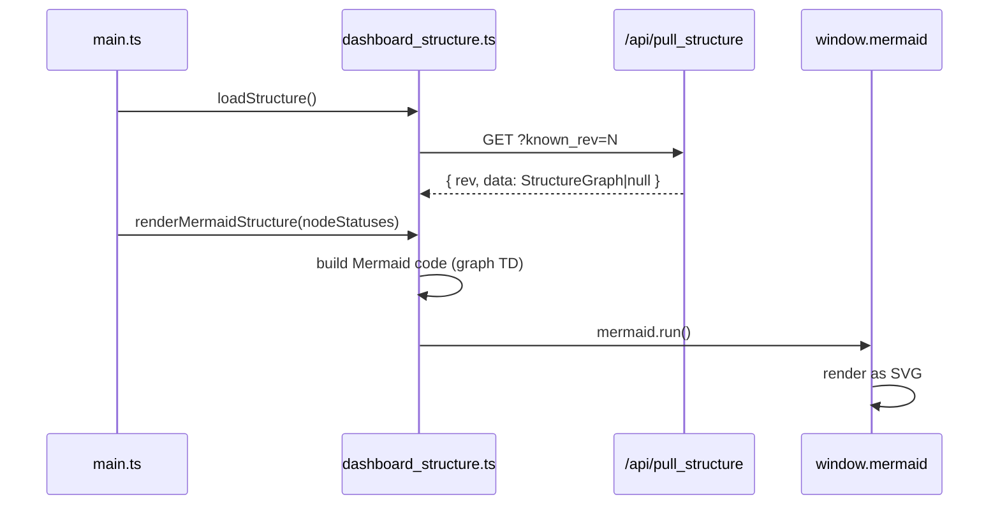

# dashboard_structure.ts

> 📅 Last Updated: 2026/06/11

Manages the loading of task graph structure data and the visualization rendering of Mermaid flowcharts, supporting real-time coloring based on node status and edge increment display.

> ⚠️ **Changed**: The `structureData` type has changed from the old `any[]` (array) to a `StructureGraph` object type (including `nodes`, `edges`, `source_nodes`). Added `getNodeShape()` function and complete type definitions.

## Type Definitions

```typescript
type StructureNodeMeta = {
  func_name: string;       // Node function name, used to derive node type (e.g. _split, _route)
  execution_mode: string;  // Node execution mode
  stage_mode: string;      // Node stage mode
  max_workers: number;     // Max concurrent workers
};

type StructureGraph = {
  nodes: Record<string, StructureNodeMeta>; // Node name to metadata mapping
  edges: Record<string, string[]>;         // Directed edge adjacency list
  source_nodes: string[];                   // List of source nodes with indegree 0
};
```

## Global Variables

| Variable | Type | Description |
|------|------|------|
| `structureData` | `StructureGraph` | Task structure graph data (directed graph), defaults to empty `nodes`/`edges`/`source_nodes` |
| `structureRev` | `number` | Last fetched revision number, initialized to `-1`, used for incremental fetch |
| `structureRequestSeq` | `number` | Request sequence number, prevents old structure responses from overwriting new results |

## Functions

### `loadStructure(): Promise<boolean>`

Asynchronously fetches graph structure from `GET /api/pull_structure?known_rev=N`. Uses `structureRequestSeq` for race protection.

---

### `getNodeId(nodeName: string): string`

Generates a Mermaid-compatible node ID (replaces non-word characters with `_`).

---

### `getNodeShape(nodeMeta: StructureNodeMeta): string`

Derives Mermaid shape type from the node metadata's `func_name`.

| `func_name` | Shape | Description |
|-------------|------|------|
| `_split` | `subgraph` | Split/fork node |
| `_route` | `rhombus` | Route/decision node |
| `_transport` / `_source` / `_ack` | `parallelogram` | Input/output type nodes |
| Other | `box` | Regular processing node |

---

### `getShapeWrappedLabel(label: string, shape?: string): string`

Generates a Mermaid-syntax node label based on the shape type. Supports 10 shapes: `box`, `circle`, `round`, `rhombus`, `subgraph`, `parallelogram`, `db`, `cloud`, `hex`, `arrow`.

---

### `renderMermaidStructure(statuses?: Record<string, NodeStatus>): void`

Builds Mermaid flowchart code and calls `window.mermaid.run()` to render.

**Key features:**

- **Dynamic coloring**: Automatically applies color classes based on `statuses` status codes (`greenNode`=running, `greyNode`=stopped, `whiteNode`=not started).
- **Theme adaptation**: Auto-detects the `dark-theme` class, switching Mermaid `classDef` color schemes (two sets: dark/light).
- **Edge increment display**: If `webConfig.dashboard.showStructureEdgeDelta` is enabled, displays `|+N|` labels on edges (derived from the `tasks_succeeded` delta from previous to current round).
- **Source nodes first**: `source_nodes` are listed before non-source nodes for better topology readability.
- **Container replacement**: Creates a new `#mermaid-container` replacing the old one on each render, avoiding Mermaid residue issues with old DOM state.

## Node Status Color Mapping

| `status` | Style Class | Meaning |
|----------|--------|------|
| `1` | `greenNode` | Running |
| `2` | `greyNode` | Stopped |
| None/other | `whiteNode` | Not started / unknown |

## Data Flow



## Usage Example

```typescript
// Simulated structure data
const mockStructure: StructureGraph = {
  nodes: {
    "DataLoader": { func_name: "_source", execution_mode: "serial", stage_mode: "serial", max_workers: 1 },
    "Processor":  { func_name: "process", execution_mode: "thread", stage_mode: "thread", max_workers: 4 },
    "Router":     { func_name: "_route", execution_mode: "serial", stage_mode: "serial", max_workers: 1 },
  },
  edges: {
    "DataLoader": ["Processor"],
    "Processor":  ["Router"],
  },
  source_nodes: ["DataLoader"],
};

// structureData = mockStructure;

// Get node ID and shape
// getNodeId("DataLoader") → "DataLoader"
// getNodeShape(mockStructure.nodes["Router"]) → "rhombus"

// Render structure diagram (with node status coloring)
// renderMermaidStructure(nodeStatuses);
```
