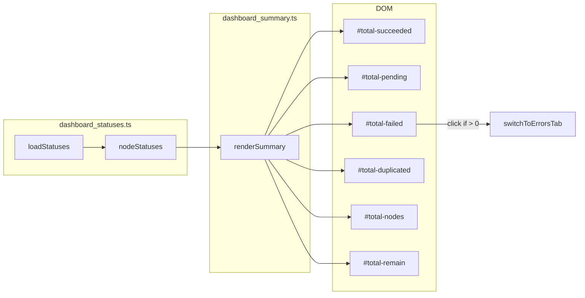

# dashboard_summary.ts

> 📅 Last Updated: 2026/06/11

Manages the rendering of global summary statistics. **The summary is entirely aggregated on the frontend from `nodeStatuses` in real time**, independent of any dedicated backend API.

> ⚠️ **Changed**: The `loadSummary()` function and `/api/pull_summary` endpoint mentioned in older docs have been removed. In the current version, `renderSummary()` aggregates all statistics directly from `nodeStatuses` (maintained by `dashboard_statuses.ts`).

## Global Variables

| Variable | Type | Description |
|------|------|------|
| `summaryRev` | `number` | Data revision number (currently retained but no incremental fetch logic used) |

## DOM Element References

| Variable | DOM ID | Description |
|------|--------|------|
| `totalSucceeded` | `#total-succeeded` | Total succeeded tasks |
| `totalPending` | `#total-pending` | Total pending tasks |
| `totalDuplicated` | `#total-duplicated` | Total duplicated tasks |
| `totalFailed` | `#total-failed` | Total failed tasks |
| `totalNodes` | `#total-nodes` | Active node count |
| `totalRemain` | `#total-remain` | Total remaining time |

## Functions

### `renderSummary(): void`

Based on the latest snapshot of `nodeStatuses` (global variable, maintained by `dashboard_statuses.ts`), aggregates all totals on the frontend and renders them to the summary panel.

**Frontend aggregation items:**

| Display Item | Calculation | Formatting Function |
|--------|---------|-----------|
| Total succeeded | `sum(status.tasks_succeeded)` | `formatLargeNumber()` |
| Total pending | `sum(status.tasks_pending)` | `formatLargeNumber()` |
| Total failed | `sum(status.tasks_failed)` | `formatLargeNumber()` |
| Total duplicated | `sum(status.tasks_duplicated)` | `formatLargeNumber()` |
| Active nodes | `count(status === 1)` | `formatLargeNumber()` |
| Total remaining time | `max(status.total_remaining_time)` | `formatDuration()` |

> The graph-level remaining time is taken from the maximum `total_remaining_time` across all nodes (considering estimates from all pipelines), not a simple sum.

**Interaction features:**

- When total failed count `> 0`, the `#total-failed` element gets the `.error-clickable` class added and binds `onclick` to call `switchToErrorsTab()`, allowing click-through to the error log page.

## Data Flow



## Usage Example

```typescript
// renderSummary() is automatically called by refreshAll() when statusesChanged

// Internal aggregation logic outline:
const statusList = Object.values(nodeStatuses || {});
const total_succeeded = statusList.reduce((sum, s) => sum + (s.tasks_succeeded || 0), 0);
const total_pending   = statusList.reduce((sum, s) => sum + (s.tasks_pending || 0), 0);
const total_failed    = statusList.reduce((sum, s) => sum + (s.tasks_failed || 0), 0);
const total_duplicated = statusList.reduce((sum, s) => sum + (s.tasks_duplicated || 0), 0);
const total_nodes     = statusList.reduce((sum, s) => sum + (s.status === 1 ? 1 : 0), 0);
const total_remain    = Math.max(...statusList.map(s => s.total_remaining_time || 0), 0);

// Update DOM
totalSucceeded.innerHTML = formatLargeNumber(total_succeeded);
totalPending.innerHTML   = formatLargeNumber(total_pending);
// ... remaining DOM updates
totalRemain.textContent  = formatDuration(total_remain);
```
