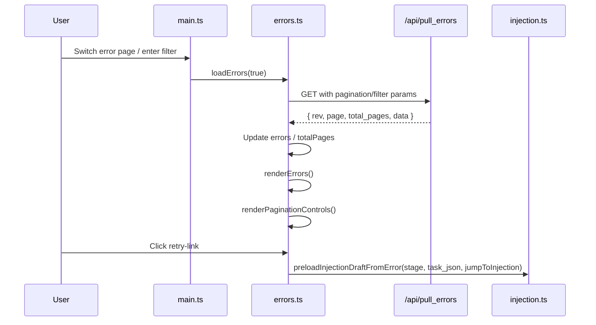

# errors.ts

> 📅 Last Updated: 2026/06/22

Error log pagination and filtering module. Responsible for asynchronously fetching error records, frontend pagination logic, and filtered display by node/keyword search.

## Type Definitions

```typescript
type ErrorData = {
  ts: number;            // Lifecycle timestamp, in seconds
  stage: string;         // Node/stage name where the error occurred, used for node filtering
  event_id: number;      // Unique identifier ID of the failure event, globally unique
  error_type: string;    // Error classification type
  error_message: string; // Specific error description
  task_json: unknown;    // Task data that triggered this error, used for display and retry backfill
  result_json: unknown;  // Successful result or placeholder result on failure
};
```

## Global Variables

| Variable | Type | Description |
|------|------|------|
| `errors` | `ErrorData[]` | Current page error record list |
| `currentPage` | `number` | Current pagination page number, default `1` |
| `pageSize` | `number` | Records per page, default `10`, synced from `webConfig.errors.pageSize` |
| `errorSortOrder` | `"newest" \| "oldest"` | Current error log sort direction, default `"newest"` |
| `totalPages` | `number` | Total pages, default `1` |
| `errorsRev` | `number` | Data revision number, used for incremental fetch, default `-1` |
| `lastQueryKey` | `string` | Cached key of the last query, used to determine if filter conditions changed |
| `errorsRequestSeq` | `number` | Request sequence number, prevents old responses from overwriting new results |

## DOM Element References

| Variable | DOM Selector | Description |
|------|-----------|------|
| `searchInput` | `#error-search` | Keyword search input |
| `nodeFilter` | `#node-filter` | Filter by node dropdown |
| `errorSortSelect` | `#error-sort-order` | Sort order dropdown |
| `errorsTableBody` | `#errors-table tbody` | Error table body |
| `paginationContainer` | `#pager-container` | Pagination controls container |

## Functions

### `buildErrorsQueryKey(page, pageSizeValue, node, keyword, sortOrder): string`

Builds a query cache key containing pagination, page size, node filter, keyword, and sort order, used to determine whether a full reload is required.

### `loadErrors(forceReload = false): Promise<boolean>`

Fetches error logs from the backend `GET /api/pull_errors` under the current filter conditions.

- **Query params**: `known_rev`, `page`, `page_size`, `node`, `keyword`, `sort_order`.
- **Cache strategy**: When filter conditions (`lastQueryKey`) change or `forceReload=true`, `known_rev` is reset to `-1` to force a full fetch.
- **Race protection**: Uses `errorsRequestSeq` to discard stale responses.
- **Return value**: Returns `true` when the backend returns new error record data.

### `renderErrors(): void`

Renders the `errors` array into the table. Each row contains error sequence number, event ID, error message, node, task data, occurrence time, and retry button.

- When `task_json` is parseable and is not a string starting with `<`, displays a clickable "Task Injection" retry link.
- Retry click calls `preloadInjectionDraftFromError(stage, task_json, webConfig.errors.jumpToInjectionAfterRetry)`.
- Displays an empty-state placeholder when there are no records.

### `goToErrorsPage(nextPage): Promise<void>`

Jumps to the specified page number and reloads data. The target page is clamped to the `[1, totalPages]` range.

### `buildPageList(current, total): Array<number \| string>`

Generates a pagination page number list, including first/last pages, current page, and adjacent pages, inserting ellipsis `…` when the gap exceeds 1.

### `renderPaginationControls(totalPages): void`

Renders pagination controls, including "Previous/Next" buttons and numeric page sequence with ellipsis. Not rendered when total pages `<= 1`.

### `populateNodeFilter(statuses): void`

Populates the node filter dropdown based on the current node status snapshot, attempting to preserve the user's previous filter selection. If the selected node no longer exists, reverts to "All Nodes".

## Event Bindings

| Element | Event | Behavior |
|------|------|------|
| `searchInput` | `input` | Return to page 1, force reload, and render |
| `nodeFilter` | `change` | Return to page 1, force reload, and render |
| `errorSortSelect` | `change` | Update `errorSortOrder` and `webConfig.errors.sortOrder`, return to page 1, reload and render, and call `saveWebConfig()` to save settings |

## Data Flow



## Usage Example

```typescript
// Directly jump to page 3
await goToErrorsPage(3);

// Filter by node (equivalent to setting nodeFilter and triggering change)
nodeFilter.value = "Processor";
nodeFilter.dispatchEvent(new Event("change"));

// Build query cache key
const key = buildErrorsQueryKey(1, 10, "Processor", "timeout", "newest");
// "1|10|Processor|timeout|newest"

// renderErrors reads global errors and renders the table
// renderPaginationControls(totalPages) renders the bottom pagination
```
