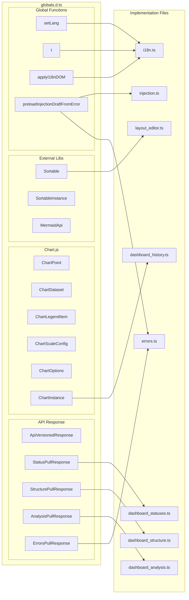

# globals.d.ts

> 📅 Last Updated: 2026/06/11

TypeScript global type declaration file, providing complete type definitions for CDN-loaded third-party libraries (Chart.js, Sortable.js), global variables, cross-module shared functions, and backend API response structures.

> ⚠️ **Changed**: In older docs, `Chart`/`Sortable` were simplified to `any`. The current version has been expanded to full minimal type definitions, and all API response types and frontend internal structure types have been added.

## API Response Types

```typescript
type ApiVersionedResponse<T> = {
  rev: number;       // Current data revision number
  data: T | null;    // May return null when known_rev hasn't changed
};

type StatusPullResponse = ApiVersionedResponse<Record<string, NodeStatus>> & {
  timestamp: number; // Unified timestamp for this status snapshot
};

type StructurePullResponse = ApiVersionedResponse<StructureGraph>;

type AnalysisPullResponse = ApiVersionedResponse<AnalysisData>;

type ErrorsPullResponse = {
  rev: number;
  page: number;
  page_size: number;
  total: number;
  total_pages: number;
  sort_order: "newest" | "oldest";
  data: ErrorData[] | null;
};
```

## Dashboard Layout Types

```typescript
type DashboardColumnKey = "left" | "middle" | "right";

type DashboardLayout = Record<DashboardColumnKey, string[]>;
```

## Chart.js Types

```typescript
type ChartPoint = { x: number; y: number };

type ChartDataset = {
  label: string;
  data: ChartPoint[];
  borderColor?: string;
  fill?: boolean;
  tension?: number;
  hidden?: boolean;
};

type ChartLegendItem = {
  datasetIndex: number;
  hidden?: boolean;
};

type ChartLegend = {
  legendItems: ChartLegendItem[];
};

type ChartScaleConfig = {
  ticks: { color: string };
  grid: { color: string };
  title: { display: boolean; text: string; color: string };
  border: { color: string };
};

type ChartOptions = {
  animation: boolean;
  responsive: boolean;
  plugins: {
    legend: {
      labels: { color: string };
      onClick: (event: Event, legendItem: ChartLegendItem, legend: { chart: ChartInstance }) => void;
    };
  };
  interaction: { intersect: boolean; mode: string };
  scales: { x: ChartScaleConfig; y: ChartScaleConfig };
};

interface ChartInstance {
  data: { labels: string[]; datasets: ChartDataset[] };
  options: ChartOptions;
  legend?: ChartLegend;
  destroy(): void;
  update(): void;
  getDatasetMeta(index: number): { hidden: boolean | null };
}

declare const Chart: {
  new (ctx: CanvasRenderingContext2D | null, config: {
    type: string;
    data: ChartInstance["data"];
    options: ChartOptions;
  }): ChartInstance;
};
```

## Sortable.js Types

```typescript
type SortableInstance = {
  destroy(): void;
};

declare const Sortable: {
  create(element: HTMLElement, options: {
    group: string;
    animation: number;
    ghostClass: string;
    dragClass: string;
  }): SortableInstance;
};
```

## Mermaid Types

```typescript
type MermaidApi = {
  run(): void; // Scans the page for Mermaid source and executes rendering
};

interface Window {
  mermaid: MermaidApi;
}
```

## i18n Types and Global Declarations

```typescript
type Lang = "zh-CN" | "en" | "ja";

declare var currentLang: Lang;
declare function setLang(lang: Lang): void;
declare function t(key: string, ...args: string[]): string;
declare function applyI18nDOM(): void;
```

## Cross-Module Function Declarations

```typescript
declare function preloadInjectionDraftFromError(
  nodeName: string,
  taskData: unknown,
  jumpToInjectionAfterRetry?: boolean
): void;
```

`preloadInjectionDraftFromError` is defined in `injection.ts` and called by the re-injection column in `errors.ts` to pre-fill the injection page editor with task data associated with an error.

## Type Relationships


