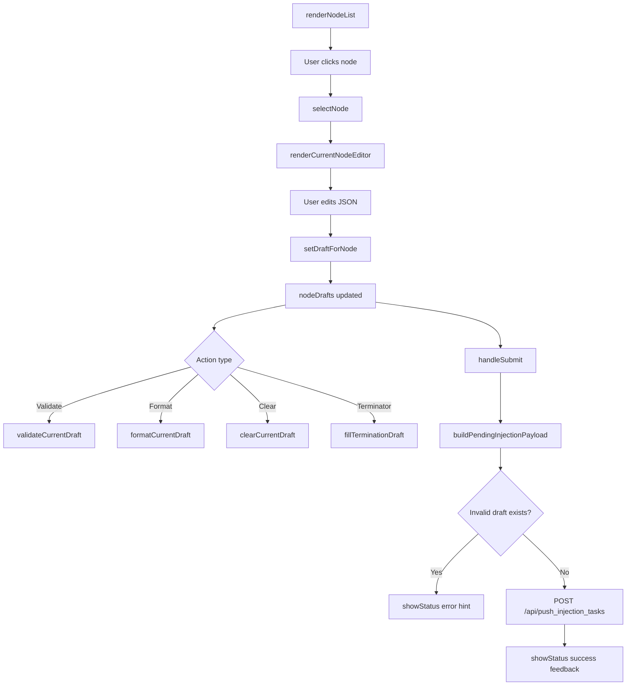

# injection.ts

> 📅 Last Updated: 2026/06/22

Manual task injection module. Uses a **single-node editing + batch submission** draft-based architecture: each node maintains an independent JSON draft, and the final submission is sent uniformly as a `{ node_name: [tasklist] }` structure.

## Type Definitions

```typescript
type ValidationState = "success" | "error" | "neutral";
```

## Global Variables

| Variable | Type | Description |
|------|------|------|
| `currentNodeName` | `string \| null` | Node name currently being edited; `null` when none selected |
| `nodeDrafts` | `Record<string, string>` | JSON draft text map keyed by node name |
| `statusHideTimer` | `number \| null` | Auto-hide timer for the bottom status message |

## i18n Meta Helper Functions

Some dynamic text in the injection page needs to be redrawn after language switching, so `data-message-key` / `data-message-args` are used to cache the original translation information.

| Function | Signature | Description |
|------|------|------|
| `setLocalizedMessageMeta` | `(element, messageKey, args = []) => void` | Records translation key and placeholder args on the element |
| `clearLocalizedMessageMeta` | `(element) => void` | Clears translation meta information on the element |
| `getLocalizedMessageArgs` | `(element) => string[]` | Reads and parses cached placeholder args |

## Status Message Helper Functions

| Function | Signature | Description |
|------|------|------|
| `getStatusIconSvg` | `(isSuccess: boolean) => string` | Returns corresponding SVG icon HTML based on success/failure state |
| `renderStatusMessage` | `(statusDiv, messageKey, isSuccess, args = []) => void` | Renders translated text with icon in the specified container |
| `showStatus` | `(messageKey, isSuccess = false, ...args) => void` | Displays status message in `#status-message`, auto-hides after 3 seconds |

## DOM Element Getter Functions

| Function | Return Type | Corresponding DOM ID |
|------|----------|-------------|
| `getSearchInput` | `HTMLInputElement` | `#search-input` |
| `getInjectableOnlyToggle` | `HTMLInputElement` | `#injectable-only-toggle` |
| `getJsonTextarea` | `HTMLTextAreaElement` | `#json-textarea` |
| `getEditorButtons` | `HTMLButtonElement[]` | `#validate-json-btn`, `#format-json-btn`, `#clear-draft-btn`, `#fill-termination-btn` |

## Event Bindings

The module calls `setupEventListeners()` on `DOMContentLoaded` to bind the following interactions:

| Element | Event | Behavior |
|------|------|------|
| `#search-input` | `input` | Real-time filtering of the left node list |
| `#json-textarea` | `input` | Syncs back to current node draft and redraws hints/preview |
| `#node-list` | `click` (event delegation) | Switch to the corresponding node |
| `#validate-json-btn` | `click` | Validate current draft |
| `#format-json-btn` | `click` | Format current draft |
| `#clear-draft-btn` | `click` | Clear current node draft |
| `#fill-termination-btn` | `click` | Append termination signal to draft |
| `#submit-btn` | `click` | Batch submit all drafts |

> Note: The `change` event of `#injectable-only-toggle` is bound uniformly in `main.ts`; after switching, it calls `renderInjectionPage()` and saves the config.

## Node List and State Synchronization

### `isInjectableNode(nodeName: string): boolean`

Determines whether the node is currently allowed to receive injections. As long as the node exists and its status is not stopped (`status !== 2`), it is considered injectable; nodes that are not running but not yet stopped can still be submitted.

### `syncInjectionStateWithStatuses(): void`

Aligns draft state with the latest node status snapshot:
- Drafts of disappeared or stopped nodes are cleaned up.
- If the current editing node is no longer injectable, the current selection is cleared.

### `renderNodeList(searchTerm = ""): void`

Renders the left node browse list. Supports:
- Search keyword filtering (case-insensitive).
- "Show injectable nodes only" toggle filtering.
- Highlighting the currently selected node (`.active-node`).
- Displaying non-injectable nodes in disabled style (`.disabled-node`).
- Displaying the "Edited" badge for nodes with edited drafts.

### `selectNode(nodeName: string): void`

Switches the current editing node. If the target node is no longer injectable, the state is cleaned up and the page is refreshed.

### `renderCurrentNodeEditor(): void`

Renders the right editor area, including the current node name, draft status badge, JSON editor, and enabled/disabled state of action buttons.

### `renderInjectionPage(): void`

Fully refreshes the injection page: sequentially calls `syncInjectionStateWithStatuses()`, `renderNodeList()`, `renderCurrentNodeEditor()`, `renderDraftList()`, and `updateSubmitButtonAvailability()`.

## Draft Management

### `setDraftForNode(nodeName: string, value: string): void`

Writes or deletes a node's draft. Empty text directly removes that node's draft entry.

### `preloadInjectionDraftFromError(nodeName, taskData, switchTab = true): void`

Called by `errors.ts`. Appends the error-associated task data to the corresponding node draft (does not overwrite existing content).

- If the current node already has a valid draft array, the new task is appended to the end.
- If `switchTab` is `true`, automatically switches to the task injection tab.
- After completion, focuses to the end of the JSON editor.

### `parseDraftTaskList(draftText: string): { ok: true; taskList: unknown[] } \| { ok: false; reason: "invalid_json" \| "not_array" }`

Parses node draft text. Task injection requires each node's value to be a JSON array.

### `buildPendingInjectionPayload(): { payload: Record<string, unknown[]>; invalidNode: string \| null; invalidReason: "invalid_json" \| "not_array" \| null }`

Iterates over all drafts, builds the final injection mapping submitted to the backend, and returns the first node that fails validation and the reason.

### `updateSubmitButtonAvailability(): void`

Enables or disables the submit button based on whether there are submittable drafts. Does not modify button availability while submitting.

### `renderDraftList(): void`

Renders the bottom "Pending Send Data Preview", as close as possible to the final sent data structure. If draft parsing fails, displays `invalid_json` or `invalid_task_list` marker under that node.

## Validation and Formatting

### `setValidationMessage(messageKey: string, state: ValidationState, args: string[] = []): void`

Displays validation hints in the `#json-validation` area and caches the translation key for redrawing after language switching.

### `clearValidationMessage(): void`

Clears the validation hint area.

### `validateCurrentDraft(showSyntaxError = true): boolean`

Validates whether the current node draft is a valid JSON array.

- No node selected → displays `injection.validationSelectNode`.
- Draft empty → displays `injection.validationEmpty`.
- Validation passed → displays `injection.validationOk`.
- Validation failed → displays `injection.invalidJson` or `injection.invalidTaskList` based on failure reason.

Returns `true` if the current draft is valid.

### `formatCurrentDraft(): void`

Formats the current node draft with `JSON.parse` + `JSON.stringify(..., null, 2)` and writes it back to the textarea and draft cache.

### `clearCurrentDraft(): void`

Clears the current node's draft and editor content.

### `fillTerminationDraft(): void`

Appends the string `"TERMINATION_SIGNAL"` to the end of the current node draft array, used to send a termination signal to the node.

## Submission and Loading State

### `handleSubmit(): Promise<void>`

Submits all pending node drafts:
1. Calls `syncInjectionStateWithStatuses()` to align state.
2. Calls `buildPendingInjectionPayload()` to build the payload.
3. If a node fails validation, jumps to that node and prompts to fix it.
4. If there is no valid payload, prompts "No drafts to submit".
5. Sends the JSON payload via `POST /api/push_injection_tasks`.
6. Clears drafts and refreshes the page on success; displays a generic failure hint on failure.

### `setButtonLoading(loading: boolean): void`

Toggles the submit button loading state. While loading, displays a spinning indicator (`.spinner`) and the `injection.submitting` text, and disables the button.

### `refreshInjectionLocalizedText(): void`

Redraws dynamic text on the injection page after language switching, including validation hints, status hints, and submit button text.

## Core Flow



## Usage Example

```typescript
// Simulate node draft data
nodeDrafts["StageA"] = '[{"id": 1, "payload": "data1"}, {"id": 2, "payload": "data2"}]';
nodeDrafts["StageB"] = '[{"id": 3}]';

// Select node and render editor
selectNode("StageA");  // Automatically calls renderInjectionPage()

// Validate current draft
validateCurrentDraft();  // Result rendered to #json-validation

// Format JSON
formatCurrentDraft();

// Build submission payload
const { payload, invalidNode, invalidReason } = buildPendingInjectionPayload();
// payload = { StageA: [{id:1,...}, {id:2,...}], StageB: [{id:3}] }

// Submit drafts
await handleSubmit();

// Pre-fill draft from error page (called by errors.ts)
preloadInjectionDraftFromError("StageA", { id: 999 }, true);
// Automatically switches to injection tab and appends task_999 to StageA's draft
```
