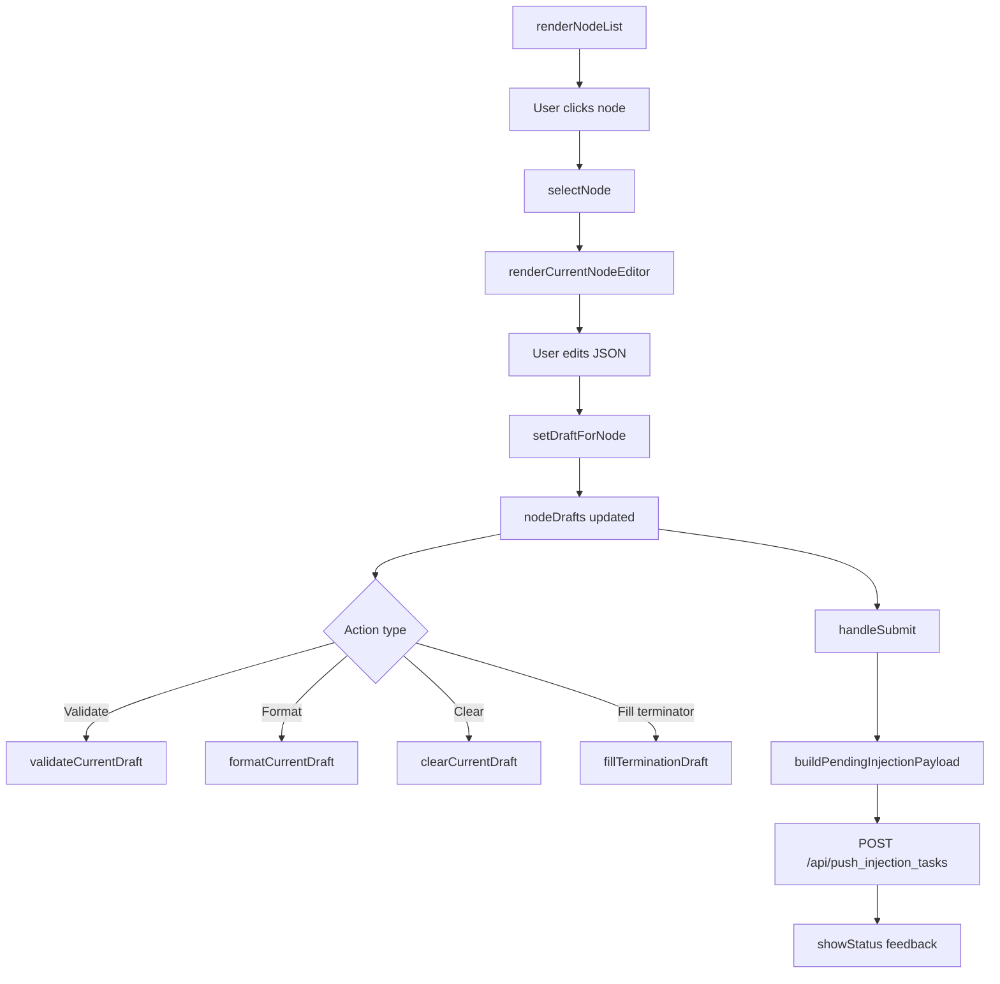

# injection.ts

> 📅 Last Updated: 2026/06/11

Manages the logic for the manual task injection page. Uses a **draft-based architecture**: the user selects a node then edits a JSON draft, edit content is cached in real-time in `nodeDrafts`, and drafts are sent to the backend all at once via "batch submit".

> ⚠️ **Changed**: The module has undergone a major refactoring. The old architecture with multi-node selection (`selectedNodes`), JSON/file input switching (`currentInputMethod`, `uploadedFile`) has been replaced with a single-node draft system based on `currentNodeName`+`nodeDrafts`. Added re-injection support from the error log page (`preloadInjectionDraftFromError`).

## Type Definitions

```typescript
type ValidationState = "idle" | "success" | "error" | "neutral";
```

## Global Variables

| Variable | Type | Description |
|------|------|------|
| `currentNodeName` | `string \| null` | Currently selected node name; `null` means none selected |
| `nodeDrafts` | `Record<string, string>` | Draft text map keyed by node name |
| `statusHideTimer` | `ReturnType<typeof setTimeout> \| null` | Status message auto-hide timer |

## Core Flow



## Functions

### Node Selection & List

#### `renderNodeList(): void`
Renders the left-side selectable node list based on `nodeStatuses`. Supports search filtering and an "injectable nodes only" toggle. Node states control interaction disabling of non-injectable nodes via the `disabled-node` class.

#### `selectNode(nodeName: string): void`
Switches the currently selected node. Updates `currentNodeName`, redraws the node list highlight and the right-side editor.

#### `isInjectableNode(nodeName: string): boolean`
Determines whether a node is injectable (status is running `status === 1`).

#### `syncInjectionStateWithStatuses(): void`
Syncs the injection page UI state when node statuses change (e.g., disabling the editor when a node transitions from running to stopped).

---

### Editor

#### `renderCurrentNodeEditor(): void`
Renders the right-side editor, including the current node name, draft status label (`.node-side-tag` "edited"), JSON textarea, and action button group.

#### `renderInjectionPage(): void`
Full refresh of the injection page: calls `renderNodeList()`, `renderCurrentNodeEditor()`, `renderDraftList()`, and `updateSubmitButtonAvailability()`.

---

### Draft Management

#### `setDraftForNode(nodeName: string, draftText: string): void`
Saves text to `nodeDrafts[nodeName]`. If text is empty or unrelated to the current node, deletes the draft entry. After updating, refreshes the draft preview and submit button state.

#### `getJsonTextarea(): HTMLTextAreaElement`
Gets the JSON editing textarea element reference.

#### `getSearchInput(): HTMLInputElement`
Gets the node search input element reference.

#### `getInjectableOnlyToggle(): HTMLInputElement`
Gets the "injectable nodes only" toggle reference.

---

### Validation & Formatting

#### `validateCurrentDraft(): void`
Validates the current draft content in the JSON textarea (calls `parseDraftTaskList()`), rendering the result to the validation message area.

#### `formatCurrentDraft(): void`
Formats the current JSON (`JSON.stringify` + `JSON.parse` re-serialized, 2-space indent) and writes it back to the textarea.

#### `parseDraftTaskList(draftText: string): { ok: boolean; taskList?: unknown[]; reason?: string }`
Parses draft text into a task list. Returns `ok: false` with a `reason` describing the failure cause.

#### `clearCurrentDraft(): void`
Clears the current node's draft.

#### `fillTerminationDraft(): void`
Fills the current textarea with the standard terminator task template (`[{"__celestial_termination__": true}]`).

---

### Preview & Submit

#### `renderDraftList(): void`
Renders the bottom draft preview area, showing all nodes with existing drafts and their payload previews. Displays corresponding error messages when draft parsing fails.

#### `buildPendingInjectionPayload(): { payload: Record<string, unknown[]>; invalidNode?: string; invalidReason?: string }`
Builds the pending injection payload. Iterates all `nodeDrafts`, parses them as task lists, and aggregates them into a `{ nodeName: taskList[] }` structure. Returns `invalidNode` and `invalidReason` if any node fails to parse.

#### `updateSubmitButtonAvailability(): void`
Controls the submit button's `disabled` state based on whether drafts exist.

#### `handleSubmit(): Promise<void>`
Executes the submit: calls `buildPendingInjectionPayload()` to build the payload, sends it via `POST /api/push_injection_tasks`. During submission, the button shows a spinning indicator (`.spinner`); upon completion, displays the result feedback.

---

### Status & i18n

#### `showStatus(messageKey: string, type: "success" | "error"): void`
Displays the submission result status message (auto-hides after 3 seconds).

#### `renderStatusMessage(messageKey: string, type: "success" | "error"): string`
Generates status message HTML with an icon.

#### `setValidationMessage(state: ValidationState, messageKey?: string): void`
Sets the validation result area's state and text.

#### `clearValidationMessage(): void`
Clears the validation result area.

#### `setButtonLoading(loading: boolean): void`
Controls the submit button's loading state (inserts/removes `.spinner` element).

#### `refreshInjectionLocalizedText(): void`
Refreshes all dynamic text on the injection page when language changes (validation messages, status messages, submit button, etc.).

---

### Cross-Module Interaction

#### `preloadInjectionDraftFromError(nodeName: string, taskData: unknown, jumpToInjectionAfterRetry?: boolean): void`
Called by the re-injection column in `errors.ts`. Merges task data into the corresponding node's draft (appends, not overwrites). If `jumpToInjectionAfterRetry` is `true`, auto-switches to the injection tab.

---

### Event Bindings

#### `setupEventListeners(): void`
Initializes all injection page interaction events (module-level auto-execution):
- **Search box** (`#injection-search`): Real-time node list filtering.
- **Validate button** (`#btn-validate`): Triggers `validateCurrentDraft()`.
- **Format button** (`#btn-format`): Triggers `formatCurrentDraft()`.
- **Clear button** (`#btn-clear-draft`): Triggers `clearCurrentDraft()`.
- **Terminator button** (`#btn-fill-termination`): Triggers `fillTerminationDraft()`.
- **Submit button** (`#btn-submit-all`): Triggers `handleSubmit()`.
- **Node list** (`#injection-node-list`): Event delegation for node item clicks.
- **Injectable-only toggle** (`#injectable-only-toggle`): Triggers `renderInjectionPage()` and saves config.

## Usage Example

```typescript
// Simulated node draft data
nodeDrafts["StageA"] = '[{"id": 1, "payload": "data1"}, {"id": 2, "payload": "data2"}]';
nodeDrafts["StageB"] = '[{"id": 3}]';

// Select a node and render the editor
// selectNode("StageA");  // Auto-calls renderCurrentNodeEditor()

// Validate the current draft
// validateCurrentDraft();  // Result rendered to .validation-message

// Format JSON
// formatCurrentDraft();

// Build the submission payload
// const { payload, invalidNode, invalidReason } = buildPendingInjectionPayload();
// payload = { StageA: [{id:1,...}, {id:2,...}], StageB: [{id:3}] }

// Submit drafts
// await handleSubmit();

// Pre-fill a draft from the error page (called by errors.ts)
// preloadInjectionDraftFromError("StageA", { id: 999 }, true);
// Auto-switches to injection tab and pre-fills task_999 into StageA's draft
```

## Data Flow

```mermaid
flowchart LR
    subgraph "errors.ts"
        RE[renderErrors]
        RETRY["retry-link click"]
    end
    subgraph "injection.ts"
        PIDE[preloadInjectionDraftFromError]
        ND[nodeDrafts]
        BPP[buildPendingInjectionPayload]
        HS[handleSubmit]
    end
    subgraph "API"
        API[POST /api/push_injection_tasks]
    end

    RETRY -->|stage, task| PIDE
    PIDE --> ND
    ND --> BPP
    BPP --> HS
    HS --> API
```
