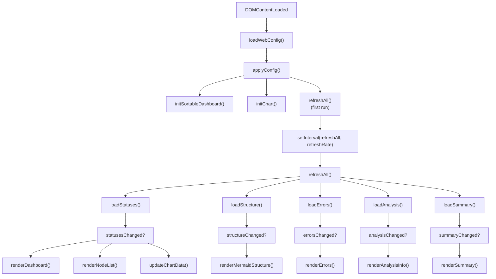

# main.ts

> 📅 Last Updated: 2026/05/24

The dashboard main entry script, responsible for coordinating global initialization, event listeners, and core data polling logic.

## Initialization Flow

1. **Configuration Loading**: Calls `loadWebConfig()` to fetch persisted configuration from the backend.
2. **UI Application**: Calls `applyConfig()` to apply settings such as theme, language, and refresh interval.
3. **Feature Activation**:
   - `initSortableDashboard()`: Enables node card drag-and-drop.
   - `initChart()`: Initializes the Chart.js history chart.
   - ⚠️ `initHistoryMetricSwitcher()` is **not called in main.ts** — it is automatically executed in the module scope of `dashboard_history.ts`.
4. **Polling Start**: Launches `refreshAll()` periodic refresh via `setInterval`.

## Core Features

### Polling Refresh (`refreshAll`)

Launches multiple asynchronous requests in parallel to fetch the latest node status, graph structure, error logs, topology analysis, and summary statistics.

- **On-Demand Rendering**: DOM re-rendering is only triggered when the corresponding data version number (`rev`) changes.
- **Status Sync**: After `loadStatuses()` succeeds, it automatically drives `appendStatusSnapshotToHistory()` to accumulate frontend history.

### Settings Interaction

| Setting | Triggered Behavior |
|---------|--------------------|
| **Refresh Interval** | Updates polling timer, calls `saveWebConfig()` |
| **History Length** | Immediately calls `trimNodeHistories()` to trim local sequences and redraw charts |
| **Interface Language** | Calls `setLang()` + `applyI18nDOM()`, and fully refreshes all dynamically rendered cards |
| **Structure Edge Delta** | Toggles `showStructureEdgeDelta` and immediately redraws the Mermaid diagram |
| **Light/Dark Theme** | Toggles body class name, synchronously updates `theme-toggle` text and chart theme colors |

### UI Helper Functions

#### `toggleDarkTheme()`
Toggles the `dark-theme` class on the `body` element and returns the resulting boolean state.

#### `showSettingsSaveStatus(messageKey)`
Displays a timed status message at the bottom of the settings panel (e.g., "Saved successfully"), supporting i18n key mapping. Automatically hides after 2 seconds (success) or 5 seconds (failure).

#### `updateSettingsStatusText()`
After a language switch, updates the settings status prompt text to the translation in the current language.

#### `isSettingsPanelOpen()` / `openSettingsPanel()` / `closeSettingsPanel()` / `toggleSettingsPanel()`
Settings panel open/close/toggle management. Supports:
- Clicking the gear button to toggle
- Clicking the close button and returning focus
- Clicking outside the panel to auto-close
- Pressing `Escape` to close

### Focus and Accessibility (a11y)

- **Settings Panel**: Supports quick close via the `Escape` key; after closing, focus is automatically returned to the settings button.
- **Status Feedback**: When settings are saved, a brief "Saved successfully" or "Save failed" prompt is displayed at the bottom of the panel (implemented via `showSettingsSaveStatus()`).

## `toggleDarkTheme()` and `showSettingsSaveStatus()` Ownership

| Function | Defined In | Purpose |
|----------|-----------|---------|
| `toggleDarkTheme()` | **main.ts** | Theme switching |
| `showSettingsSaveStatus()` | **main.ts** | Settings save status feedback |

> These two functions are **not** defined in `utils.ts`.

## Data Flow Diagram



## Usage Examples

### Manual `refreshAll` Invocation and Data Flow-Driven Example

The following example demonstrates how to manually trigger a data refresh in the browser console, as well as the core data flow-driven relationships:

```typescript
// 1. Manually trigger the full data refresh flow
// Execute in the browser console:
refreshAll().then(() => {
    console.log("全量刷新完成");
});

// 2. Internal flow of refreshAll (based on main.ts source):
// async function refreshAll() {
//     // Parallel fetch of 5 data types
//     const [statusesChanged, structureChanged, errorsChanged,
//            analysisChanged, summaryChanged] = await Promise.all([
//         loadStatuses(),
//         loadStructure(),
//         loadErrors(),
//         loadAnalysis(),
//         loadSummary(),
//     ]);
//
//     // Render driven by dependency relationships:
//     // Structure diagram depends on structure data + status data
//     // Analysis panel depends on analysis data
//     // Status cards / node list / line chart depend on status data
//     // Summary panel depends on summary data
//     // Error table depends on error data
// }

// 3. Manually invoke individual data loading functions
async function manualDataFetch() {
    // Fetch status data only
    const statusChanged = await loadStatuses();
    if (statusChanged) {
        renderDashboard();           // Update status cards
        populateNodeFilter(nodeStatuses); // Update error filter
        renderNodeList();            // Update injection page node list
        updateChartData();           // Update line chart
    }

    // Fetch structure data only and redraw
    const structChanged = await loadStructure();
    if (structChanged && nodeStatuses) {
        renderMermaidStructure(nodeStatuses);
    }

    // Fetch error data only
    const errChanged = await loadErrors(true);
    if (errChanged) {
        renderErrors();
    }
}

// 4. Modify polling frequency
// Default stored in webConfig.refreshInterval
// Temporarily adjust in browser console:
// clearInterval(refreshIntervalId);
// refreshRate = 2000;  // Change to 2 seconds
// refreshIntervalId = setInterval(refreshAll, refreshRate);

// 5. Manually trigger settings save
// saveWebConfig().then(success => {
//     showSettingsSaveStatus(
//         success ? "settings.saveSuccess" : "settings.saveFailed"
//     );
// });

// 6. Theme switching
function toggleTheme() {
    const isDark = toggleDarkTheme();
    webConfig.theme = isDark ? "dark" : "light";
    themeToggleBtn.textContent = isDark ? t("theme.light") : t("theme.dark");
    renderMermaidStructure(nodeStatuses);
    updateChartTheme();
    saveWebConfig();
}

// toggleTheme();  // Execute theme switch
```
