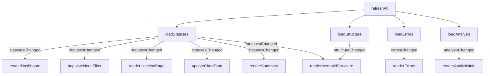
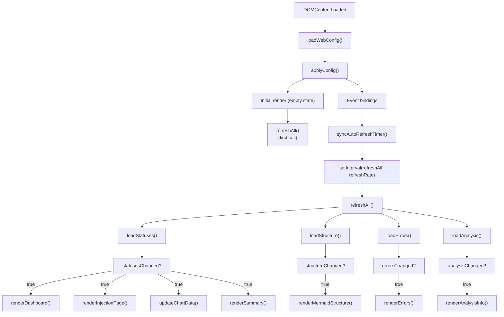

# main.ts

> 📅 Last Updated: 2026/06/11

Dashboard main entry script, responsible for coordinating global initialization, event listeners, and core data polling logic.

> ⚠️ **Changed**: The `loadSummary()` and `initSortableDashboard()` mentioned in older docs have been removed. `refreshAll()` now makes 4 parallel requests (statuses, structure, errors, analysis); summary is frontend-aggregated by `renderSummary()` directly from `nodeStatuses`. Added `updateCurrentPageSettings()`, `activateTab()` and other settings panel management functions.

## Global Variables

| Variable | Type | Description |
|------|------|------|
| `refreshRate` | `number` | Polling refresh interval (milliseconds), default `5000` |
| `refreshIntervalId` | `ReturnType<typeof setInterval> \| null` | Polling timer ID |

## DOM Element References

| Variable | DOM Selector | Description |
|------|-----------|------|
| `refreshSelect` | `#refresh-interval` | Refresh interval dropdown |
| `autoRefreshToggle` | `#auto-refresh-toggle` | Auto-refresh toggle |
| `historyLimitSelect` | `#history-limit` | History limit dropdown |
| `settingsBtn` | `#settings-btn` | Settings gear button |
| `settingsPanel` | `#settings-panel` | Settings floating panel |
| `themeToggleBtn` | `#theme-toggle` | Theme toggle button |
| `languageSelect` | `#language-select` | Language selection dropdown |
| `errorPageSizeSelect` | `#error-page-size` | Error page size dropdown |
| `errorJumpToInjectionToggle` | `#error-jump-to-injection-toggle` | Error page re-injection jump toggle |
| `structureEdgeDeltaToggle` | `#structure-edge-delta` | Structure graph edge delta display toggle |
| `statusTotalPendingToggle` | `#status-total-pending-toggle` | Node status card pending value mode toggle |
| `injectableOnlyToggle` | `#injectable-only-toggle` | Injection page "injectable nodes only" toggle |
| `tabButtons` | `.tab-btn` | Tab button list |
| `tabContents` | `.tab-content` | Tab content list |

## Core Features

### Polling Refresh (`refreshAll`)

Launches 4 parallel async requests: `loadStatuses()`, `loadStructure()`, `loadErrors()`, `loadAnalysis()`. Based on the change flags returned by each module, triggers DOM rendering as needed.



### Settings Interactions

| Setting | Event | Triggered Behavior |
|-------|------|----------|
| **Refresh Interval** | `change` | Update `refreshRate`, save config, rebuild timer |
| **Auto Refresh** | `change` | Toggle `autoRefreshEnabled`, sync timer, save config |
| **History Limit** | `change` | Update `historyLimit`, trim history and redraw, save config |
| **UI Language** | `change` | `setLang()` + `applyI18nDOM()`, full refresh of all cards and charts |
| **Structure Edge Delta** | `change` | Toggle `showStructureEdgeDelta`, redraw Mermaid, save config |
| **Node Pending Mode** | `change` | Toggle `useTotalPendingInStatus`, redraw node cards, save config |
| **Injection Node Filter** | `change` | Toggle `showInjectableOnly`, refresh injection page, save config |
| **Error Page Size** | `change` | Update `pageSize`, reload error list, save config |
| **Error Re-injection Jump** | `change` | Toggle `jumpToInjectionAfterRetry`, save config |
| **Light/Dark Theme** | `click` | Toggle `dark-theme` class, update chart theme colors, save config |

### UI Helper Functions

#### `toggleDarkTheme(): boolean`
Toggles the `dark-theme` class on the `body` element, returns whether dark mode is active after the toggle.

#### `showSettingsSaveStatus(messageKey: string): void`
Displays a time-limited status tip at the bottom of the settings panel (auto-hides after 2s for success, 5s for failure).

#### `updateSettingsStatusText(): void`
Updates the settings status tip text after language switch.

#### `syncAutoRefreshTimer(): void`
Creates or clears the polling timer based on `webConfig.global.autoRefreshEnabled`.

#### Settings Panel Management
`isSettingsPanelOpen()` / `openSettingsPanel()` / `closeSettingsPanel(options?)` / `toggleSettingsPanel()` — manages settings panel visibility and focus restoration.

#### Tab Management
`getActiveTab(): string` / `activateTab(button): void` / `updateCurrentPageSettings(): void` — manages top tab switching and the "current page settings" grouping in the settings panel.

## Data Flow Diagram



## Usage Example

```typescript
// Manually trigger a full refresh
// await refreshAll();

// Change polling frequency
// refreshRate = 2000;
// syncAutoRefreshTimer();

// Theme toggle
// const isDark = toggleDarkTheme();
// themeToggleBtn.textContent = isDark ? t("theme.light") : t("theme.dark");
// updateChartTheme();
// renderMermaidStructure(nodeStatuses);

// Switch tabs
// activateTab(document.querySelector('[data-tab="errors"]'));
```
