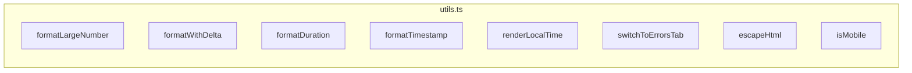

# utils.ts

> 📅 Last Updated: 2026/05/24

Contains common formatting utilities, UI helper logic, DOM operation wrappers, and environment detection functions for the Web frontend.

## Number and Time Formatting

### `formatLargeNumber(n)`
Converts large numbers to a human-readable format.
- `< 10,000,000`: Uses thousand-separator comma formatting.
- `>= 10,000,000`: Converts to HTML scientific notation (e.g., `~1.23×10⁹`).

### `formatWithDelta(value, delta, deltaClass, negClass)`
Formats a value with a delta. If the delta is non-zero, appends a colored `+N` or `-N` small text after the main value.

### `formatDuration(seconds)`
Formats seconds into an `HH:MM:SS` or `MM:SS` string.

### `formatTimestamp(timestamp)`
Formats a Unix timestamp (seconds) into a `YYYY-MM-DD HH:MM:SS` local time string.
```ts
function formatTimestamp(timestamp: number): string {
  const d = new Date(timestamp * 1000);
  // Returns format like "2026-05-24 14:30:00"
}
```

### `renderLocalTime(timestamp)`
Converts a Unix timestamp to a locale-sensitive localized date-time string (`toLocaleString()`).

---

## UI and Routing Helpers

### `switchToErrorsTab(nodeFilter?)`
Global route navigation function.
- Switches the current tab to "Error Logs".
- If `nodeFilter` is provided, automatically populates the error filter dropdown and triggers a query.

---

## Security and Utilities

### `escapeHtml(str)`
Basic HTML escaping function to prevent XSS risks when dynamically inserting text. Escapes characters: `&` `<` `>` `"` `'` `/`.

### `isMobile()`
Simple mobile device detection based on UserAgent (matches `Mobi|Android|iPhone|iPad|iPod`), used to disable interactions like drag-and-drop sorting.

---

## ❌ Functions Not in utils.ts

The following functions are **not** defined in `utils.ts`; they belong to `main.ts`:

| Function | Actual Location | Description |
|----------|----------------|-------------|
| `toggleDarkTheme()` | **main.ts** | Light/dark theme switching |
| `showSettingsSaveStatus()` | **main.ts** | Settings save status prompt |

---

## Function Overview



## Usage Examples

### Usage Examples for formatLargeNumber / formatDuration / escapeHtml and Other Functions

The following examples demonstrate the usage of all utility functions in `utils.ts` (can be run directly in the browser console):

```typescript
// ====== 1. formatLargeNumber: Large number formatting ======
console.log("=== formatLargeNumber ===");
console.log(formatLargeNumber(1234));        // "1,234"
console.log(formatLargeNumber(1234567));     // "1,234,567"
console.log(formatLargeNumber(9999999));     // "9,999,999"
console.log(formatLargeNumber(10000000));    // "~1.00×10⁷"
console.log(formatLargeNumber(1234567890));  // "~1.23×10⁹"

// ====== 2. formatWithDelta: Value + delta display ======
console.log("\n=== formatWithDelta ===");
const value = 1000;
const delta = 5;
// Green +5 small text appended after main value
console.log(formatWithDelta(value, delta, "delta-positive", "delta-negative"));
// "1,000<small class="delta-positive" style="margin-left: 4px;">+5</small>"

// Negative delta displayed in red
console.log(formatWithDelta(value, -3, "delta-positive", "delta-negative"));
// "1,000<small class="delta-negative" style="margin-left: 4px;">-3</small>"

// Delta of 0 not displayed
console.log(formatWithDelta(value, 0, "", ""));
// "1,000"

// ====== 3. formatDuration: Seconds formatting ======
console.log("\n=== formatDuration ===");
console.log(formatDuration(0));          // "00:00"
console.log(formatDuration(45));         // "00:45"
console.log(formatDuration(120));        // "02:00"
console.log(formatDuration(3661));       // "01:01:01"
console.log(formatDuration(86399));      // "23:59:59"

// ====== 4. formatTimestamp: Timestamp formatting ======
console.log("\n=== formatTimestamp ===");
console.log(formatTimestamp(1745400000));
// "2026-05-24 14:40:00" (depends on current timezone)

// Current time
console.log(formatTimestamp(Date.now() / 1000));

// ====== 5. renderLocalTime: Localized time ======
console.log("\n=== renderLocalTime ===");
console.log(renderLocalTime(1745400000));
// "2026/5/24 14:40:00" (depends on browser locale)

// ====== 6. escapeHtml: HTML escaping ======
console.log("\n=== escapeHtml ===");
const userInput = '<script>alert("xss")</script>';
console.log(escapeHtml(userInput));
// "&lt;script&gt;alert(&quot;xss&quot;)&lt;&#x2F;script&gt;"

console.log(escapeHtml('A&B < C > D'));
// "A&amp;B &lt; C &gt; D"

// ====== 7. isMobile: Mobile detection ======
console.log("\n=== isMobile ===");
console.log(isMobile());
// Returns false on desktop browsers
// Returns true on mobile devices

// ====== 8. switchToErrorsTab: Navigate to error page ======
console.log("\n=== switchToErrorsTab ===");
// Navigate to error log tab without node filtering
switchToErrorsTab();

// Navigate to error log tab with specific node filtering
// switchToErrorsTab("StageA");
```
