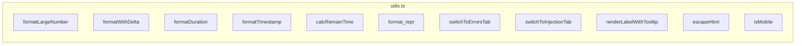

# utils.ts

> 📅 Last Updated: 2026/06/11

Contains common formatting utilities, UI helper logic, DOM manipulation wrappers, and environment detection functions for the web frontend.

> ⚠️ **Changed**: The `renderLocalTime()` function mentioned in older docs does not actually exist in this file. Four new functions added: `renderLabelWithTooltip()`, `switchToInjectionTab()`, `calcRemainTime()`, `format_repr()`.

## Number & Time Formatting

### `formatLargeNumber(n: number): string`
Converts large numbers to readable HTML format.
- `< 10,000,000`: Uses `toLocaleString('en-US')` with thousands comma separators.
- `>= 10,000,000`: Converts to scientific notation HTML (e.g., `~1.23×10⁹`).

### `formatWithDelta(value: number, delta: number, deltaClass: string, negClass: string): string`
Formats a value with an increment. If the delta is non-zero, appends a colored `+N` or `-N` in a small `<small>` tag after the main value.

### `formatDuration(seconds: number): string`
Formats seconds as an `HH:MM:SS` (≥1 hour) or `MM:SS` (<1 hour) string. Positive numbers show at least 1 second.

### `formatTimestamp(timestamp: number): string`
Formats a Unix timestamp (seconds) as a `YYYY-MM-DD HH:MM:SS` local time string.

### `calcRemainTime(processed: number, pending: number, elapsed: number): number`
Linearly estimates remaining time based on processed count, pending count, and elapsed time. Returns 0 when `processed` or `pending` is 0.

### `format_repr(obj: unknown, max_length: number): string`
Formats any object as a string, truncating when exceeding `max_length` (front 2/3 + `...` + back 1/3), preserving visible forms of newlines and backslashes.

---

## UI & Routing Helpers

### `switchToErrorsTab(nodeFilter?: string): void`
Global routing jump function.
- Switches to the "Error Log" tab (`activateTab`).
- If `nodeFilter` is provided, sets the node filter dropdown and triggers the `change` event to start the query.

### `switchToInjectionTab(): void`
Switches to the "Task Injection" tab.

### `renderLabelWithTooltip(labelKey: string, tooltipKey: string): string`
Renders label HTML with a tooltip bubble. Contains an `i` button (`.tooltip-trigger`) that shows the translated help text (`.tooltip-bubble`) on hover or focus.

> This function is widely used by `dashboard_statuses.ts` and `dashboard_analysis.ts` to provide instant explanations for technical terms such as "stage mode" and "scheduling mode".

---

## Security & Utilities

### `escapeHtml(str: string): string`
Basic HTML escaping function to prevent XSS risks when dynamically inserting text. Escapes: `&` `<` `>` `"` `'` `/`.

### `isMobile(): boolean`
Simple mobile detection based on UserAgent (matches `Mobi|Android|iPhone|iPad|iPod`).

---

## ❌ Functions NOT in utils.ts

The following functions are **not** defined in `utils.ts`; they belong to `main.ts`:

| Function | Actual Location | Description |
|------|---------|------|
| `toggleDarkTheme()` | **main.ts** | Light/dark theme toggle |
| `showSettingsSaveStatus()` | **main.ts** | Settings save status tip |

> The `renderLocalTime()` mentioned in older docs does not exist in the source code, possibly a legacy remnant or never implemented.

---

## Function Overview



## Usage Example

```typescript
// ====== Number Formatting ======
formatLargeNumber(1234567);     // "1,234,567"
formatLargeNumber(1234567890);  // "~1.23×10⁹"

// ====== Delta Display ======
formatWithDelta(1000, 5, "text-delta-success", "text-delta-success");
// "1,000<small class="text-delta-success">+5</small>"

// ====== Time Formatting ======
formatDuration(3661);           // "01:01:01"
formatTimestamp(1745400000);    // "2026-04-23 14:40:00"

// ====== Remaining Time Estimation ======
calcRemainTime(500, 100, 300);  // 60

// ====== String Truncation ======
format_repr("very long string...", 10);  // "very lo...g..."

// ====== Tooltip Label ======
renderLabelWithTooltip("status.stageMode", "status.stageModeHelp");
// Returns HTML with tooltip-trigger and tooltip-bubble

// ====== Tab Navigation ======
switchToErrorsTab("StageA");    // Jump to error page and filter StageA
switchToInjectionTab();          // Jump to injection page

// ====== HTML Escaping ======
escapeHtml('<script>alert("xss")</script>');
// "&lt;script&gt;alert(&quot;xss&quot;)&lt;&#x2F;script&gt;"

// ====== Mobile Detection ======
isMobile();  // false on desktop, true on mobile
```
