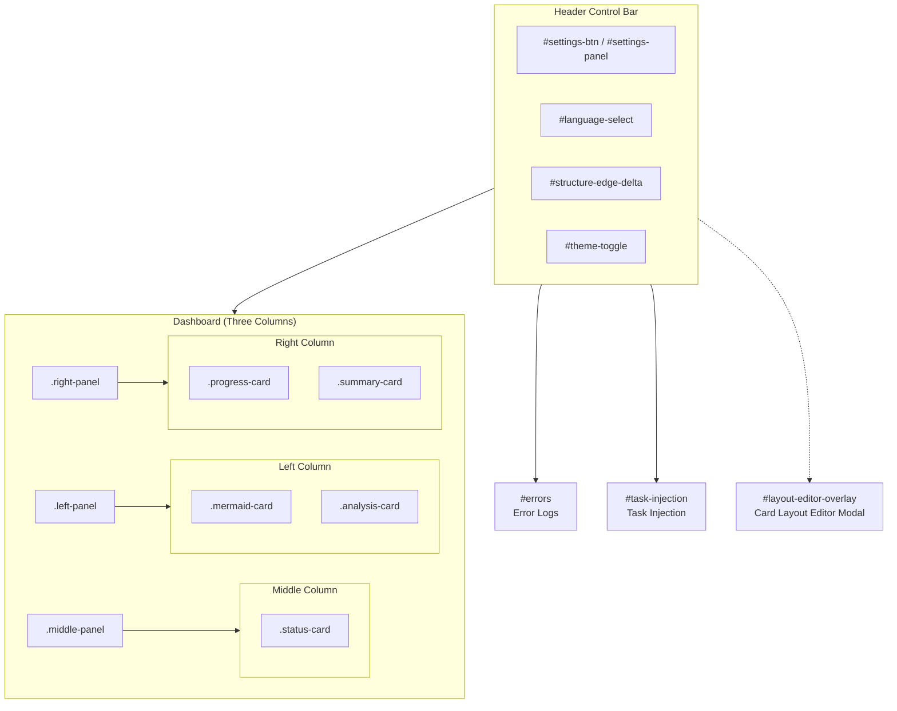

# index.html

> 📅 Last Updated: 2026/06/18

The Jinja2 template file for the Web UI, defining the complete page structure of the monitoring system.

## Overall Layout

The page is divided into three main regions:

```
<header>  — Top control bar (settings panel, theme toggle)
<main>
  ├─ .tabs               — Tab navigation (Dashboard / Error Logs / Task Injection)
  ├─ #dashboard          — Dashboard (three-column layout)
  ├─ #errors             — Error logs
  └─ #task-injection      — Task injection
```

## Header Control Bar

| Element | ID / Class | Description |
|---------|-----------|-------------|
| Settings button | `#settings-btn` | Click to open the settings panel, with a11y attributes |
| Settings panel | `#settings-panel` | Contains refresh, history, language, pagination, delta toggle, and other settings |
| Interface language | `#language-select` | Supports Chinese, English, and Japanese switching |
| Structure edge delta | `#structure-edge-delta` | Toggle, controls whether success count deltas are shown on Mermaid diagram edges |
| Theme toggle | `#theme-toggle` | Rounded capsule button, switches between light and dark modes |

## Dashboard Three-Column Structure

### Left Column `.left-panel`

| Card | Class | Description |
|------|-------|-------------|
| Task structure diagram | `.mermaid-card` | Mermaid flowchart, supports node coloring and edge deltas |
| Graph analysis info | `.analysis-card` | Topology structure insight information |

### Middle Column `.middle-panel`

| Card | Class | Description |
|------|-------|-------------|
| Node runtime status | `.status-card` | Dynamic node cards, with progress bars and real-time delta statistics |

### Right Column `.right-panel`

| Card | Class | Description |
|------|-------|-------------|
| Node metric trends | `.progress-card` | Historical line chart supporting metric switching (completed/success/error/duplicate/pending) |
| Overall status summary | `.summary-card` | Global 6-cell statistics dashboard |

## External Dependencies (CDN)

| Library | Version | Purpose |
|---------|---------|---------|
| Chart.js | latest | Line chart rendering |
| SortableJS | latest | Node card drag-and-drop sorting |
| Mermaid | `^10` (ESM) | Task graph visualization rendering |

## JS Script Loading Order

Scripts are loaded in dependency order:

```html
i18n.js               ← Internationalization support
utils.js              ← General utility functions
web_config.js         ← Configuration management logic
dashboard_statuses.js ← Node status management
dashboard_structure.js← Structure diagram rendering
errors.js             ← Error log pagination
dashboard_analysis.js ← Topology analysis display
dashboard_summary.js  ← Summary statistics
dashboard_history.js  ← Historical charts
injection.js          ← Task injection logic
layout_editor.js      ← Card layout editor (depends on web_config's CARD_TEMPLATES, PANEL_SELECTOR_MAP, and applyDashboardLayout)
main.js               ← Global entry and polling coordination
```

## CSS Style References

```html
css/_colors.css             ← Color variable definitions
css/base.css                ← Global base styles and settings panel
css/dashboard.css           ← Dashboard layout and Tab container
css/dashboard_structure.css  ← Structure diagram exclusive styles
css/dashboard_analysis.css   ← Analysis card exclusive styles
css/dashboard_statuses.css   ← Node card exclusive styles
css/dashboard_summary.css    ← Summary panel exclusive styles
css/dashboard_history.css    ← History chart exclusive styles
css/errors.css              ← Error log page styles
css/injection_layout.css     ← Injection page layout styles
css/injection_nodes.css      ← Injection page node list styles
css/injection_editor.css     ← Injection page editor styles
css/injection_preview.css    ← Injection page preview styles
```

## Card Layout Editor Modal (`#layout-editor-overlay`)

A floating modal (default `.overlay.hidden` hidden), supports drag-and-drop sorting of three-column dashboard cards.

- **Overlay layer**: `#layout-editor-overlay` / `.overlay` — Full-screen semi-transparent black background, `z-index: 200`
- **Editor body**: `#layout-editor` / `.layout-editor` — Rounded card container, `max-width: 700px`
- **Three-column drop zones**: Left, middle, and right drop zones (`#layout-dropzone-left`, `#layout-dropzone-middle`, `#layout-dropzone-right`), drag-and-drop powered by SortableJS
- **Unused pool**: `#layout-dropzone-unused` — Horizontal drop zone, holds cards removed from the three columns
- **Bottom buttons**: Save (`#layout-save-btn`) and Reset to default (`#layout-reset-btn`)
- Opened via the `.btn-layout-editor` button in the settings panel; closed by clicking `#layout-editor-close` or outside the overlay
- On save, calls `applyDashboardLayout()` to take effect immediately, then `saveWebConfig()` to persist to the backend

## Usage Examples

### Accessing via Browser

After starting the web server, navigate to the following address in your browser:

```
http://127.0.0.1:5000
```

Startup commands:

```bash
# CLI startup (default 0.0.0.0:5000)
celestialflow-web

# Or start in Python
python -c "from celestialflow import TaskWebServer; TaskWebServer(host='127.0.0.1', port=5000).start_server()"
```

After opening in a browser, you will see three tab pages:
- **Dashboard**: Real-time display of the task graph's structure diagram, node runtime status, metric trends, and overall summary
- **Error Logs**: Paginated viewing and searching of error records
- **Task Injection**: Inject new tasks into specified nodes

### Template Modification Examples

`index.html` uses the Jinja2 template engine. You can customize the interface through custom template variables or by directly modifying the HTML.

#### Changing the Page Title

Edit `index.html` and locate the `<title>` tag:

```html
<!-- Original content -->
<title>Task Graph Monitoring System</title>

<!-- Modified to custom title -->
<title>My Task Monitor</title>
```

#### Adjusting Dashboard Layout

The template has a hardcoded three-column structure (left-panel / middle-panel / right-panel). You can modify the card container ordering:

```html
<!-- Swap the structure diagram and analysis info positions -->
<div class="left-panel">
  <div class="analysis-card"><!-- Analysis panel --></div>
  <div class="mermaid-card"><!-- Structure diagram --></div>
</div>
```

#### Dynamic Control via Configuration

At runtime, the actual card layout is controlled by `WebConfig.dashboard`. Modify defaults in `web_config.ts` or adjust via the backend `config.json`:

```json
{
    "dashboard": {
        "left": ["status"],
        "middle": ["mermaid"],
        "right": ["summary", "progress"]
    }
}
```

#### Adding Custom CSS

Place custom style files in the `web/static/css/` directory and include them in `index.html`:

```html
<link rel="stylesheet" href="static/css/custom.css">
```

## Page Region Flowchart


